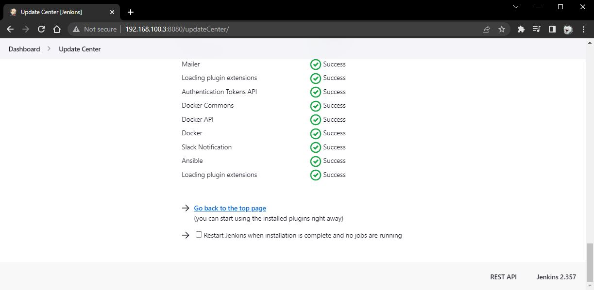
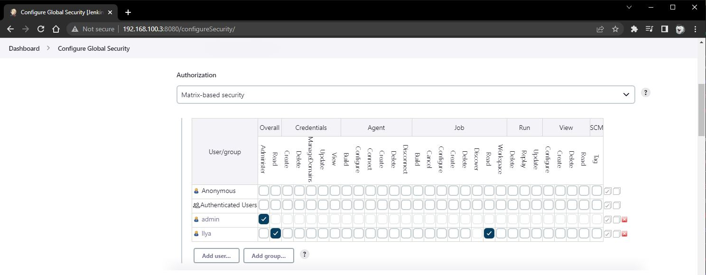
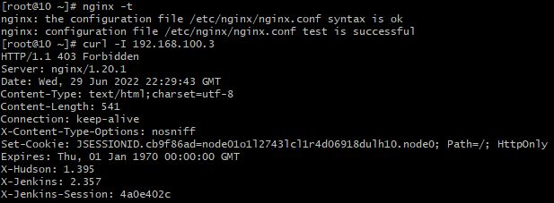

# 18.Jenkins

### To do:
* Deploy Jenkins inside home environment
* Setup Vagrant file
* Install Jenkins
* install plugins for Jenkins: Ansible, Slack notification
* Add restricted user to view Jobs, without any changes inside Jobs and Jenkins settings
* Hide Jenkins behind the web server (Nginx)

### Jenkins screenshots:
#### Plugins:

#### New user creation:

#### Do curl to test NGINX:
