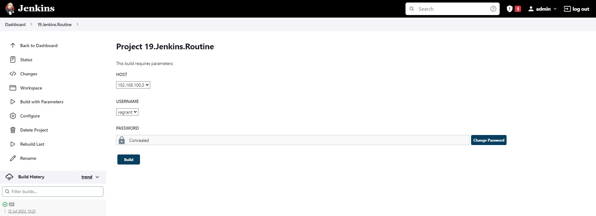

# 19.Jenkins.Routine homework
## Implement tasks with the following steps
* Parameters: host IP and credentials
* Check connection to the host
* Install/upgrade nmap
* Checks all online hosts
* Remove nmap
* Print list of collected/online hosts
### Jenkins task output:
```
Started by user admin
Running as SYSTEM
Building in workspace /var/lib/jenkins/workspace/19.Jenkins.Routine
[19.Jenkins.Routine] $ /bin/bash /tmp/jenkins7411505435655006745.sh
==========Ping Remote host==========
PING 192.168.100.3 (192.168.100.3) 56(84) bytes of data.
64 bytes from 192.168.100.3: icmp_seq=1 ttl=64 time=0.021 ms
64 bytes from 192.168.100.3: icmp_seq=2 ttl=64 time=0.021 ms
64 bytes from 192.168.100.3: icmp_seq=3 ttl=64 time=0.025 ms
64 bytes from 192.168.100.3: icmp_seq=4 ttl=64 time=0.023 ms

--- 192.168.100.3 ping statistics ---
4 packets transmitted, 4 received, 0% packet loss, time 3017ms
rtt min/avg/max/mdev = 0.021/0.022/0.025/0.005 ms
==========SSH check==========
host is accessible via SSH
==========NMAP install==========
Loaded plugins: fastestmirror
Loading mirror speeds from cached hostfile
 * base: ftp.byfly.by
 * epel: mirror.logol.ru
 * extras: ftp.byfly.by
 * updates: ftp.byfly.by
Resolving Dependencies
--> Running transaction check
---> Package nmap.x86_64 2:6.40-19.el7 will be installed
--> Finished Dependency Resolution

Dependencies Resolved

================================================================================
 Package        Arch             Version                   Repository      Size
================================================================================
Installing:
 nmap           x86_64           2:6.40-19.el7             base           3.9 M

Transaction Summary
================================================================================
Install  1 Package

Total download size: 3.9 M
Installed size: 16 M
Downloading packages:
Running transaction check
Running transaction test
Transaction test succeeded
Running transaction
  Installing : 2:nmap-6.40-19.el7.x86_64                                    1/1 
  Verifying  : 2:nmap-6.40-19.el7.x86_64                                    1/1 

Installed:
  nmap.x86_64 2:6.40-19.el7                                                     

Complete!

Nmap version 6.40 ( http://nmap.org )
Platform: x86_64-redhat-linux-gnu
Compiled with: nmap-liblua-5.2.2 openssl-1.0.2k libpcre-8.32 libpcap-1.5.3 nmap-libdnet-1.12 ipv6
Compiled without:
Available nsock engines: epoll poll select
==========Checks all online hosts==========

Starting Nmap 6.40 ( http://nmap.org ) at 2022-07-12 13:21 UTC
Nmap scan report for galaxy-enote8 (192.168.100.3)
Host is up (0.00040s latency).
Nmap scan report for 192.168.100.4 (192.168.100.4)
Host is up (0.00059s latency).
Nmap done: 256 IP addresses (2 hosts up) scanned in 3.09 seconds
==========Remove NMAP==========
Loaded plugins: fastestmirror
Resolving Dependencies
--> Running transaction check
---> Package nmap.x86_64 2:6.40-19.el7 will be erased
--> Finished Dependency Resolution

Dependencies Resolved

================================================================================
 Package        Arch             Version                  Repository       Size
================================================================================
Removing:
 nmap           x86_64           2:6.40-19.el7            @base            16 M

Transaction Summary
================================================================================
Remove  1 Package

Installed size: 16 M
Downloading packages:
Running transaction check
Running transaction test
Transaction test succeeded
Running transaction
  Erasing    : 2:nmap-6.40-19.el7.x86_64                                    1/1 
  Verifying  : 2:nmap-6.40-19.el7.x86_64                                    1/1 

Removed:
  nmap.x86_64 2:6.40-19.el7                                                     

Complete!
==========Print list of hosts==========
Hosts IPs:
Nmap scan report for galaxy-enote8 (192.168.100.3)
Nmap scan report for 192.168.100.4 (192.168.100.4)
Finished: SUCCESS
```
### Jenkins job parameters:
