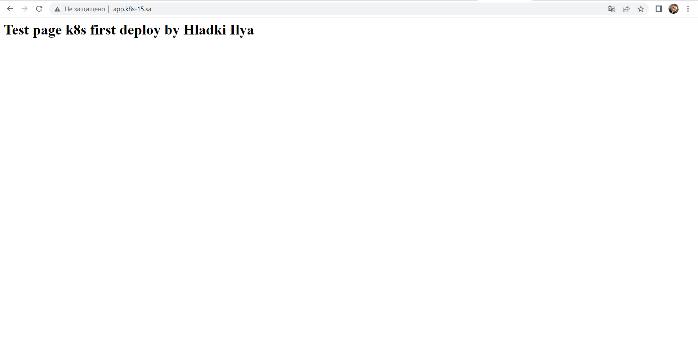
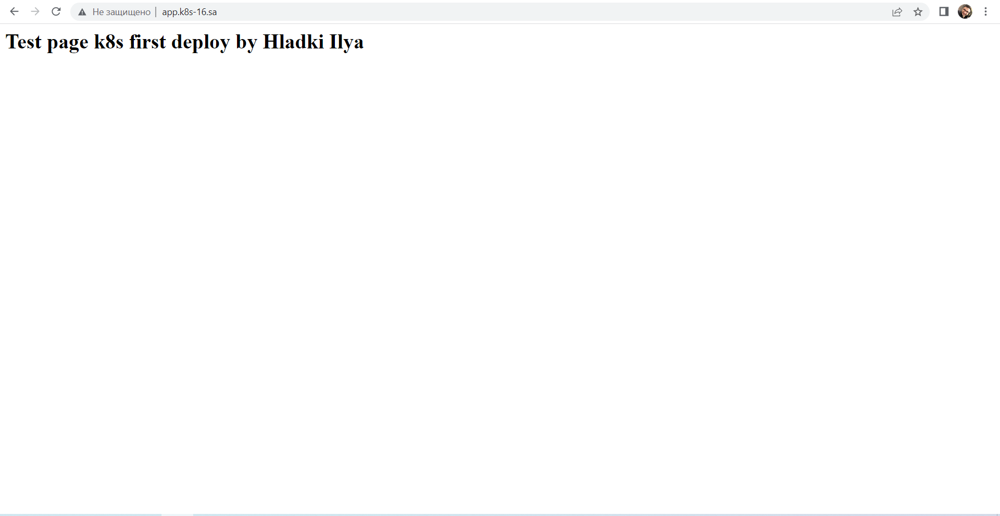
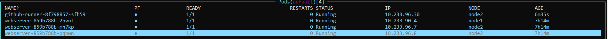
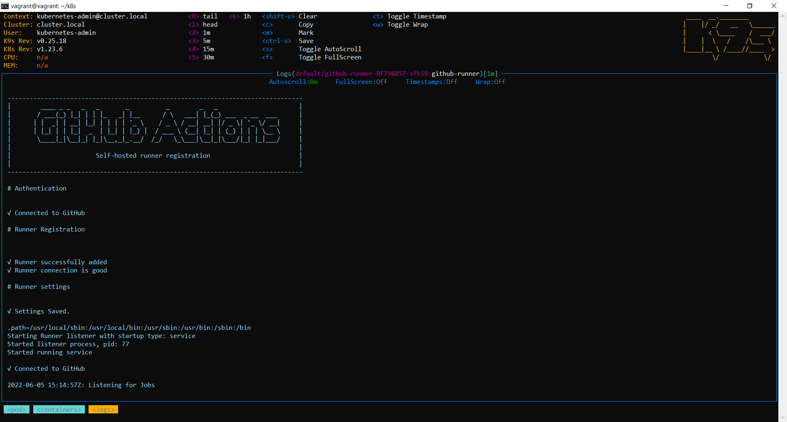
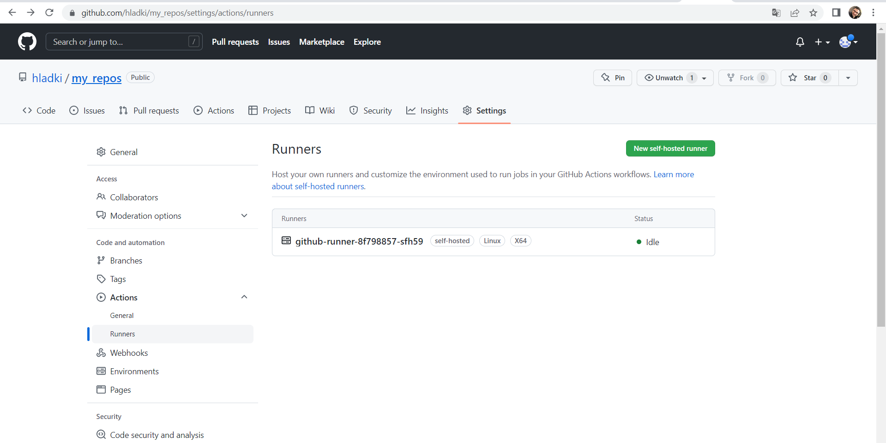

## 12. Kubernetes. First deployment HOMEWORK
### deployment nginx service
Screenshots of webpages:

### deploy pod inside k8s which should be connected to github as self-hosted runner

Screenshots of Pods

Screenshots self-hosted runner k8s

Screenshots self-hosted runner github

