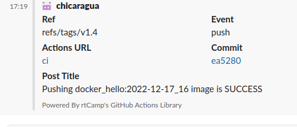

#### 08.Docker-compose
#
#
#
##### Links
[Docker Hub Registry](https://hub.docker.com/repository/docker/chicaragua/docker_hello)

[GitHub Container Registry](https://github.com/users/chicaragua/packages/container/package/docker_hello)

[GitHub Action File](https://github.com/chicaragua/docker_build/blob/main/.github/workflows/main.yml)


##### Report
#
#
#
```bash
name: ci

on:
  push:
    tags:
      - "v[0-9]+.[0-9]+"
jobs:
  docker:
    env:
      USER_NAME: ${{ github.actor }}
    runs-on: ubuntu-latest
    outputs:
      date: ${{ steps.date.output.date }}
    steps:
    
      - name: Get current date
        id: date
        run: echo "date=$(date +'%F')" >> "$GITHUB_OUTPUT"
        
      - name: Checkout
        uses: actions/checkout@v3
        
      - name: Login to GitHub Registry
        uses: docker/login-action@v2
        with:
          registry: ghcr.io
          username: ${{ env.USER_NAME }}
          password: ${{ secrets.CR_SECRET }}
      
      - name: Login to DockerHub
        uses: docker/login-action@v2
        with:
          username: ${{ secrets.DOCKERHUB_USERNAME }}
          password: ${{ secrets.DOCKERHUB_TOKEN }}
      - name: Build and push
        uses: docker/build-push-action@v3
        with:
          context: .
          push: true
          tags: |
            chicaragua/docker_hello:${{ steps.date.outputs.date }}_${{ github.run_number }}
            ghcr.io/chicaragua/docker_hello:${{ steps.date.outputs.date }}_${{ github.run_number }}
      - name: Slack OK notification
        uses: rtCamp/action-slack-notify@v2
        if: success()
        env:
          SLACK_CHANNEL: ivan_belov_slack_notification
          SLACK_COLOR: 'green'
          SLACK_ICON: https://github.com/rtCamp.png?size=48
          SLACK_MESSAGE: 'Pushing docker_hello:${{ steps.date.outputs.date }}_${{ github.run_number }} image is SUCCESS'
          SLACK_TITLE: Post Title
          SLACK_USERNAME: rtCamp
          SLACK_WEBHOOK: ${{ secrets.SLACK_WEBHOOK }}
          
      - name: Slack FAIL notification
        uses: rtCamp/action-slack-notify@v2
        if: failure()
        env:
          SLACK_CHANNEL: ivan_belov_slack_notification
          SLACK_COLOR: 'green'
          SLACK_ICON: https://github.com/rtCamp.png?size=48
          SLACK_MESSAGE: 'Pushing docker_hello:${{ steps.date.outputs.date }}_${{ github.run_number }} image is FAIL'
          SLACK_TITLE: Post Title
          SLACK_USERNAME: rtCamp
          SLACK_WEBHOOK: ${{ secrets.SLACK_WEBHOOK }}
```

