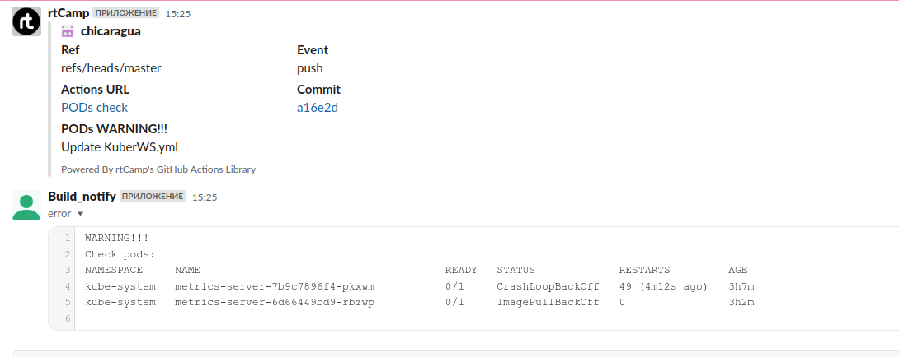
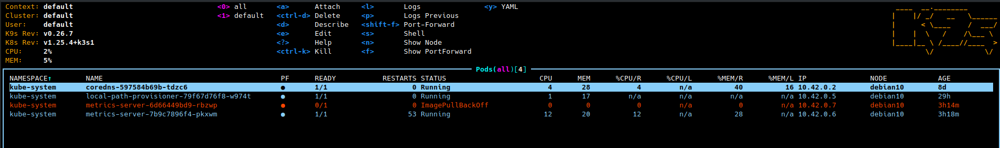

#### 10.Kubernetes (WS)
#
#
#
#### Links


[GitHub Action Workflow](https://github.com/chicaragua/ITA/actions/runs/3749245835)


#### Report
#
```bash
name: PODs check
on:
  schedule:
    - cron: '*/10 * * * *'
jobs:
  checks:
    runs-on: vm3
    name: Checks
    env:
      error_file: error.log
    steps:
    
    - name: install packages
      id: install
      run: |
        sudo apt-get -y update
        sudo apt-get -y install sshuttle
        sudo snap install kubectl --classic

        
    - name: Connect via SSH
      id: ssh_connect
      run: |
        ping -c 4 178.124.206.53
        ssh -o ProxyCommand="ssh -W %h:%p -q jump_sa@178.124.206.53" -L 6443:127.0.0.1:6443 root@192.168.203.2 -f -N
        
    - name: Clone repo
      uses: actions/checkout@v3
      with:
        fetch-depth: 0
        
    - name: Del old config
      continue-on-error: true
      run: |
        sudo rm -R ~/.kube
        sudo rm pods.err
        
    - name: Making dir for config
      continue-on-error: true
      run: |
        sudo mkdir ~/.kube
        echo 'WARNING!!!
        Check pods:' >> ${{ env.error_file }}        
        
    - name: Copy config
      run: |
        sudo cp 10.Kubernetes.WS/config ~/.kube
        
    - name: Checking
      id: checking
      run: echo "count_failed_pods=$(kubectl get pods -A | sed -n '/NAME/,$p' | sed '/NAME/d' | sed '/Running/d' | wc -l)" >> "$GITHUB_OUTPUT"
 
    - name: Get failed pods
      id: get_failed_pods
      if: ${{ steps.checking.outputs.count_failed_pods > 0 }}
      run: |
        kubectl get pods -A | sed '/Running/d' >> ${{ env.error_file }}      

    - name: Slack notification
      uses: rtCamp/action-slack-notify@v2
      if: ${{ steps.checking.outputs.count_failed_pods > 0 }}
      env:
        SLACK_CHANNEL: ivan_belov_slack_notification
        SLACK_COLOR: 'red'
        SLACK_ICON: https://github.com/rtCamp.png?size=48
        SLACK_TITLE: PODs WARNING!!!
        SLACK_USERNAME: rtCamp
        SLACK_WEBHOOK: ${{ secrets.SLACK_WEBHOOK }}
   
    - name: Upload to slack result file
      if: ${{ steps.checking.outputs.count_failed_pods > 0 }}
      uses: adrey/slack-file-upload-action@master
      with:
        token: ${{ secrets.SLACK_TOKEN }}
        path: ${{ env.error_file }}
        channel: ivan_belov_slack_notification

```



