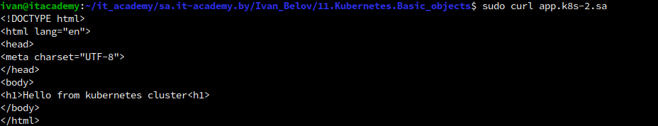

#### 11.Kubernetes. Basic objects
#
#
#

#### Report
#
```bash
ivan@itacademy:~/it_academy/sa.it-academy.by/Ivan_Belov/11.Kubernetes.Basic_objects$ sudo curl app.k8s-2.sa
<!DOCTYPE html>
<html lang="en">
<head>
<meta charset="UTF-8">
</head>
<body>
<h1>Hello from kubernetes cluster<h1>
</body>
</html>
ivan@itacademy:~/it_academy/sa.it-academy.by/Ivan_Belov/11.Kubernetes.Basic_objects$ kubectl get po -A
NAMESPACE       NAME                                        READY   STATUS      RESTARTS   AGE
kube-system     local-path-provisioner-79f67d76f8-8xvzx     1/1     Running     0          7d
kube-system     coredns-597584b69b-dwdbj                    1/1     Running     0          7d
kube-system     metrics-server-5c8978b444-p8jsq             1/1     Running     0          7d
ingress-nginx   ingress-nginx-admission-create-4bhzb        0/1     Completed   0          3h39m
ingress-nginx   ingress-nginx-admission-patch-s6879         0/1     Completed   0          3h39m
ingress-nginx   ingress-nginx-controller-6c56945c75-fk7cb   1/1     Running     0          3h39m
homework-11     nginx-deployment-7bfb99bc87-ljzjs           1/1     Running     0          3h22m
homework-11     nginx-deployment-7bfb99bc87-csngk           1/1     Running     0          3h22m
homework-11     nginx-deployment-7bfb99bc87-7jdzp           1/1     Running     0          3h22m
ivan@itacademy:~/it_academy/sa.it-academy.by/Ivan_Belov/11.Kubernetes.Basic_objects$ kubectl get ns
NAME              STATUS   AGE
default           Active   7d
kube-system       Active   7d
kube-public       Active   7d
kube-node-lease   Active   7d
ingress-nginx     Active   3h39m
homework-11       Active   3h22m
ivan@itacademy:~/it_academy/sa.it-academy.by/Ivan_Belov/11.Kubernetes.Basic_objects$ kubectl get service -A
NAMESPACE       NAME                                 TYPE        CLUSTER-IP     EXTERNAL-IP   PORT(S)                      AGE
default         kubernetes                           ClusterIP   10.43.0.1      <none>        443/TCP                      7d
kube-system     kube-dns                             ClusterIP   10.43.0.10     <none>        53/UDP,53/TCP,9153/TCP       7d
kube-system     metrics-server                       ClusterIP   10.43.191.79   <none>        443/TCP                      7d
ingress-nginx   ingress-nginx-controller             NodePort    10.43.32.138   <none>        80:30001/TCP,443:32235/TCP   3h39m
ingress-nginx   ingress-nginx-controller-admission   ClusterIP   10.43.76.241   <none>        443/TCP                      3h39m
homework-11     nginx-service                        ClusterIP   10.43.129.91   <none>        80/TCP                       3h22m
ivan@itacademy:~/it_academy/sa.it-academy.by/Ivan_Belov/11.Kubernetes.Basic_objects$ kubectl get ing
No resources found in default namespace.
ivan@itacademy:~/it_academy/sa.it-academy.by/Ivan_Belov/11.Kubernetes.Basic_objects$ kubectl get ing -A
NAMESPACE     NAME         CLASS    HOSTS          ADDRESS         PORTS   AGE
homework-11   ingress-sa   <none>   app.k8s-2.sa   192.168.203.2   80      3h22m
ivan@itacademy:~/it_academy/sa.it-academy.by/Ivan_Belov/11.Kubernetes.Basic_objects$ 

```

