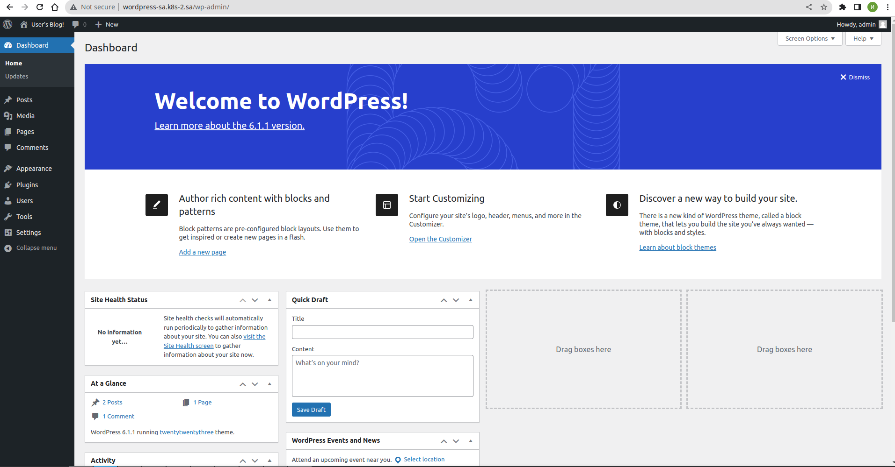

#### 13.Kubernetes. Helm
#
#
#

#### Report

```bash
 
 1678 nano ingress-wordpress.yaml
 1716  ansible-playbook -i ansible_workshop_invertory.yaml mariadb.yaml -e "name_db=db_wordpress user_db=db_user pass_db=db_pass"
 1719  helm install wordpress --set mariadb.enabled=false,externalDatabase.host=192.168.201.2,externalDatabase.password=db_pass,externalDatabase.user=db_user,externalDatabase.database=db_wordpress,global.storageClass=nfs,wordpressUsername=admin,wordpressPassword=admin bitnami/wordpress
```


