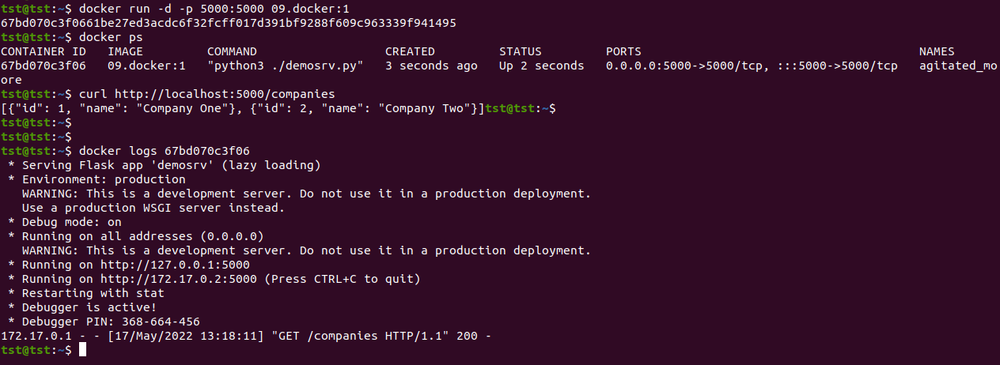

# 09.Docker

### URLs of repository and package
[Git](https://github.com/voyager1122/09.Docker)

[DockerHub](https://hub.docker.com/r/voyager1122/docker_srv)


### Dockerfile
```
FROM python:3-alpine
MAINTAINER ivan.fanchenko@gmail.com
RUN apk update && apk add python3 
RUN pip3 install --no-cache-dir flask
ADD demosrv.py /
CMD [ "python3", "./demosrv.py" ]
EXPOSE 5000 
```


### Github actions:    .github/workflows/build.yaml

```yaml
name: Docker build and push
on:
  push:
    branches:
    - main 
jobs:
  build:
    runs-on: ubuntu-latest 
    steps:
      - name: Login to Docker Hub
        uses: docker/login-action@v1
        with:
          username: ${{ secrets.DOCKER_LOGIN }}
          password: ${{ secrets.DOCKER_PASSWORD }}

      - name: Build and push
        uses: docker/build-push-action@v2
        with:
          push: true
          tags: voyager1122/docker_srv:latest

```


### Running docker container
```
docker run -d -p 5000:5000 09.docker:1
67bd070c3f0661be27ed3acdc6f32fcff017d391bf9288f609c963339f941495
tst@tst:~$ docker ps
CONTAINER ID   IMAGE         COMMAND                  CREATED         STATUS         PORTS                                       NAMES
67bd070c3f06   09.docker:1   "python3 ./demosrv.py"   3 seconds ago   Up 2 seconds   0.0.0.0:5000->5000/tcp, :::5000->5000/tcp   agitated_moore
tst@tst:~$ curl http://localhost:5000/companies
[{"id": 1, "name": "Company One"}, {"id": 2, "name": "Company Two"}]tst@tst:~$ 
tst@tst:~$ 
tst@tst:~$ 
tst@tst:~$ docker logs 67bd070c3f06
 * Serving Flask app 'demosrv' (lazy loading)
 * Environment: production
   WARNING: This is a development server. Do not use it in a production deployment.
   Use a production WSGI server instead.
 * Debug mode: on
 * Running on all addresses (0.0.0.0)
   WARNING: This is a development server. Do not use it in a production deployment.
 * Running on http://127.0.0.1:5000
 * Running on http://172.17.0.2:5000 (Press CTRL+C to quit)
 * Restarting with stat
 * Debugger is active!
 * Debugger PIN: 368-664-456
172.17.0.1 - - [17/May/2022 13:18:11] "GET /companies HTTP/1.1" 200 -

```

### Testing connection
```
curl http://localhost:5000/companies

[{"id": 1, "name": "Company One"}, {"id": 2, "name": "Company Two"}] 

```


#### Screenshot

