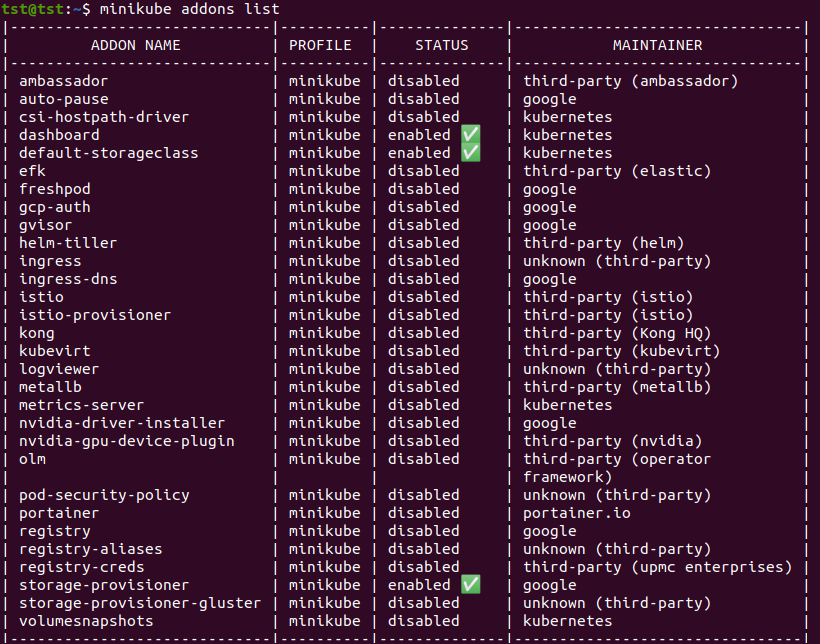
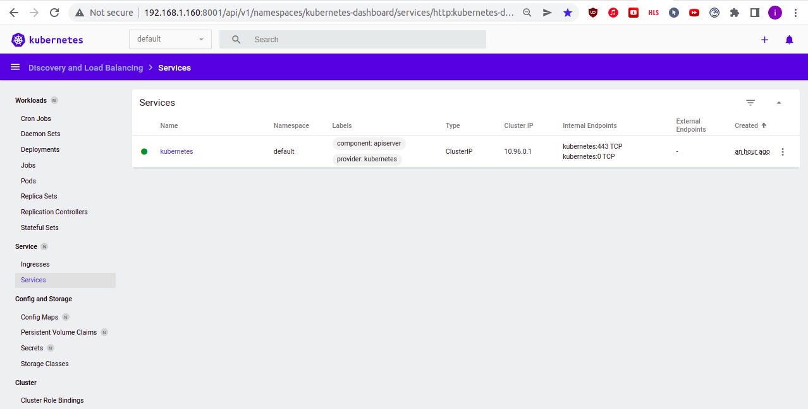

## 10.Kubernetes

### Minikube

#### Minikube deployment

```bash
sudo apt update
curl -Lo minikube https://storage.googleapis.com/minikube/releases/latest/minikube-linux-amd64   && chmod +x minikube
mkdir -p /usr/local/bin/
install minikube /usr/local/bin/
minikube version
minikube start --vm-driver=none
minikube status
curl -LO https://storage.googleapis.com/kubernetes-release/release/`curl -s https://storage.googleapis.com/kubernetes-release/release/stable.txt`/bin/linux/amd64/kubectl
chmod +x ./kubectl
sudo mv ./kubectl /usr/local/bin/kubectl
kubectl version --client
```

#### Enable dashboard and ingress plugin
```bash
minikube addons enable dashboard
minikube addons enable ingress
minikube addons list
kubectl proxy --address='0.0.0.0' --disable-filter=true
```

#### Run minikube with different options (RAM/CPU)
```bash
minikube start --cpus='2' --memory='2g'
```

#### minikube addons list output




#### K8S Dashbord screenshot



### Deployment of k8s in IT-ACADEMY environment

```log
PLAY RECAP *********************************************************************************************************************************
localhost                  : ok=4    changed=0    unreachable=0    failed=0    skipped=0    rescued=0    ignored=0   
node1                      : ok=768  changed=149  unreachable=0    failed=0    skipped=1315 rescued=0    ignored=6   
node2                      : ok=507  changed=94   unreachable=0    failed=0    skipped=772  rescued=0    ignored=2   

Пятница 20 мая 2022  16:44:53 +0300 (0:00:00.082)       0:29:10.930 *********** 
=============================================================================== 
kubernetes/preinstall : Install packages requirements ------------------------------------------------------------------------------ 67.73s
download : download_file | Validate mirrors ---------------------------------------------------------------------------------------- 66.14s
download : download_container | Download image if required ------------------------------------------------------------------------- 34.64s
kubernetes-apps/ansible : Kubernetes Apps | Lay Down CoreDNS templates ------------------------------------------------------------- 31.81s
download : download_container | Download image if required ------------------------------------------------------------------------- 28.35s
download : download_container | Download image if required ------------------------------------------------------------------------- 27.89s
kubernetes/control-plane : kubeadm | Initialize first master ----------------------------------------------------------------------- 26.92s
kubernetes/kubeadm : Join to cluster ----------------------------------------------------------------------------------------------- 26.22s
container-engine/containerd : download_file | Download item ------------------------------------------------------------------------ 25.71s
download : download_container | Download image if required ------------------------------------------------------------------------- 25.68s
download : download_container | Download image if required ------------------------------------------------------------------------- 24.82s
bootstrap-os : Assign inventory name to unconfigured hostnames (non-CoreOS, non-Flatcar, Suse and ClearLinux, non-Fedora) ---------- 22.51s
download : download_file | Download item ------------------------------------------------------------------------------------------- 22.02s
kubernetes-apps/ansible : Kubernetes Apps | Start Resources ------------------------------------------------------------------------ 21.60s
network_plugin/calico : Calico | Create calico manifests --------------------------------------------------------------------------- 17.96s
download : download_container | Download image if required ------------------------------------------------------------------------- 17.80s
download : download_file | Download item ------------------------------------------------------------------------------------------- 17.70s
download : download_file | Download item ------------------------------------------------------------------------------------------- 17.03s
download : download_container | Download image if required ------------------------------------------------------------------------- 16.50s
bootstrap-os : Update Apt cache ---------------------------------------------------------------------------------------------------- 15.98s
```