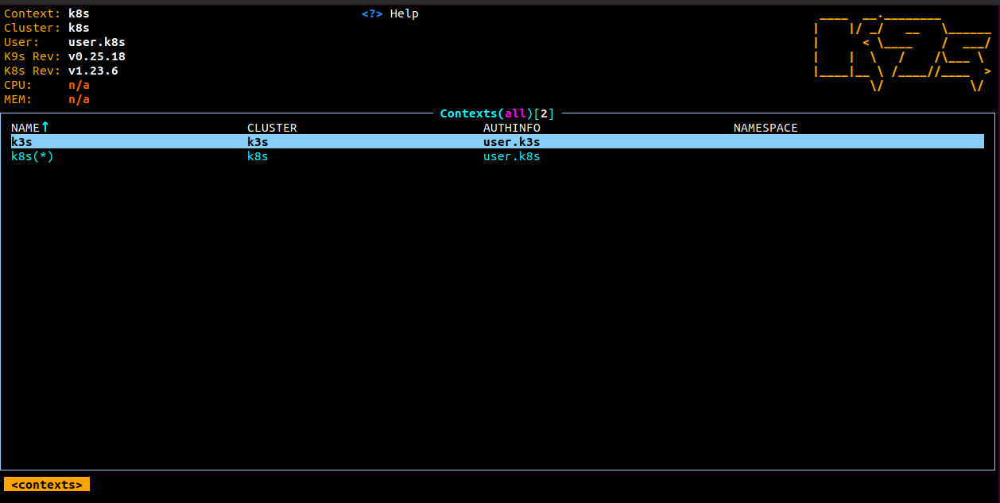
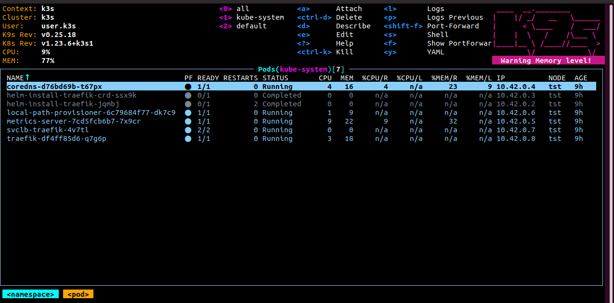
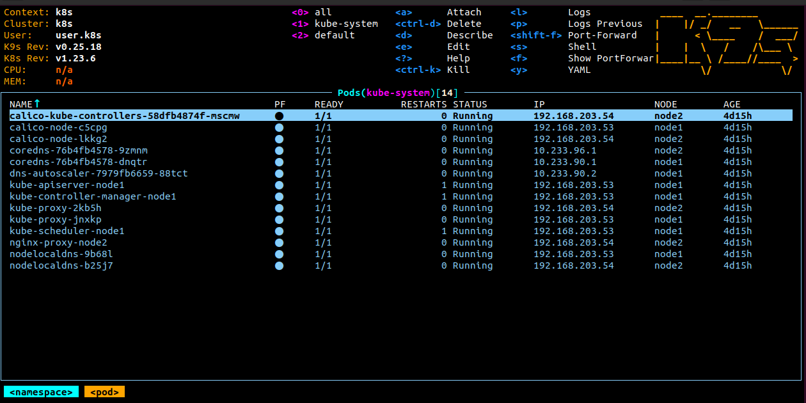

## 11. Kubernetes installation

### k9s screenshot






### kubectl config use-context

```log
kubectl config get-contexts
CURRENT   NAME   CLUSTER   AUTHINFO   NAMESPACE
          k3s    k3s       user.k3s   
*         k8s    k8s       user.k8s  
 
kubectl config use-context k8s
Switched to context "k8s".

kubectl get nodes
NAME    STATUS   ROLES                  AGE     VERSION
node1   Ready    control-plane,master   4d15h   v1.23.6
node2   Ready    <none>                 4d15h   v1.23.6

kubectl config use-context k3s
Switched to context "k3s".

kubectl get nodes
NAME   STATUS   ROLES                  AGE   VERSION
tst    Ready    control-plane,master   9h    v1.23.6+k3s1

```

### kubectl config view

```yaml
apiVersion: v1
clusters:
- cluster:
    certificate-authority-data: {}
    server: https://127.0.0.1:6443
  name: k3s
- cluster:
    certificate-authority-data: {}
    server: https://127.0.0.1:16443
  name: k8s
contexts:
- context:
    cluster: k3s
    user: user.k3s
  name: k3s
- context:
    cluster: k8s
    user: user.k8s
  name: k8s
current-context: k3s
kind: Config
preferences: {}
users:
- name: user.k3s
  user:
    client-certificate-data: {}
    client-key-data: {}
- name: user.k8s
  user:
    client-certificate-data: {}
    client-key-data: {}
```