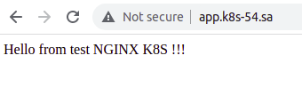
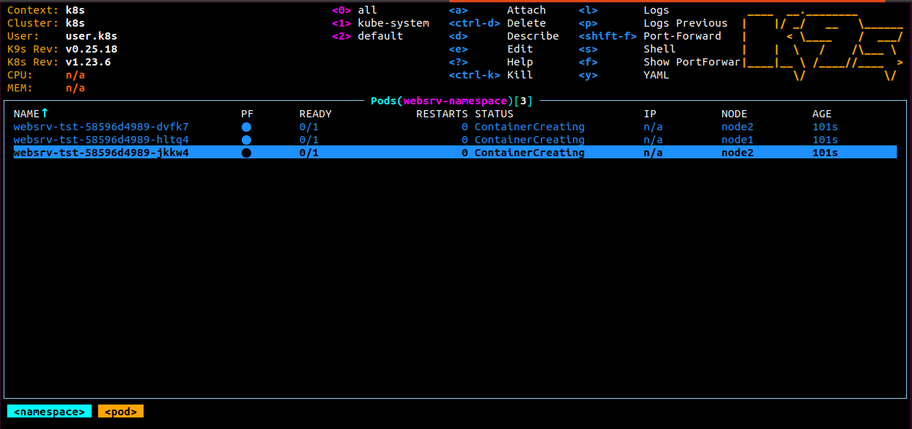
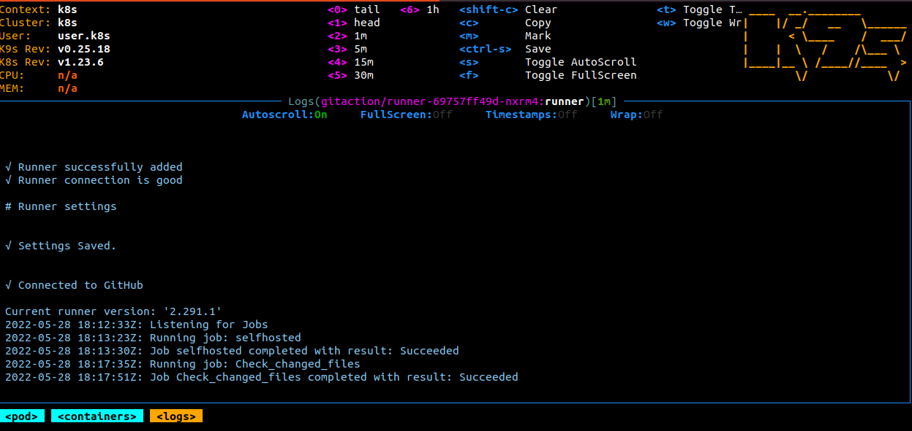
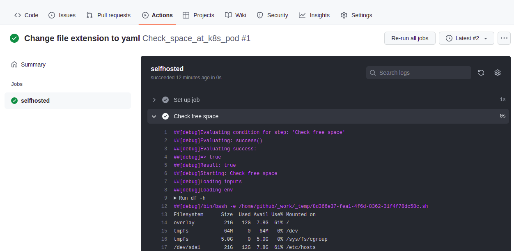

## 12. Kubernetes. First deployment

### Custom index.html screenshot on both nodes




### Console command output

```log

kubectl get ns
NAME               STATUS   AGE
default            Active   9d
gitaction          Active   43h
ingress-nginx      Active   2d16h
kube-node-lease    Active   9d
kube-public        Active   9d
kube-system        Active   9d
websrv-namespace   Active   2d19h

kubectl get pods -n ingress-nginx
NAME                                        READY   STATUS      RESTARTS   AGE
ingress-nginx-admission-create-96wn6        0/1     Completed   0          2d16h
ingress-nginx-admission-patch-9l9xs         0/1     Completed   0          2d16h
ingress-nginx-controller-84b85b6b66-k7x2z   1/1     Running     0          2d16h


kubectl get pods -n websrv-namespace
NAME                          READY   STATUS    RESTARTS   AGE
websrv-tst-5d5df89cc8-hh7hd   1/1     Running   0          2d16h
websrv-tst-5d5df89cc8-msstw   1/1     Running   0          2d16h
websrv-tst-5d5df89cc8-pm45b   1/1     Running   0          2d16h
```




## Additional task

### Image with self-hosted runner was uploaded to docker hub.

[URL of image] https://hub.docker.com/repository/docker/voyager1122/12docker_runner

When image deployed on the pod there are 3 external variable used in the deployment yaml  (k8s_github_action.yaml) to let runner on the pod authorize at github:

```log
       env:
        - name: GITHUB_OWNER
          value: voyager1122
        - name: GITHUB_REPOSITORY
          value: 04.Gitops
        - name: GITHUB_PAT
          valueFrom:
            secretKeyRef:
              name: github-secret
              key: GITHUB_PAT
```

The secret variable(GITHUB_PAT) generated at github and saved in the file secret.yaml
To apply secret in k8s use command:
```log
kubectl apply -f secret.yaml
```

####  2 tasks from lesson 4 were used to be run as self-hosted runners.

[URL of workflow files](https://github.com/voyager1122/04.Gitops/actions/workflows/check_files.yaml)





