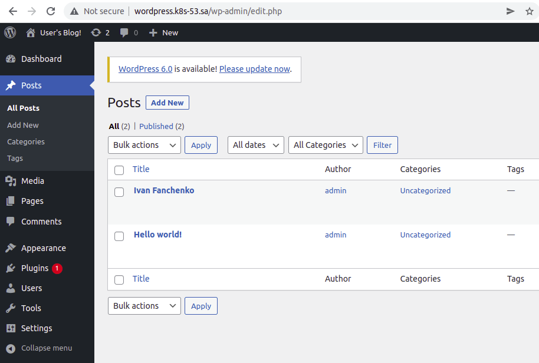
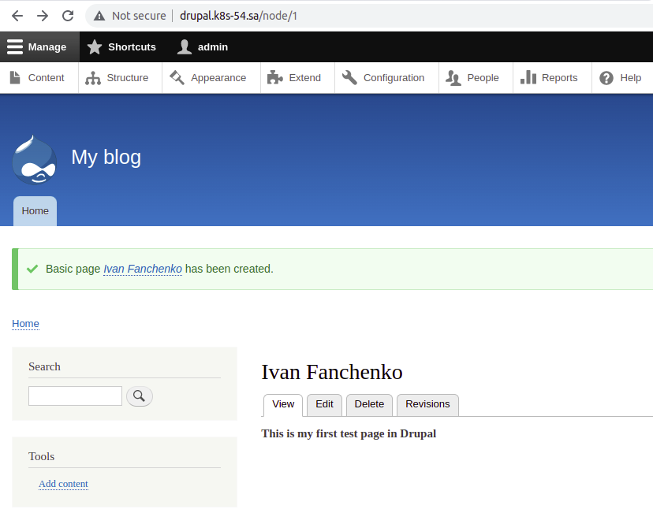

## 13. Kubernetes. Helm

### Wordress


### Drupal


### Installation
```log
============================= WORDPRESS  =====================================================================
helm repo add nfs-subdir-external-provisioner https://kubernetes-sigs.github.io/nfs-subdir-external-provisioner/
helm install nfs-subdir-external-provisioner nfs-subdir-external-provisioner/nfs-subdir-external-provisioner \
    --set nfs.server=192.168.37.105\
    --set nfs.path=/mnt/IT-Academy/nfs-data/sa2-20-22/Ivan_Fanchenko/


kubectl create namespace wordpress

helm install -n wordpress wp --set global.storageClass=nfs-client,\
wordpressUsername=admin,\
wordpressPassword=admin,\
service.type=ClusterIP,\
ingress.enabled=true,ingress.ingressClassName=nginx,\
ingress.hostname=wordpress.k8s-53.sa,\
ingress.pathType=Prefix,ingress.path="/" \
bitnami/wordpress


===============================DRUPAL===================================================


kubectl create namespace drupal


helm install drupal-nfs-subdir-external-provisioner nfs-subdir-external-provisioner/nfs-subdir-external-provisioner \
--set nfs.server=192.168.37.105 \
--set nfs.path=/mnt/IT-Academy/nfs-data/sa2-20-22/Ivan_Fanchenko/ \
--set storageClass.accessModes=ReadWriteMany \
--set storageClass.name=drupal-nfs-client


helm install -n drupal dp --set global.storageClass=drupal-nfs-client,\
drupalUsername=admin,\
drupalPassword=admin,\
service.type=ClusterIP,\
ingress.enabled=true,ingress.ingressClassName=nginx,\
ingress.hostname=drupal.k8s-54.sa,\
ingress.pathType=Prefix,ingress.path="/" \
bitnami/drupal

```
