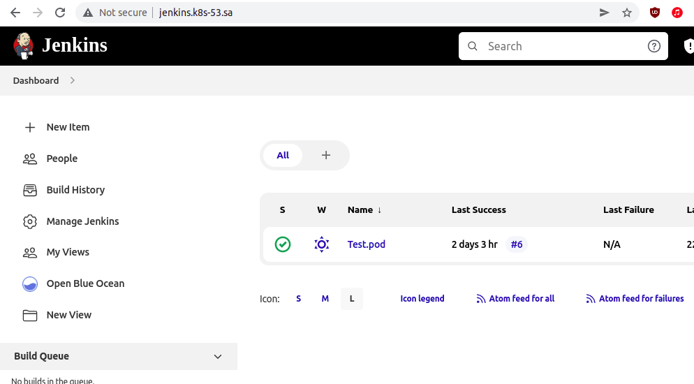
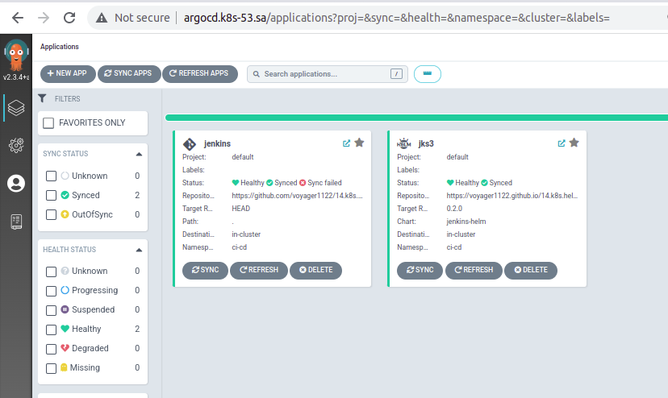
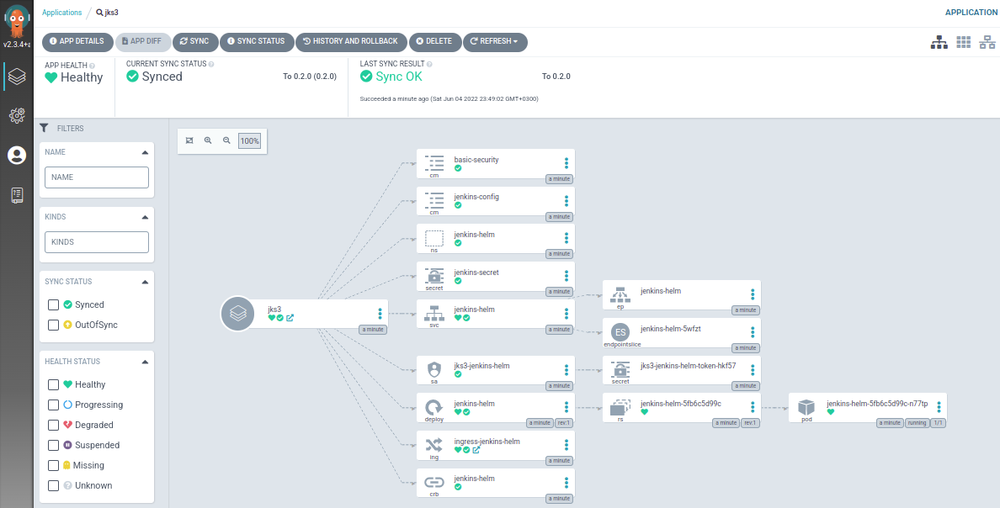
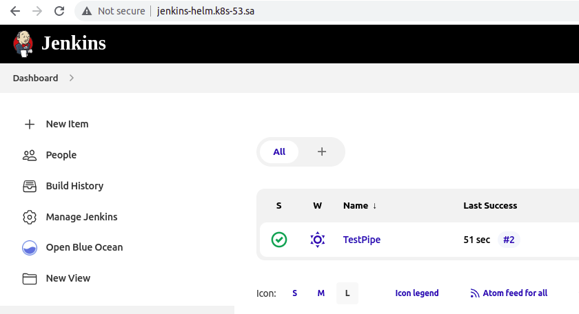

## 14. Kubernetes application deployment

### Jenkins screenshot


### Argo CD screenshot and Jenkins-helm app


### Jenkins-helm app status


### Jenkins-helm web


#### URL to personal Jenkins-helm repo

[URL of Jenkins-helm app](https://github.com/voyager1122/14.k8s.helmapp)

####  argoCD application manifests:
```log
kubectl get application -n argocd jks3 -o yaml

apiVersion: argoproj.io/v1alpha1
kind: Application
metadata:
  creationTimestamp: "2022-06-04T20:49:01Z"
  generation: 26
  name: jks3
  namespace: argocd
  resourceVersion: "2489079"
  uid: 8374ac7e-05c1-4b1d-a574-0b42275e3066
spec:
  destination:
    namespace: ci-cd
    server: https://kubernetes.default.svc
  project: default
  source:
    chart: jenkins-helm
    repoURL: https://voyager1122.github.io/14.k8s.helmapp/
    targetRevision: 0.2.0
  syncPolicy:
    automated: {}
status:
  health:
    status: Healthy
  history:
  - deployStartedAt: "2022-06-04T20:49:01Z"
    deployedAt: "2022-06-04T20:49:02Z"
    id: 0
    revision: 0.2.0
    source:
      chart: jenkins-helm
      repoURL: https://voyager1122.github.io/14.k8s.helmapp/
      targetRevision: 0.2.0
  operationState:
    finishedAt: "2022-06-04T20:49:02Z"
    message: successfully synced (all tasks run)
    operation:
      initiatedBy:
        automated: true
      retry:
        limit: 5
      sync:
        revision: 0.2.0
    phase: Succeeded
    startedAt: "2022-06-04T20:49:01Z"
    syncResult:
      resources:
      - group: ""
        hookPhase: Running
        kind: Namespace
        message: namespace/jenkins-helm created
        name: jenkins-helm
        namespace: ci-cd
        status: Synced
        syncPhase: Sync
        version: v1
      - group: ""
        hookPhase: Running
        kind: ServiceAccount
        message: serviceaccount/jks3-jenkins-helm created
        name: jks3-jenkins-helm
        namespace: ci-cd
        status: Synced
        syncPhase: Sync
        version: v1
      - group: ""
        hookPhase: Running
        kind: Secret
        message: secret/jenkins-secret created
        name: jenkins-secret
        namespace: jenkins-helm
        status: Synced
        syncPhase: Sync
        version: v1
      - group: ""
        hookPhase: Running
        kind: ConfigMap
        message: configmap/basic-security created
        name: basic-security
        namespace: jenkins-helm
        status: Synced
        syncPhase: Sync
        version: v1
      - group: ""
        hookPhase: Running
        kind: ConfigMap
        message: configmap/jenkins-config created
        name: jenkins-config
        namespace: jenkins-helm
        status: Synced
        syncPhase: Sync
        version: v1
      - group: rbac.authorization.k8s.io
        hookPhase: Running
        kind: ClusterRoleBinding
        message: "clusterrolebinding.rbac.authorization.k8s.io/jenkins-helm reconciled.
          reconciliation required create\n\tmissing subjects added:\n\t\t{Kind:ServiceAccount
          APIGroup: Name:default Namespace:jenkins-helm}. clusterrolebinding.rbac.authorization.k8s.io/jenkins-helm
          configured. Warning: resource clusterrolebindings/jenkins-helm is missing
          the kubectl.kubernetes.io/last-applied-configuration annotation which is
          required by  apply.  apply should only be used on resources created declaratively
          by either  create --save-config or  apply. The missing annotation will be
          patched automatically."
        name: jenkins-helm
        namespace: ci-cd
        status: Synced
        syncPhase: Sync
        version: v1
      - group: ""
        hookPhase: Running
        kind: Service
        message: service/jenkins-helm created
        name: jenkins-helm
        namespace: jenkins-helm
        status: Synced
        syncPhase: Sync
        version: v1
      - group: apps
        hookPhase: Running
        kind: Deployment
        message: deployment.apps/jenkins-helm created
        name: jenkins-helm
        namespace: jenkins-helm
        status: Synced
        syncPhase: Sync
        version: v1
      - group: networking.k8s.io
        hookPhase: Running
        kind: Ingress
        message: ingress.networking.k8s.io/ingress-jenkins-helm created
        name: ingress-jenkins-helm
        namespace: jenkins-helm
        status: Synced
        syncPhase: Sync
        version: v1
      revision: 0.2.0
      source:
        chart: jenkins-helm
        repoURL: https://voyager1122.github.io/14.k8s.helmapp/
        targetRevision: 0.2.0
  reconciledAt: "2022-06-04T21:29:00Z"
  resources:
  - kind: ConfigMap
    name: basic-security
    namespace: jenkins-helm
    status: Synced
    version: v1
  - kind: ConfigMap
    name: jenkins-config
    namespace: jenkins-helm
    status: Synced
    version: v1
  - kind: Namespace
    name: jenkins-helm
    status: Synced
    version: v1
  - kind: Secret
    name: jenkins-secret
    namespace: jenkins-helm
    status: Synced
    version: v1
  - health:
      status: Healthy
    kind: Service
    name: jenkins-helm
    namespace: jenkins-helm
    status: Synced
    version: v1
  - kind: ServiceAccount
    name: jks3-jenkins-helm
    namespace: ci-cd
    status: Synced
    version: v1
  - group: apps
    health:
      status: Healthy
    kind: Deployment
    name: jenkins-helm
    namespace: jenkins-helm
    status: Synced
    version: v1
  - group: networking.k8s.io
    health:
      status: Healthy
    kind: Ingress
    name: ingress-jenkins-helm
    namespace: jenkins-helm
    status: Synced
    version: v1
  - group: rbac.authorization.k8s.io
    kind: ClusterRoleBinding
    name: jenkins-helm
    status: Synced
    version: v1
  sourceType: Helm
  summary:
    externalURLs:
    - http://jenkins-helm.k8s-53.sa/
    images:
    - jfrog.it-academy.by/public/jenkins-ci:ifanchenko
  sync:
    comparedTo:
      destination:
        namespace: ci-cd
        server: https://kubernetes.default.svc
      source:
        chart: jenkins-helm
        repoURL: https://voyager1122.github.io/14.k8s.helmapp/
        targetRevision: 0.2.0
    revision: 0.2.0
    status: Synced

```


