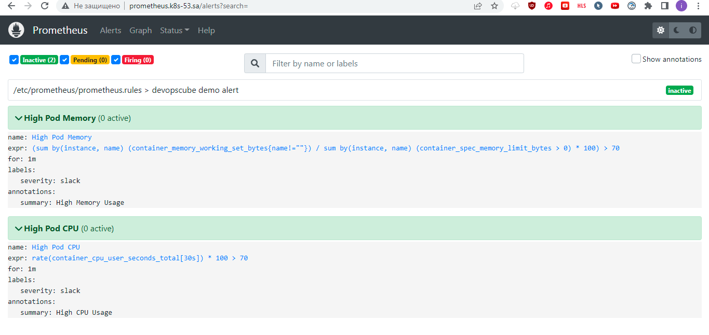
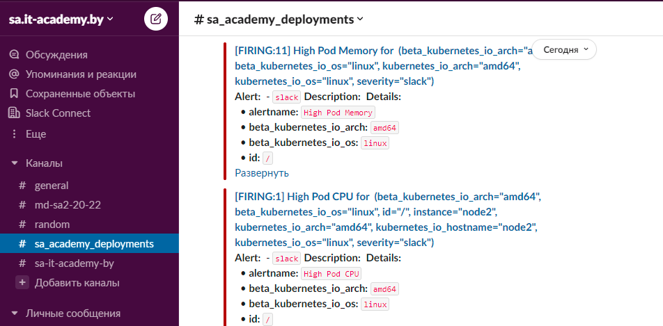
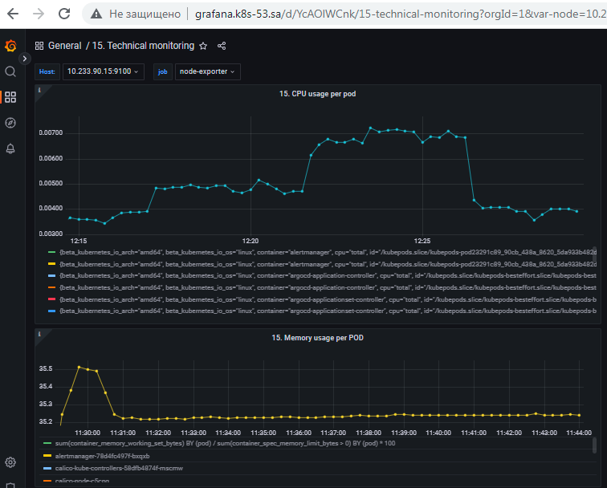

## 15. Technical and service monitoring

### Screenshot of prometheus


### Screenshot of alerts in slack


### Screenshot of grafana dashboard


### Queries
```sql
rate(container_cpu_usage_seconds_total[5m])

sum(container_memory_working_set_bytes) BY (pod) / sum(container_spec_memory_limit_bytes > 0) BY (pod) * 100
```