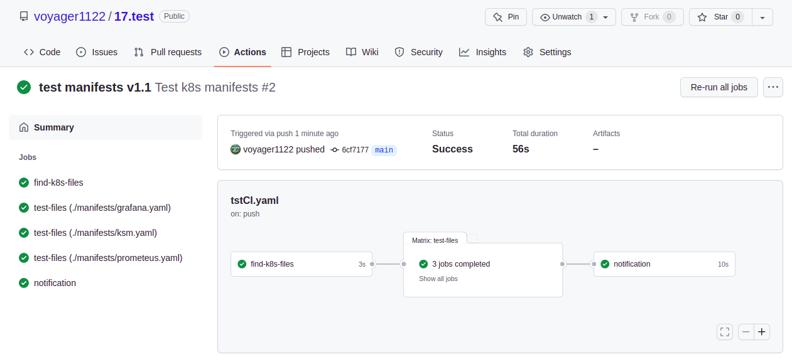
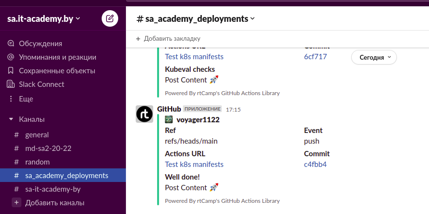

## 17. Testing

### Molecule test
```bash
tst@tst:~/17.test/ht/roles/srv$ molecule test
INFO     default scenario test matrix: dependency, lint, cleanup, destroy, syntax, create, prepare, converge, idempotence, side_effect, verify, cleanup, destroy
INFO     Performing prerun...
INFO     Set ANSIBLE_LIBRARY=/home/tst/.cache/ansible-compat/5e12af/modules:/home/tst/.ansible/plugins/modules:/usr/share/ansible/plugins/modules
INFO     Set ANSIBLE_COLLECTIONS_PATH=/home/tst/.cache/ansible-compat/5e12af/collections:/home/tst/.ansible/collections:/usr/share/ansible/collections
INFO     Set ANSIBLE_ROLES_PATH=/home/tst/.cache/ansible-compat/5e12af/roles:/home/tst/.ansible/roles:/usr/share/ansible/roles:/etc/ansible/roles
INFO     Running default > dependency
WARNING  Skipping, missing the requirements file.
WARNING  Skipping, missing the requirements file.
INFO     Running default > lint
INFO     Lint is disabled.
INFO     Running default > cleanup
WARNING  Skipping, cleanup playbook not configured.
INFO     Running default > destroy
INFO     Sanity checks: 'docker'

PLAY [Destroy] *****************************************************************

TASK [Destroy molecule instance(s)] ********************************************
changed: [localhost] => (item=instance-debian)
changed: [localhost] => (item=instance-centos)

TASK [Wait for instance(s) deletion to complete] *******************************
ok: [localhost] => (item=instance-debian)
ok: [localhost] => (item=instance-centos)

TASK [Delete docker networks(s)] ***********************************************

PLAY RECAP *********************************************************************
localhost                  : ok=2    changed=1    unreachable=0    failed=0    skipped=1    rescued=0    ignored=0

INFO     Running default > syntax

playbook: /home/tst/17.test/ht/roles/srv/molecule/default/converge.yml
INFO     Running default > create

PLAY [Create] ******************************************************************

TASK [Log into a Docker registry] **********************************************
skipping: [localhost] => (item=None) 
skipping: [localhost] => (item=None) 
skipping: [localhost]

TASK [Check presence of custom Dockerfiles] ************************************
ok: [localhost] => (item={'image': 'debian:stable', 'name': 'instance-debian', 'pre_build_image': True})
ok: [localhost] => (item={'image': 'centos:7', 'name': 'instance-centos', 'pre_build_image': True})

TASK [Create Dockerfiles from image names] *************************************
skipping: [localhost] => (item={'image': 'debian:stable', 'name': 'instance-debian', 'pre_build_image': True}) 
skipping: [localhost] => (item={'image': 'centos:7', 'name': 'instance-centos', 'pre_build_image': True}) 

TASK [Discover local Docker images] ********************************************
ok: [localhost] => (item={'changed': False, 'skipped': True, 'skip_reason': 'Conditional result was False', 'item': {'image': 'debian:stable', 'name': 'instance-debian', 'pre_build_image': True}, 'ansible_loop_var': 'item', 'i': 0, 'ansible_index_var': 'i'})
ok: [localhost] => (item={'changed': False, 'skipped': True, 'skip_reason': 'Conditional result was False', 'item': {'image': 'centos:7', 'name': 'instance-centos', 'pre_build_image': True}, 'ansible_loop_var': 'item', 'i': 1, 'ansible_index_var': 'i'})

TASK [Build an Ansible compatible image (new)] *********************************
skipping: [localhost] => (item=molecule_local/debian:stable) 
skipping: [localhost] => (item=molecule_local/centos:7) 

TASK [Create docker network(s)] ************************************************

TASK [Determine the CMD directives] ********************************************
ok: [localhost] => (item={'image': 'debian:stable', 'name': 'instance-debian', 'pre_build_image': True})
ok: [localhost] => (item={'image': 'centos:7', 'name': 'instance-centos', 'pre_build_image': True})

TASK [Create molecule instance(s)] *********************************************
changed: [localhost] => (item=instance-debian)
changed: [localhost] => (item=instance-centos)

TASK [Wait for instance(s) creation to complete] *******************************
FAILED - RETRYING: [localhost]: Wait for instance(s) creation to complete (300 retries left).
changed: [localhost] => (item={'failed': 0, 'started': 1, 'finished': 0, 'ansible_job_id': '615093765158.32841', 'results_file': '/home/tst/.ansible_async/615093765158.32841', 'changed': True, 'item': {'image': 'debian:stable', 'name': 'instance-debian', 'pre_build_image': True}, 'ansible_loop_var': 'item'})
changed: [localhost] => (item={'failed': 0, 'started': 1, 'finished': 0, 'ansible_job_id': '940667782860.32869', 'results_file': '/home/tst/.ansible_async/940667782860.32869', 'changed': True, 'item': {'image': 'centos:7', 'name': 'instance-centos', 'pre_build_image': True}, 'ansible_loop_var': 'item'})

PLAY RECAP *********************************************************************
localhost                  : ok=5    changed=2    unreachable=0    failed=0    skipped=4    rescued=0    ignored=0

INFO     Running default > prepare
WARNING  Skipping, prepare playbook not configured.
INFO     Running default > converge

PLAY [Converge] ****************************************************************

TASK [Gathering Facts] *********************************************************
fatal: [instance-debian]: FAILED! => {"ansible_facts": {}, "changed": false, "failed_modules": {"ansible.legacy.setup": {"ansible_facts": {"discovered_interpreter_python": "/usr/bin/python"}, "failed": true, "module_stderr": "/bin/sh: 1: /usr/bin/python: not found\n", "module_stdout": "", "msg": "The module failed to execute correctly, you probably need to set the interpreter.\nSee stdout/stderr for the exact error", "rc": 127}}, "msg": "The following modules failed to execute: ansible.legacy.setup\n"}
ok: [instance-centos]

TASK [Include srv] *************************************************************

TASK [srv : Check Mount point] *************************************************
skipping: [instance-centos] => (item={'block_used': 8813164, 'uuid': 'N/A', 'size_total': 131043921920, 'block_total': 31993145, 'mount': '/etc/resolv.conf', 'block_available': 23179981, 'size_available': 94945202176, 'fstype': 'ext4', 'inode_total': 8159232, 'options': 'rw,relatime,errors=remount-ro,bind', 'device': '/dev/sda6', 'inode_used': 625138, 'block_size': 4096, 'inode_available': 7534094})
skipping: [instance-centos] => (item={'block_used': 8813164, 'uuid': 'N/A', 'size_total': 131043921920, 'block_total': 31993145, 'mount': '/etc/hosts', 'block_available': 23179981, 'size_available': 94945202176, 'fstype': 'ext4', 'inode_total': 8159232, 'options': 'rw,relatime,errors=remount-ro,bind', 'device': '/dev/sda6', 'inode_used': 625138, 'block_size': 4096, 'inode_available': 7534094})
skipping: [instance-centos] => (item={'block_used': 8813164, 'uuid': 'N/A', 'size_total': 131043921920, 'block_total': 31993145, 'mount': '/etc/hostname', 'block_available': 23179981, 'size_available': 94945202176, 'fstype': 'ext4', 'inode_total': 8159232, 'options': 'rw,relatime,errors=remount-ro,bind', 'device': '/dev/sda6', 'inode_used': 625138, 'block_size': 4096, 'inode_available': 7534094})

TASK [srv : Check RAM] *********************************************************
ok: [instance-centos] => {
    "changed": false,
    "msg": "OK. Available 3.93% of RAM."
}

PLAY RECAP *********************************************************************
instance-centos            : ok=2    changed=0    unreachable=0    failed=0    skipped=1    rescued=0    ignored=0
instance-debian            : ok=0    changed=0    unreachable=0    failed=1    skipped=0    rescued=0    ignored=0

WARNING  Retrying execution failure 2 of: ansible-playbook --inventory /home/tst/.cache/molecule/srv/default/inventory --skip-tags molecule-notest,notest /home/tst/17.test/ht/roles/srv/molecule/default/converge.yml
CRITICAL Ansible return code was 2, command was: ['ansible-playbook', '--inventory', '/home/tst/.cache/molecule/srv/default/inventory', '--skip-tags', 'molecule-notest,notest', '/home/tst/17.test/ht/roles/srv/molecule/default/converge.yml']
WARNING  An error occurred during the test sequence action: 'converge'. Cleaning up.
INFO     Running default > cleanup
WARNING  Skipping, cleanup playbook not configured.
INFO     Running default > destroy

PLAY [Destroy] *****************************************************************

TASK [Destroy molecule instance(s)] ********************************************
changed: [localhost] => (item=instance-debian)
changed: [localhost] => (item=instance-centos)

TASK [Wait for instance(s) deletion to complete] *******************************
changed: [localhost] => (item=instance-debian)
FAILED - RETRYING: [localhost]: Wait for instance(s) deletion to complete (300 retries left).
changed: [localhost] => (item=instance-centos)

TASK [Delete docker networks(s)] ***********************************************

PLAY RECAP *********************************************************************
localhost                  : ok=2    changed=2    unreachable=0    failed=0    skipped=1    rescued=0    ignored=0

INFO     Pruning extra files from scenario ephemeral directory
```

### Kubeval action

#### Github actions



#### Slack notification



#### URL to github action file
https://github.com/voyager1122/17.test/actions/runs/2495859008/workflow

#### CI action yaml  
```yaml
name: Test k8s manifests

on: [push, pull_request]

jobs:
  find-k8s-files:
    runs-on: ubuntu-latest
    outputs:
      files: ${{ env.files }}
    steps:
      - name: Get k8s files
        uses: actions/checkout@v2
        id: files
      - run: |
              FILES="$(ls -d ./manifests/* | jq -R -s -c 'split("\n")[:-1]')"
              echo "files=`echo -n $FILES`" >> $GITHUB_ENV
  test-files:
    needs: find-k8s-files
    runs-on: ubuntu-latest
    strategy:
      matrix:
        k8s-files: ${{fromJson(needs.find-k8s-files.outputs.files)}}
      fail-fast: false
    steps:
    - uses: actions/checkout@v2 
    - name: Test files with kubeval
      uses: instrumenta/kubeval-action@master
      with: 
       files: ${{matrix.k8s-files}}
  notification:
    needs: test-files
    runs-on: ubuntu-latest
    steps:
    - name: Slack Notification
      uses: rtCamp/action-slack-notify@v2
      env:
        SLACK_CHANNEL: '#sa_academy_deployments'
        SLACK_COLOR: ${{ job.status }}
        SLACK_ICON: https://github.com/rtCamp.png?size=48
        SLACK_MESSAGE: 'Post Content :rocket:'
        SLACK_TITLE: 'Well done!'
        SLACK_USERNAME: GitHub
        SLACK_WEBHOOK: ${{ secrets.SLACK_WEBHOOK }}
```