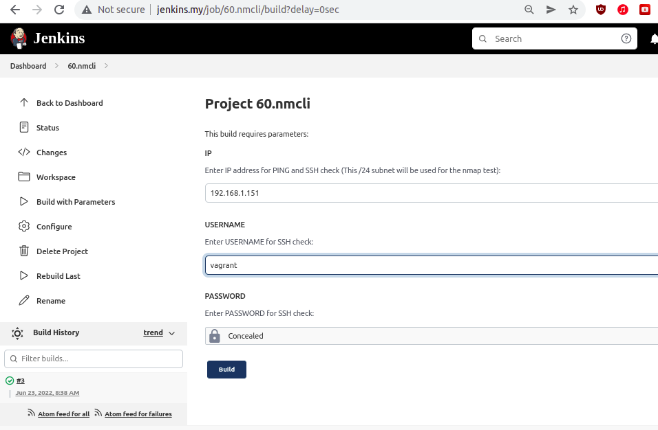

# 19.Jenkins.Routine

## Output of task:
```log
Started by user admin admin
Running as SYSTEM
Building on the built-in node in workspace /var/lib/jenkins/workspace/60.nmcli
[60.nmcli] $ /bin/bash /tmp/jenkins15671779450933079861.sh
***Start ping check***
PING 192.168.1.151 (192.168.1.151) 56(84) bytes of data.
64 bytes from 192.168.1.151: icmp_seq=1 ttl=64 time=0.492 ms
64 bytes from 192.168.1.151: icmp_seq=2 ttl=64 time=0.392 ms
64 bytes from 192.168.1.151: icmp_seq=3 ttl=64 time=0.464 ms
64 bytes from 192.168.1.151: icmp_seq=4 ttl=64 time=0.755 ms

--- 192.168.1.151 ping statistics ---
4 packets transmitted, 4 received, 0% packet loss, time 3001ms
rtt min/avg/max/mdev = 0.392/0.525/0.755/0.140 ms
[60.nmcli] $ /bin/bash /tmp/jenkins7515911526797708952.sh
***Start ssh check***
/tmp/jenkins7515911526797708952.sh: line 3: sshpass: command not found
Host is not available via ssh
[60.nmcli] $ /bin/bash /tmp/jenkins4927357560279742981.sh
***Start installing nmap***
Loaded plugins: fastestmirror
Loading mirror speeds from cached hostfile
 * base: mirror.datacenter.by
 * epel: fedora-epel.koyanet.lv
 * extras: mirror.datacenter.by
 * updates: mirror.datacenter.by
Package 2:nmap-6.40-19.el7.x86_64 already installed and latest version
Nothing to do
[60.nmcli] $ /bin/bash /tmp/jenkins13559877501498056922.sh
***Checks all online hosts***

Starting Nmap 6.40 ( http://nmap.org ) at 2022-06-23 08:38 UTC
Nmap scan report for 192.168.1.13
Host is up (0.0080s latency).
Nmap scan report for tst (192.168.1.14)
Host is up (0.0021s latency).
Nmap scan report for jenkins.my (192.168.1.150)
Host is up (0.00020s latency).
Nmap scan report for 192.168.1.151
Host is up (0.0021s latency).
Nmap scan report for 192.168.1.244
Host is up (0.013s latency).
Nmap done: 256 IP addresses (5 hosts up) scanned in 3.05 seconds
[60.nmcli] $ /bin/bash /tmp/jenkins15704742272865749404.sh
***Start uninstalling nmap***
Loaded plugins: fastestmirror
Resolving Dependencies
--> Running transaction check
---> Package nmap.x86_64 2:6.40-19.el7 will be erased
--> Finished Dependency Resolution

Dependencies Resolved

================================================================================
 Package        Arch             Version                  Repository       Size
================================================================================
Removing:
 nmap           x86_64           2:6.40-19.el7            @base            16 M

Transaction Summary
================================================================================
Remove  1 Package

Installed size: 16 M
Downloading packages:
Running transaction check
Running transaction test
Transaction test succeeded
Running transaction
  Erasing    : 2:nmap-6.40-19.el7.x86_64                                    1/1 
  Verifying  : 2:nmap-6.40-19.el7.x86_64                                    1/1 

Removed:
  nmap.x86_64 2:6.40-19.el7                                                     

Complete!
[60.nmcli] $ /bin/bash /tmp/jenkins5835630514487981538.sh
***Print list of host***
IP adresses of hosts:
192.168.1.13
tst
jenkins.my
192.168.1.151
192.168.1.244
Finished: SUCCESS
```

## Job:
