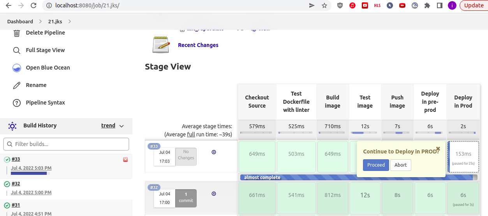
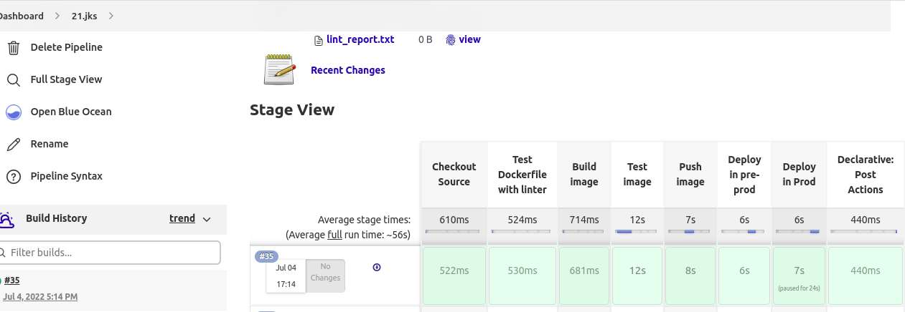
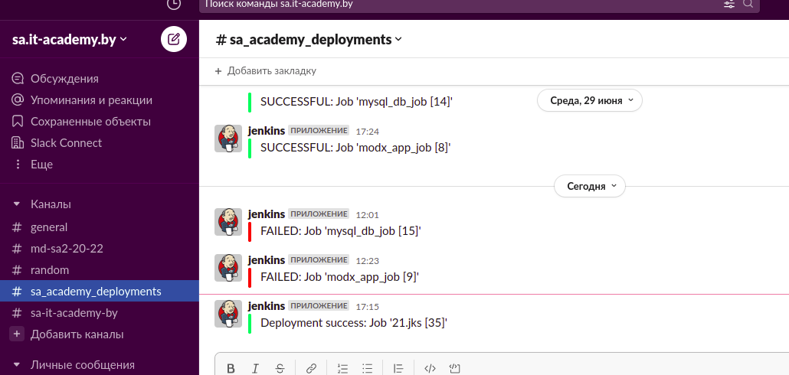

# 21. Jenkins. Docker and Pod

## Screenshot of stages








## Repo with Jenkinsfile and Dockerfile (this report also attached)

https://github.com/voyager1122/09.Docker.git

## Console Output

```log
Started by user admin
[Pipeline] Start of Pipeline
[Pipeline] node
Running on Jenkins in /var/lib/jenkins/workspace/21.jks
[Pipeline] {
[Pipeline] withEnv
[Pipeline] {
[Pipeline] stage
[Pipeline] { (Checkout Source)
[Pipeline] git
The recommended git tool is: NONE
No credentials specified
 > git rev-parse --resolve-git-dir /var/lib/jenkins/workspace/21.jks/.git # timeout=10
Fetching changes from the remote Git repository
 > git config remote.origin.url https://github.com/voyager1122/09.Docker.git # timeout=10
Fetching upstream changes from https://github.com/voyager1122/09.Docker.git
 > git --version # timeout=10
 > git --version # 'git version 2.25.1'
 > git fetch --tags --force --progress -- https://github.com/voyager1122/09.Docker.git +refs/heads/*:refs/remotes/origin/* # timeout=10
 > git rev-parse refs/remotes/origin/main^{commit} # timeout=10
Checking out Revision 612f86dd49871ebb7588e55da537be66a6faaf47 (refs/remotes/origin/main)
 > git config core.sparsecheckout # timeout=10
 > git checkout -f 612f86dd49871ebb7588e55da537be66a6faaf47 # timeout=10
 > git branch -a -v --no-abbrev # timeout=10
 > git branch -D main # timeout=10
 > git checkout -b main 612f86dd49871ebb7588e55da537be66a6faaf47 # timeout=10
Commit message: "modify yaml"
 > git rev-list --no-walk 612f86dd49871ebb7588e55da537be66a6faaf47 # timeout=10
[Pipeline] }
[Pipeline] // stage
[Pipeline] stage
[Pipeline] { (Test Dockerfile with linter)
[Pipeline] script
[Pipeline] {
[Pipeline] echo
Linting Dockerfile...
[Pipeline] sh
+ hadolint --ignore DL3018 --ignore DL3013 --ignore DL3019 --ignore DL4003 Dockerfile
[Pipeline] archiveArtifacts
Archiving artifacts
[Pipeline] }
[Pipeline] // script
[Pipeline] }
[Pipeline] // stage
[Pipeline] stage
[Pipeline] { (Build image)
[Pipeline] script
[Pipeline] {
[Pipeline] isUnix
[Pipeline] withEnv
[Pipeline] {
[Pipeline] sh
+ docker build -t voyager1122/jks21:latest .
Sending build context to Docker daemon  162.3kB

Step 1/7 : FROM python:3-alpine
 ---> 2c167788a673
Step 2/7 : RUN apk update && apk add python3 && apk add curl && apk add bash
 ---> Using cache
 ---> f239d0f1071a
Step 3/7 : RUN pip3 install --no-cache-dir flask
 ---> Using cache
 ---> 8b2013ca8e29
Step 4/7 : COPY demosrv.py /
 ---> Using cache
 ---> ee15602b43bc
Step 5/7 : COPY test.sh /
 ---> Using cache
 ---> 2f932a364a3c
Step 6/7 : ENTRYPOINT [ "/usr/local/bin/python3", "/demosrv.py" ]
 ---> Using cache
 ---> 933988d3431e
Step 7/7 : EXPOSE 5000
 ---> Using cache
 ---> 6050c75d1e4d
Successfully built 6050c75d1e4d
Successfully tagged voyager1122/jks21:latest
[Pipeline] }
[Pipeline] // withEnv
[Pipeline] }
[Pipeline] // script
[Pipeline] }
[Pipeline] // stage
[Pipeline] stage
[Pipeline] { (Test image)
[Pipeline] script
[Pipeline] {
[Pipeline] isUnix
[Pipeline] withEnv
[Pipeline] {
[Pipeline] sh
+ docker inspect -f . voyager1122/jks21:latest
.
[Pipeline] }
[Pipeline] // withEnv
[Pipeline] withDockerContainer
Jenkins does not seem to be running inside a container
$ docker run -t -d -u 127:135 --entrypoint= -w /var/lib/jenkins/workspace/21.jks -v /var/lib/jenkins/workspace/21.jks:/var/lib/jenkins/workspace/21.jks:rw,z -v /var/lib/jenkins/workspace/21.jks@tmp:/var/lib/jenkins/workspace/21.jks@tmp:rw,z -e ******** -e ******** -e ******** -e ******** -e ******** -e ******** -e ******** -e ******** -e ******** -e ******** -e ******** -e ******** -e ******** -e ******** -e ******** -e ******** -e ******** -e ******** -e ******** -e ******** -e ******** -e ******** -e ******** -e ******** -e ******** -e ******** -e ******** -e ******** -e ******** voyager1122/jks21:latest cat
$ docker top 6c43819a6e492fd9666fa3b7f177afcecedbd7f37a05136aece4848391d45ace -eo pid,comm
[Pipeline] {
[Pipeline] sh
+ ./test.sh
 * Running on all addresses (0.0.0.0)
   WARNING: This is a development server. Do not use it in a production deployment.
 * Running on http://127.0.0.1:5000
 * Running on http://172.17.0.2:5000 (Press CTRL+C to quit)
 * Restarting with stat
 * Debugger is active!
 * Debugger PIN: 637-953-693
  % Total    % Received % Xferd  Average Speed   Time    Time     Time  Current
                                 Dload  Upload   Total   Spent    Left  Speed

  0     0    0     0    0     0      0      0 --:--:-- --:--:-- --:--:--     0127.0.0.1 - - [04/Jul/2022 14:14:32] "GET /companies HTTP/1.1" 200 -

100    68  100    68    0     0  33431      0 --:--:-- --:--:-- --:--:-- 68000
[Pipeline] }
$ docker stop --time=1 6c43819a6e492fd9666fa3b7f177afcecedbd7f37a05136aece4848391d45ace
$ docker rm -f 6c43819a6e492fd9666fa3b7f177afcecedbd7f37a05136aece4848391d45ace
[Pipeline] // withDockerContainer
[Pipeline] archiveArtifacts
Archiving artifacts
[Pipeline] catchError
[Pipeline] {
[Pipeline] sh
+ grep Company image.log
[{"id": 1, "name": "Company One"}, {"id": 2, "name": "Company Two"}]
[Pipeline] }
[Pipeline] // catchError
[Pipeline] }
[Pipeline] // script
[Pipeline] }
[Pipeline] // stage
[Pipeline] stage
[Pipeline] { (Push image)
[Pipeline] script
[Pipeline] {
[Pipeline] catchError
[Pipeline] {
[Pipeline] withEnv
[Pipeline] {
[Pipeline] withDockerRegistry
$ docker login -u voyager1122 -p ******** https://index.docker.io/v1/
WARNING! Using --password via the CLI is insecure. Use --password-stdin.
WARNING! Your password will be stored unencrypted in /var/lib/jenkins/workspace/21.jks@tmp/bef699f0-8f6c-4b44-be0a-66a8d2ca80a0/config.json.
Configure a credential helper to remove this warning. See
https://docs.docker.com/engine/reference/commandline/login/#credentials-store

Login Succeeded
[Pipeline] {
[Pipeline] isUnix
[Pipeline] withEnv
[Pipeline] {
[Pipeline] sh
+ docker tag voyager1122/jks21:latest voyager1122/jks21:latest
[Pipeline] }
[Pipeline] // withEnv
[Pipeline] isUnix
[Pipeline] withEnv
[Pipeline] {
[Pipeline] sh
+ docker push voyager1122/jks21:latest
The push refers to repository [docker.io/voyager1122/jks21]
f6ef7eed1862: Preparing
9ffe6e6fd60c: Preparing
39d64b64e3d5: Preparing
5b7b8fbe30fd: Preparing
b02dd59d34c0: Preparing
0b800261971d: Preparing
16e3ab2d4dee: Preparing
fbd7d5451c69: Preparing
4fc242d58285: Preparing
0b800261971d: Waiting
16e3ab2d4dee: Waiting
fbd7d5451c69: Waiting
4fc242d58285: Waiting
b02dd59d34c0: Layer already exists
9ffe6e6fd60c: Layer already exists
5b7b8fbe30fd: Layer already exists
39d64b64e3d5: Layer already exists
f6ef7eed1862: Layer already exists
fbd7d5451c69: Layer already exists
16e3ab2d4dee: Layer already exists
0b800261971d: Layer already exists
4fc242d58285: Layer already exists
latest: digest: sha256:3a13884041094fd08597f7eb97e18125c197439a136adb1f7d97665135adc5eb size: 2205
[Pipeline] }
[Pipeline] // withEnv
[Pipeline] }
[Pipeline] // withDockerRegistry
[Pipeline] }
[Pipeline] // withEnv
[Pipeline] }
[Pipeline] // catchError
[Pipeline] }
[Pipeline] // script
[Pipeline] }
[Pipeline] // stage
[Pipeline] stage
[Pipeline] { (Deploy in pre-prod)
[Pipeline] script
[Pipeline] {
[Pipeline] catchError
[Pipeline] {
[Pipeline] sh
+ kubectl apply -f ./jks21.yaml --namespace=pre-prod
service/jks21 created
deployment.apps/jks21 created
[Pipeline] sleep
Sleeping for 5 sec
[Pipeline] timeout
Timeout set to expire in 3 min 0 sec
[Pipeline] {
[Pipeline] waitUntil
[Pipeline] {
[Pipeline] script
[Pipeline] {
[Pipeline] sh
+ kubectl get pods --namespace pre-prod --no-headers -o custom-columns=:status.phase
[Pipeline] }
[Pipeline] // script
[Pipeline] }
[Pipeline] // waitUntil
[Pipeline] }
[Pipeline] // timeout
[Pipeline] }
[Pipeline] // catchError
[Pipeline] }
[Pipeline] // script
[Pipeline] }
[Pipeline] // stage
[Pipeline] stage
[Pipeline] { (Deploy in Prod)
[Pipeline] script
[Pipeline] {
[Pipeline] catchError
[Pipeline] {
[Pipeline] input
Continue to Deploy in PROD?
Proceed or Abort
Approved by admin
[Pipeline] echo
===== Start deploy in PROD =====
[Pipeline] sh
+ kubectl apply -f ./jks21.yaml --namespace=prod
service/jks21 unchanged
deployment.apps/jks21 configured
[Pipeline] sleep
Sleeping for 5 sec
[Pipeline] timeout
Timeout set to expire in 3 min 0 sec
[Pipeline] {
[Pipeline] waitUntil
[Pipeline] {
[Pipeline] script
[Pipeline] {
[Pipeline] sh
+ kubectl get pods --namespace prod --no-headers -o custom-columns=:status.phase
[Pipeline] }
[Pipeline] // script
[Pipeline] }
[Pipeline] // waitUntil
[Pipeline] }
[Pipeline] // timeout
[Pipeline] sh
+ kubectl delete -f ./jks21.yaml --namespace=pre-prod
service "jks21" deleted
deployment.apps "jks21" deleted
[Pipeline] }
[Pipeline] // catchError
[Pipeline] }
[Pipeline] // script
[Pipeline] }
[Pipeline] // stage
[Pipeline] stage
[Pipeline] { (Declarative: Post Actions)
[Pipeline] slackSend
Slack Send Pipeline step running, values are - baseUrl: <empty>, teamDomain: sa-itacademy-by, channel: #sa_academy_deployments, color: #00FF00, botUser: false, tokenCredentialId: slack_token2, notifyCommitters: false, iconEmoji: <empty>, username: <empty>, timestamp: <empty>
[Pipeline] }
[Pipeline] // stage
[Pipeline] }
[Pipeline] // withEnv
[Pipeline] }
[Pipeline] // node
[Pipeline] End of Pipeline
Finished: SUCCESS
```