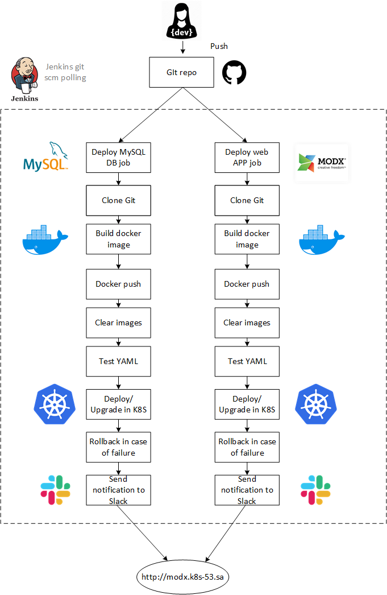

# Project report

### Project's reporter: Ivan Fanchenko

### Group number: md-sa2-20-22

---

## Description of application for deployment:

- Application: MODx 

- Programming language: PHP

- DB: MySQL 5.7

- Web server: Apache  2.4.38

---

## Pipeline. HLD:

---

## Technologies which were used in project:

### Orchestration: 
Kubernetes

### Automation tools:
Jenkins

### SCM:
Github

### Notification:
Slack

### Infrastructure:
Virtual hosts in it-academy.by. Jenkins run on personal host.

## CI description:

Jenkins polls the project's Git repository once an hour on weekly working days. 
If a new commit is detected, Jenkins start a job. 
The first time the pipeline is started manually.

### Job Deploy Mysql
- Stage "**Cloning Git**": cloning git branch to localhost.
- Stage "**Building image**": build image from ./mysql/Dockerfile
- Stage "**Push Image to DockerHub**": push image to dockerhub with image name and build id.
- Stage "**Remove Unused docker image**": remove image to save disk space.
- Stage "**Testing YAML syntax**": Testing manifests by kubeval.
- Stage "**Deploy/Upgrade in cluster**": Deploy in k8s cluster if testing yaml success.

Finish stage - send notification to Slack.

### Job Deploy App

App's version number can  be controlled in Dockerfile (environment virable MODX_VERSION 2.7.x)
When docker image is building a script will download source code of the requested version into docker image.

- Stage "**Cloning Git**": cloning git branch to localhost.
- Stage "**Building image**": build image from ./Dockerfile
- Stage "**Push Image to DockerHub**": push image to dockerhub with image name and build id.
- Stage "**Remove Unused docker image**": remove image to save disk space.
- Stage "**Testing YAML syntax**": Testing manifests by kubeval.
- Stage "**Deploy/Upgrade in cluster**": Deploy in k8s cluster if testing yaml success.

Finish stage - send notification to Slack.

## Rollback flow description and implementation:

If the "**Deploy/Upgrade**" stage fails, then the "**Rollback**" stage is executed, which rolls back the deployment to the previous image.

## Links:

Project repository: https://github.com/voyager1122/modx.git