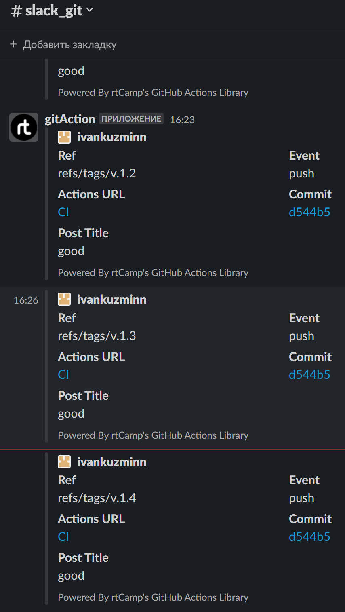

# Homework for 08.DockerCompose

## Links
[>> GitHub Container Registry <<](https://github.com/users/ivankuzminn/packages/container/package/docker-repo)
[>> Docker Hub Registry <<](https://hub.docker.com/repository/docker/ivankuzminn/docker-repo/tags?page=1&ordering=last_updated)

## Slack notification screenshot


## GitHub Action
```bash
name: CI
on:
  push:
    tags:
      - "v.*" 
jobs:
  push_to_registries:
    name: Pushing Docker image
    runs-on: ubuntu-latest
    permissions:
      packages: write
      contents: read
    steps:
      - name: Check repo
        uses: actions/checkout@v2

      - name: Login to GitHub Container Registry
        uses: docker/login-action@v2
        with:
          registry: ghcr.io
          username: ${{ github.actor }}
          password: ${{ secrets.tokensa }}
      - name: Login to Docker Hub
        uses: docker/login-action@v2
        with:
          username: ${{ secrets.DOCKERHUB_USERNAME }}
          password: ${{ secrets.DOCKERHUB_TOKEN }}
      - name: Build and push Docker images
        uses: docker/build-push-action@v4
        with:
          context: .
          push: true
          tags: |
            ghcr.io/ivankuzminn/docker-repo:${{ github.ref_name }}
            ivankuzminn/docker-repo:${{ github.ref_name }}
      - name: Slack good
        uses: rtCamp/action-slack-notify@v2
        if: success()
        env:
          SLACK_CHANNEL: slack_git
          SLACK_COLOR: 'green'
          SLACK_ICON: https://github.com/rtCamp.png?size=48
          SLACK_MESSAGE: 'good'
          SLACK_TITLE: Post Title
          SLACK_USERNAME: gitAction
          SLACK_WEBHOOK: ${{ secrets.SLACK_WEBHOOK }}
      - name: slack bad
        uses: rtCamp/action-slack-notify@v2
        if: failure()
        env:
          SLACK_CHANNEL: slack_git
          SLACK_COLOR: 'red'
          SLACK_ICON: https://github.com/rtCamp.png?size=48
          SLACK_MESSAGE: 'bad'
          SLACK_TITLE: Post Title
          SLACK_USERNAME: gitAction
          SLACK_WEBHOOK: ${{ secrets.SLACK_WEBHOOK }}
```