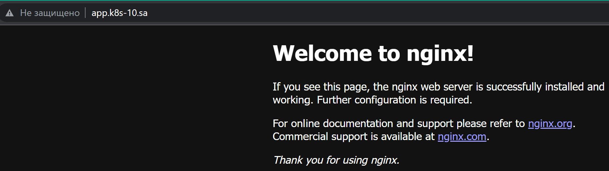

# Homework for 11.K8s.Basic objects


## deploy screenshot


## ingress screenshot


## result screenshot



## YAML file:
```bash
---
apiVersion: apps/v1
kind: Deployment
metadata:
  name: nginx-webserver
spec:
  selector:
    matchLabels:
      app: nginx
  replicas: 3
  strategy:
    type: RollingUpdate
    rollingUpdate:
      maxSurge: "33%"
      maxUnavailable: "0%"
  template:
    metadata:
      labels:
        app: nginx
    spec:
      containers:
      - name: nginx
        image: nginx:latest
        ports:
        - containerPort: 80
        resources:
          requests:
            cpu: 51m
            memory: 50Mi
          limits:
            cpu: 100m
            memory: 100Mi
---
apiVersion: v1
kind: Service
metadata:
  name: nginx-web-service
  labels:
    run: nginx-web-service
spec:
        #type: LoadBalancer
  ports:
  - port: 80
    protocol: TCP
  selector:
    app: nginx
---
apiVersion: networking.k8s.io/v1
kind: Ingress
metadata:
  name: ingress-sa
  annotations:
    kubernetes.io/ingress.class: nginx
    nginx.ingress.kubernetes.io/server-alias: "app.k8s-10.sa"
spec:
  rules:
    - host: app.k8s-10.sa
      http:
        paths:
          - path: /
            pathType: Prefix
            backend:
              service:
                name: nginx-web-service
                port:
                  number: 80
```
