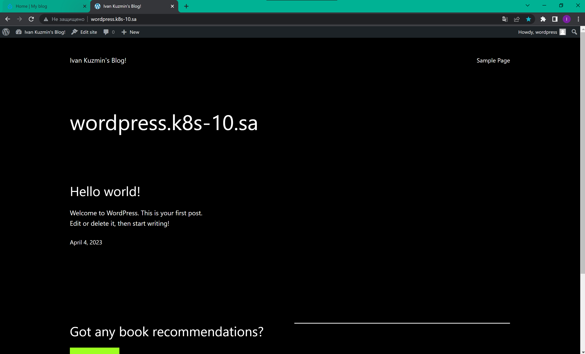
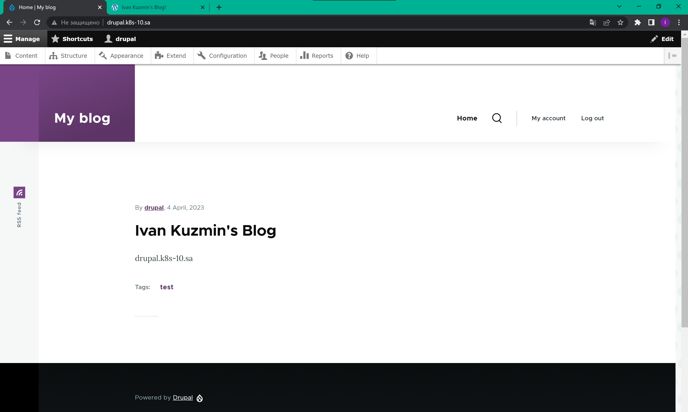
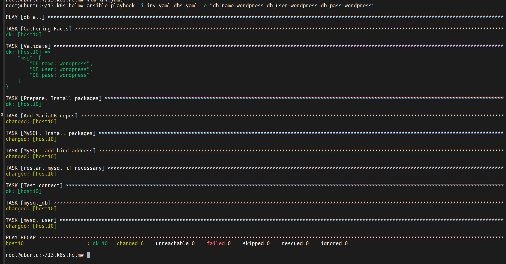
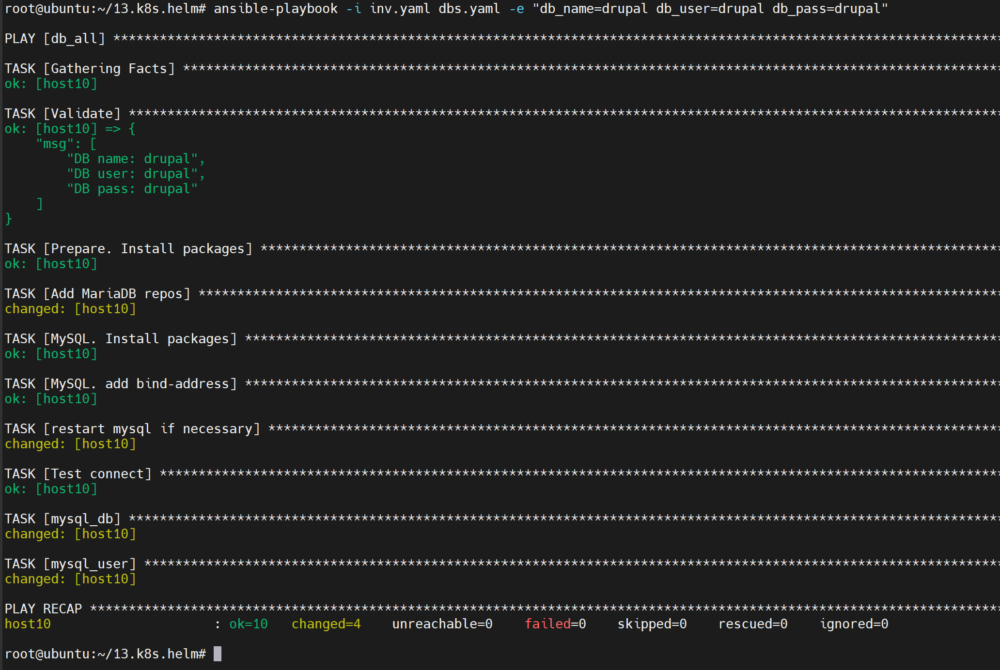

# Homework for 13.K8s.Helm

## wordpress screenshot


## drupal screenshot


## db_wp ansible screenshot


## db_drupal ansible screenshot


## ingress YAML file: 
```bash
---
apiVersion: networking.k8s.io/v1
kind: Ingress
metadata:
  name: ingress-wordpress
  annotations:
    kubernetes.io/ingress.class: nginx
spec:
  rules:
    - host: wordpress.k8s-10.sa
      http:
        paths:
          - path: /
            pathType: Prefix
            backend:
              service:
                name: wordpress
                port:
                  number: 80
---
apiVersion: networking.k8s.io/v1
kind: Ingress
metadata:
  name: ingress-drupal
  annotations:
    kubernetes.io/ingress.class: nginx
spec:
  rules:
    - host: drupal.k8s-10.sa
      http:
        paths:
          - path: /
            pathType: Prefix
            backend:
              service:
                name: drupal
                port:
                  number: 80

```

## nfs-subdir-external-provisioner YAML file:
```bash
---
apiVersion: helm.cattle.io/v1
kind: HelmChart
metadata:
  name: nfs
  namespace: default
spec:
  chart: nfs-subdir-external-provisioner
  repo: https://kubernetes-sigs.github.io/nfs-subdir-external-provisioner
  targetNamespace: default
  set:
    nfs.server: 192.168.37.105
    nfs.path: /mnt/IT-Academy/nfs-data/sa2-23-23/Ivan_Kuzmin/
    storageClass.name: nfs
---
apiVersion: storage.k8s.io/v1
kind: StorageClass
metadata:
  name: nfs-wordpress
provisioner: cluster.local/nfs-nfs-subdir-external-provisioner
parameters:
  onDelete: "retain"
  pathPattern: "/wordpress/"
---
apiVersion: storage.k8s.io/v1
kind: StorageClass
metadata:
  name: nfs-drupal
provisioner: cluster.local/nfs-nfs-subdir-external-provisioner
parameters:
  onDelete: "retain"
  pathPattern: "/drupal/"

```

## Ansible playbook file:
```bash
---
- hosts: db_all
  vars:
    app_packages:
      - mariadb-server
      - mariadb-client
      - python3-pymysql
      - python3-mysqldb
    db_name: "{{ name_db | default('test') }}"
    db_user: "{{ user_db | default('test') }}"
    db_pass: "{{ pass_db | default('test') }}"
  pre_tasks:
  - name: Validate
    debug:
      msg:
       - "DB name: {{ db_name }}"
       - "DB user: {{ db_user }}"
       - "DB pass: {{ db_pass }}"

  - name: Prepare. Install packages
    apt:
      name: "curl"
      state: latest
      update_cache: yes
    tags: install
  tasks:
  - name: Add MariaDB repos
    shell: |
      curl -LsS -O https://downloads.mariadb.com/MariaDB/mariadb_repo_setup
      bash mariadb_repo_setup --mariadb-server-version=10.6
    tags: install
  - name: MySQL. Install packages
    apt:
      name: "{{ app_packages }}"
      state: latest
    environment:
      DEBIAN_FRONTEND: noninteractive
    tags: install

  - name: MySQL. add bind-address
    ini_file:
      dest: /etc/mysql/my.cnf
      section: mysqld
      option: "bind-address"
      value: "{{ ansible_host }}"

  - name: restart mysql if necessary
    command: service mysql restart

  - name: Test connect
    wait_for:
      host: "{{ ansible_host }}"
      port: 3306
      timeout: 3

  - mysql_db:
      name: "{{ db_name }}"
      state: absent
      login_unix_socket: /var/run/mysqld/mysqld.sock
    tags: never

  - mysql_db:
      name: "{{ db_name }}"
      encoding: utf8
      login_unix_socket: /var/run/mysqld/mysqld.sock

  - mysql_user:
      name: "{{ db_user }}"
      host: "%"
      password: "{{ db_pass }}"
      priv: "{{ db_name }}.*:ALL"
      login_unix_socket: /var/run/mysqld/mysqld.sock
    no_log: yes  

```

## History
```bash
  root@ubuntu:~/13.k8s.helm# curl -fsSL -o get_helm.sh https://raw.githubusercontent.com/helm/helm/main/scripts/get-helm-3
  root@ubuntu:~/13.k8s.helm# chmod 700 get_helm.sh
  root@ubuntu:~/13.k8s.helm# ./get_helm.sh
Downloading https://get.helm.sh/helm-v3.11.2-linux-amd64.tar.gz
Verifying checksum... Done.
Preparing to install helm into /usr/local/bin
helm installed into /usr/local/bin/helm
  root@ubuntu:~/13.k8s.helm# helm repo add bitnami https://charts.bitnami.com/bitnami
WARNING: Kubernetes configuration file is group-readable. This is insecure. Location: /root/.kube/config
WARNING: Kubernetes configuration file is world-readable. This is insecure. Location: /root/.kube/config
"bitnami" has been added to your repositories
root@ubuntu:~/13.k8s.helm# helm list
WARNING: Kubernetes configuration file is group-readable. This is insecure. Location: /root/.kube/config
WARNING: Kubernetes configuration file is world-readable. This is insecure. Location: /root/.kube/config
NAME    NAMESPACE       REVISION        UPDATED STATUS  CHART   APP VERSION
  root@ubuntu:~/13.k8s.helm# helm repo update
WARNING: Kubernetes configuration file is group-readable. This is insecure. Location: /root/.kube/config
WARNING: Kubernetes configuration file is world-readable. This is insecure. Location: /root/.kube/config
Hang tight while we grab the latest from your chart repositories...
...Successfully got an update from the "bitnami" chart repository
Update Complete. ⎈Happy Helming!⎈

```