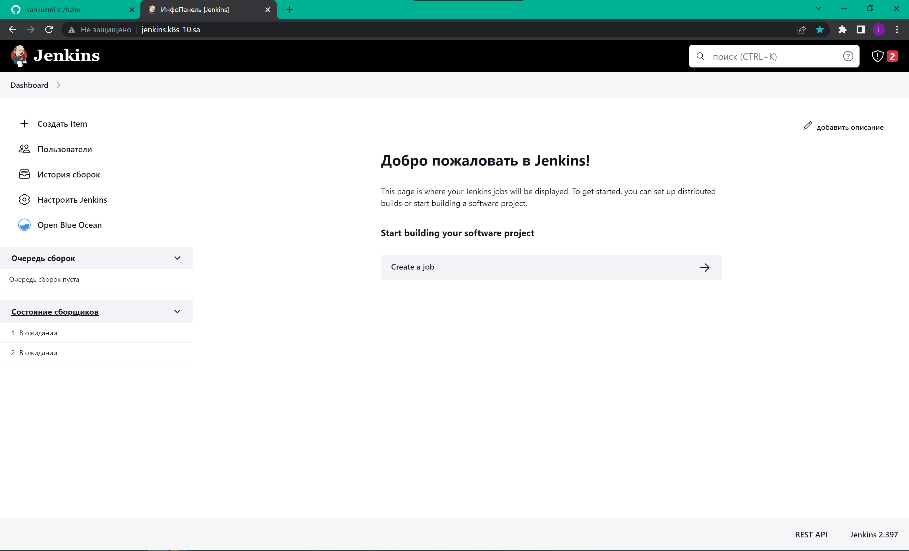
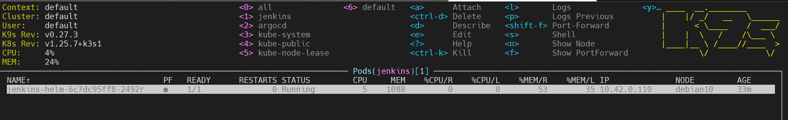

# Homework for 14.K8s.Application deployment

## Helm repository [GITHUB](https://github.com/ivankuzminn/helm) ##

## Jenkins web screenshot


## Jenkins k9s screenshot


## --dry-run result: 
```bash
root@ubuntu:~/13.k8s.helm/helm/helm-releases# helm install jenkins --dry-run jenkins-0.1.0.tgz
WARNING: Kubernetes configuration file is group-readable. This is insecure. Location: /root/.kube/config
WARNING: Kubernetes configuration file is world-readable. This is insecure. Location: /root/.kube/config
NAME: jenkins
LAST DEPLOYED: Thu Apr  6 12:55:40 2023
NAMESPACE: default
STATUS: pending-install
REVISION: 1
TEST SUITE: None
HOOKS:
MANIFEST:
---
# Source: jenkins/templates/deployment.yaml
apiVersion: v1
kind: Namespace
metadata:
  name: jenkins
---
# Source: jenkins/templates/deployment.yaml
apiVersion: v1
kind: ConfigMap
metadata:
  name: basic-security
  namespace: jenkins
data:
  basic-security.groovy: |
    #!groovy
    import jenkins.model.*
    import hudson.security.*
    def instance = Jenkins.getInstance()
    println "--> creating local user 'admin'"
    def password = System.getenv("PASS")
    def hudsonRealm = new HudsonPrivateSecurityRealm(false)`
    hudsonRealm.createAccount('admin',"admin")
    instance.setSecurityRealm(hudsonRealm)
    def strategy = new FullControlOnceLoggedInAuthorizationStrategy()
    strategy.setAllowAnonymousRead(true)
    instance.setAuthorizationStrategy(strategy)
    instance.save()
---
# Source: jenkins/templates/deployment.yaml
apiVersion: v1
kind: ConfigMap
metadata:
  name: jenkins-config
  namespace: jenkins
data:
  jenkins.yaml: |
        jenkins:
          numExecutors: 2
          clouds:
          - kubernetes:
              containerCapStr: "10"
              maxRequestsPerHostStr: "32"
              jenkinsUrl: "http://jenkins:8080"
              name: "kubernetes"
              namespace: "jenkins"
              skipTlsVerify: true
        credentials:
          system:
            domainCredentials:
            - credentials:
              - usernamePassword:
                  description: "Githubuser"
                  id: "some_randome"
                  password: "XXXXXXXXXXX"
                  scope: GLOBAL
                  username: "git_hub_user"
        unclassified:
          location:
            adminAddress: "ivan.kuzmin.bel@gmail.com"
            url: "http://jenkins.k8s-10.sa/"
          shell:
            shell: "/bin/bash"
---
# Source: jenkins/templates/deployment.yaml
apiVersion: rbac.authorization.k8s.io/v1
kind: ClusterRoleBinding
metadata:
  name: jenkins-helm
  namespace: jenkins
roleRef:
  apiGroup: rbac.authorization.k8s.io
  kind: ClusterRole
  name: cluster-admin
subjects:
- kind: ServiceAccount
  name: default
  namespace: jenkins
---
# Source: jenkins/templates/service.yaml
apiVersion: v1
kind: Service
metadata:
  name: jenkins-helm
  namespace: jenkins
spec:
  ports:
    - name: master
      port: 8080
      targetPort: 8080
    - name: slave
      port: 50000
      targetPort: 50000
  selector:
    app:  jenkins-helm
---
# Source: jenkins/templates/deployment.yaml
apiVersion: apps/v1
kind: Deployment
metadata:
  name: jenkins-helm
  namespace: jenkins
spec:
  replicas:
  selector:
    matchLabels:
      app: jenkins-helm
  template:
    metadata:
      labels:
        app: jenkins-helm
    spec:
      containers:
        - name: jenkins-helm
          image: "jfrog.it-academy.by/public/jenkins-ci:ikuzmin"
          imagePullPolicy: IfNotPresent
          env:
            - name: JAVA_OPTS
              value: "-Djenkins.install.runSetupWizard=false"
            - name: CASC_JENKINS_CONFIG
              value: /var/jenkins_home/casc_configs/jenkins.yaml
          ports:
            - name: http-port
              containerPort: 8080
            - name: jnlp-port
              containerPort: 50000
          securityContext:
            runAsUser: 0
          resources:
            requests:
              cpu: 2
              memory: 2Gi
            limits:
              cpu: 3
              memory: 3Gi
          volumeMounts:
            - name: jenkins-auth-config
              mountPath: /var/jenkins_home/init.groovy.d/basic-security.groovy
              subPath: basic-security.groovy
            - name: jenkins-config-yaml
              mountPath: /var/jenkins_home/casc_configs/jenkins.yaml
              subPath: jenkins.yaml
            - name: jenkins-config
              mountPath: /var/jenkins_home
      volumes:
        - name: jenkins-auth-config
          configMap:
            name: basic-security
        - name: jenkins-config-yaml
          configMap:
            name: jenkins-config
        - name: jenkins-config
          nfs:
            server: 192.168.37.105
            path: /mnt/IT-Academy/nfs-data/sa2-23-23/Ivan_Kuzmin/jenkins_helm
---
# Source: jenkins/templates/ingress.yaml
apiVersion: networking.k8s.io/v1
kind: Ingress
metadata:
  name: ingress-jenkins
  namespace: jenkins
  annotations:
    kubernetes.io/ingress.class: nginx
spec:
  rules:
    - host: jenkins.k8s-10.sa
      http:
        paths:
          - path: /
            pathType: Prefix
            backend:
              service:
                name: jenkins-helm
                port:
                  number: 8080

```

## values YAML file:
```bash
namespace: jenkins
name: jenkins-helm

image:
  repository: jfrog.it-academy.by/public/jenkins-ci
  pullPolicy: IfNotPresent
  # Overrides the image tag whose default is the chart appVersion.
  tag: "ikuzmin"
service:
  httpport: 8080
  jnlpport: 50000

ingress:
  name: ingress-jenkins
  enabled: true
  className: ""
  hosts:
    host: jenkins.k8s-10.sa
  
resources: 
  limits:
    cpu: 3
    memory: 3Gi
  requests:
    cpu: 2
    memory: 2Gi

JenkinsAuthConfig: /var/jenkins_home/init.groovy.d/basic-security.groovy
JACsubPath: basic-security.groovy
JenkinsConfigYaml: /var/jenkins_home/casc_configs/jenkins.yaml
JCYsubPath: jenkins.yaml
JenkinsConfig: /var/jenkins_home

nfs:
   server: 192.168.37.105
   path: /mnt/IT-Academy/nfs-data/sa2-23-23/Ivan_Kuzmin/jenkins_helm

configMap:
   basic_name: basic-security
   jenkins_name: jenkins-config

autoscaling:
  enabled: false
  minReplicas: 1
  maxReplicas: 100
  targetCPUUtilizationPercentage: 80
  # targetMemoryUtilizationPercentage: 80

nodeSelector: {}

tolerations: []

affinity: {}

```

## Chart YAML file:
```bash
apiVersion: v2
name: jenkins
description: A Helm chart for Kubernetes
type: application
version: 0.1.0
appVersion: "1.16.0"

```

## Deployment YAML file
```bash
---
apiVersion: v1
kind: Namespace
metadata:
  name: {{ .Values.namespace }}
---
apiVersion: apps/v1
kind: Deployment
metadata:
  name: {{ .Values.name }}
  namespace: {{ .Values.namespace }}
spec:
  replicas: {{ .Values.replicaCount }}
  selector:
    matchLabels:
      app: {{.Values.name }}
  template:
    metadata:
      labels:
        app: {{.Values.name }}
    spec:
      containers:
        - name: {{ .Values.name }}
          image: "{{ .Values.image.repository }}:{{ .Values.image.tag | default .Chart.AppVersion }}"
          imagePullPolicy: {{ .Values.image.pullPolicy }}
          env:
            - name: JAVA_OPTS
              value: "-Djenkins.install.runSetupWizard=false"
            - name: CASC_JENKINS_CONFIG
              value: /var/jenkins_home/casc_configs/jenkins.yaml
          ports:
            - name: http-port
              containerPort: {{ .Values.service.httpport }}
            - name: jnlp-port
              containerPort: {{ .Values.service.jnlpport }}
          securityContext:
            runAsUser: 0
          resources:
            requests:
              cpu: {{ .Values.resources.requests.cpu }}
              memory: {{ .Values.resources.requests.memory }}
            limits:
              cpu: {{ .Values.resources.limits.cpu }}
              memory: {{ .Values.resources.limits.memory }}
          volumeMounts:
            - name: jenkins-auth-config
              mountPath: {{ .Values.JenkinsAuthConfig }} 
              subPath: {{ .Values.JACsubPath }}
            - name: jenkins-config-yaml
              mountPath: {{ .Values.JenkinsConfigYaml  }}
              subPath: {{ .Values.JCYsubPath }}
            - name: jenkins-config
              mountPath: {{ .Values.JenkinsConfig }}
      volumes:
        - name: jenkins-auth-config
          configMap:
            name: {{ .Values.configMap.basic_name }} 
        - name: jenkins-config-yaml
          configMap:
            name: {{ .Values.configMap.jenkins_name }}
        - name: jenkins-config
          nfs:
            server: {{ .Values.nfs.server }}
            path: {{ .Values.nfs.path }}
---
apiVersion: v1
kind: ConfigMap
metadata:
  name: {{ .Values.configMap.basic_name }}
  namespace: {{ .Values.namespace }}
data:
  basic-security.groovy: |
    #!groovy
    import jenkins.model.*
    import hudson.security.*
    def instance = Jenkins.getInstance()
    println "--> creating local user 'admin'"
    def password = System.getenv("PASS")
    def hudsonRealm = new HudsonPrivateSecurityRealm(false)`
    hudsonRealm.createAccount('admin',"admin")
    instance.setSecurityRealm(hudsonRealm)
    def strategy = new FullControlOnceLoggedInAuthorizationStrategy()
    strategy.setAllowAnonymousRead(true)
    instance.setAuthorizationStrategy(strategy)
    instance.save()
---
apiVersion: v1
kind: ConfigMap
metadata:
  name: {{ .Values.configMap.jenkins_name }}
  namespace: {{ .Values.namespace }}
data:
  jenkins.yaml: |
        jenkins:
          numExecutors: 2
          clouds:
          - kubernetes:
              containerCapStr: "10"
              maxRequestsPerHostStr: "32"
              jenkinsUrl: "http://jenkins:{{ .Values.service.httpport}}"
              name: "kubernetes"
              namespace: "{{ .Values.namespace }}"
              skipTlsVerify: true
        credentials:
          system:
            domainCredentials:
            - credentials:
              - usernamePassword:
                  description: "Githubuser"
                  id: "some_randome"
                  password: "XXXXXXXXXXX"
                  scope: GLOBAL
                  username: "git_hub_user"
        unclassified:
          location:
            adminAddress: "ivan.kuzmin.bel@gmail.com"
            url: "http://jenkins.k8s-10.sa/"
          shell:
            shell: "/bin/bash"
---
apiVersion: rbac.authorization.k8s.io/v1
kind: ClusterRoleBinding
metadata:
  name: {{ .Values.name }}
  namespace: {{ .Values.namespace }}
roleRef:
  apiGroup: rbac.authorization.k8s.io
  kind: ClusterRole
  name: cluster-admin
subjects:
- kind: ServiceAccount
  name: default
  namespace: {{ .Values.namespace }}

```

## Ingress YAML file:
```bash
---
apiVersion: networking.k8s.io/v1
kind: Ingress
metadata:
  name: {{ .Values.ingress.name }}
  namespace: {{ .Values.namespace }}
  annotations:
    kubernetes.io/ingress.class: nginx
spec:
  rules:
    - host: {{ .Values.ingress.hosts.host }}
      http:
        paths:
          - path: /
            pathType: Prefix
            backend:
              service:
                name: {{ .Values.name }}
                port:
                  number: {{ .Values.service.httpport }}
```

## Service YAML file:
```bash
---
apiVersion: v1
kind: Service
metadata:
  name: {{ .Values.name }}
  namespace: {{ .Values.namespace }}
spec:
  ports:
    - name: master
      port: {{ .Values.service.httpport }}
      targetPort: {{ .Values.service.httpport }}
    - name: slave
      port: {{ .Values.service.jnlpport }}
      targetPort: {{ .Values.service.jnlpport }}
  selector:
    app:  {{ .Values.name }}
```
