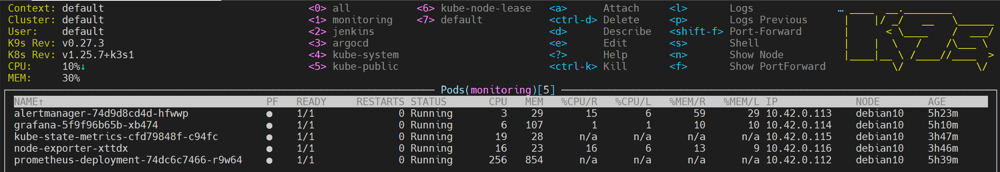
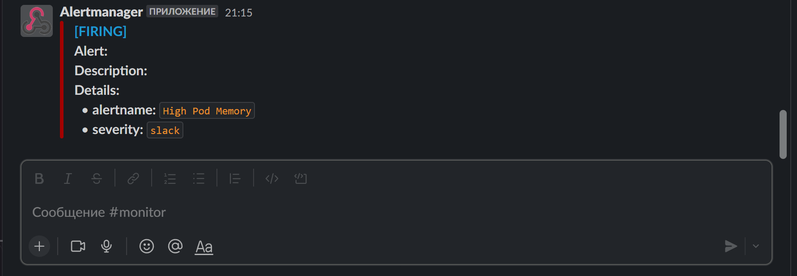
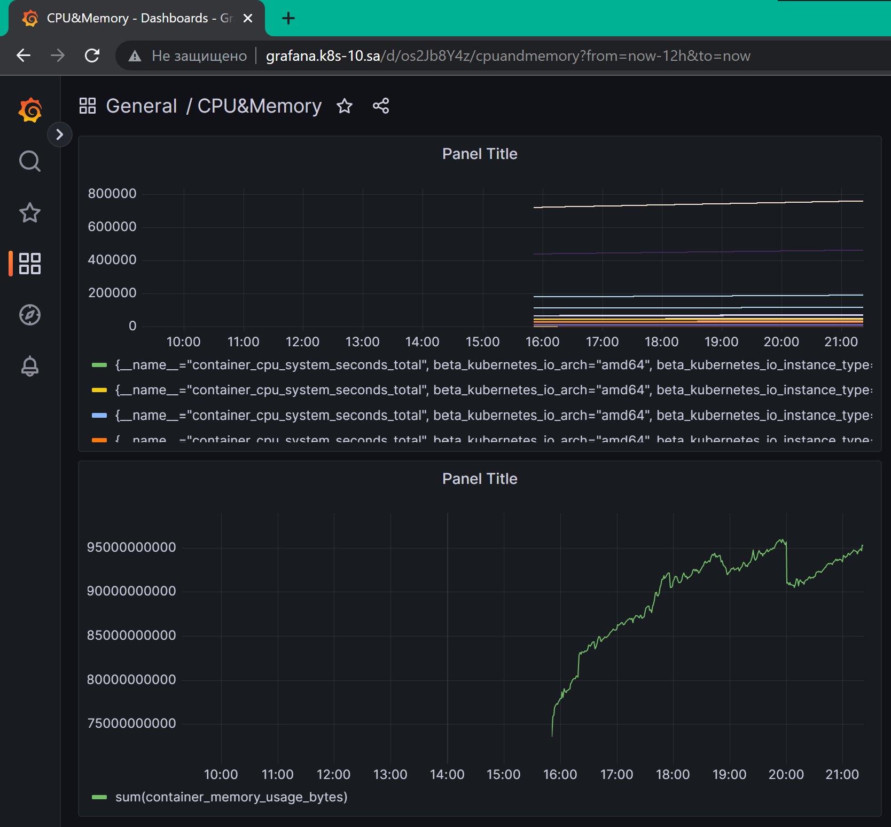

# Homework for 16.Technical and service monitoring


## k9s screenshot


## Slack screenshot


## Panels screenshot


## Prometheus.yaml
```bash
---
apiVersion: rbac.authorization.k8s.io/v1
kind: ClusterRole
metadata:
  name: prometheus
rules:
- apiGroups: [""]
  resources:
  - nodes
  - nodes/proxy
  - services
  - endpoints
  - pods
  verbs: ["get", "list", "watch"]
- apiGroups:
  - extensions
  resources:
  - ingresses
  verbs: ["get", "list", "watch"]
- nonResourceURLs: ["/metrics"]
  verbs: ["get"]
---
apiVersion: rbac.authorization.k8s.io/v1
kind: ClusterRoleBinding
metadata:
  name: prometheus
roleRef:
  apiGroup: rbac.authorization.k8s.io
  kind: ClusterRole
  name: prometheus
subjects:
- kind: ServiceAccount
  name: default
  namespace: monitoring

---
apiVersion: v1
kind: ConfigMap
metadata:
  name: prometheus-server-conf
  labels:
    name: prometheus-server-conf
  namespace: monitoring
data:
  prometheus.rules: |-
    groups:
    - name: devopscube demo alert
      rules:
      - alert: High Pod Memory
        expr: sum(container_memory_working_set_bytes{container!~"POD|"} / 1024/1024) > 6000
        for: 1m
        labels:
          severity: slack
        annotations:
          summary: High Memory Usage
      - alert: High Pods CPU
        expr: sum(rate(container_cpu_usage_seconds_total[1m]) * 100) > 2000
        for: 1m
        labels:
          severity: slack
        annotations:
          summary: High CPU Usage
  prometheus.yml: |-
    global:
      scrape_interval: 5s
      evaluation_interval: 5s
    rule_files:
      - /etc/prometheus/prometheus.rules
    alerting:
      alertmanagers:
      - scheme: http
        static_configs:
        - targets:
          - "alertmanager:9093"
    scrape_configs:
      - job_name: kubernetes-nodes-cadvisor
        scrape_interval: 10s
        scrape_timeout: 10s
        scheme: https  # remove if you want to scrape metrics on insecure port
        tls_config:
          ca_file: /var/run/secrets/kubernetes.io/serviceaccount/ca.crt
        bearer_token_file: /var/run/secrets/kubernetes.io/serviceaccount/token
        kubernetes_sd_configs:
          - role: node
        relabel_configs:
          - action: labelmap
            regex: __meta_kubernetes_node_label_(.+)
          # Only for Kubernetes ^1.7.3.
          # See: https://github.com/prometheus/prometheus/issues/2916
          - target_label: __address__
            replacement: kubernetes.default.svc:443
          - source_labels: [__meta_kubernetes_node_name]
            regex: (.+)
            target_label: __metrics_path__
            replacement: /api/v1/nodes/${1}/proxy/metrics/cadvisor
        metric_relabel_configs:
          - action: replace
            source_labels: [id]
            regex: '^/machine\.slice/machine-rkt\\x2d([^\\]+)\\.+/([^/]+)\.service$'
            target_label: rkt_container_name
            replacement: '${2}-${1}'
          - action: replace
            source_labels: [id]
            regex: '^/system\.slice/(.+)\.service$'
            target_label: systemd_service_name
            replacement: '${1}'
      - job_name: 'node-exporter'
        kubernetes_sd_configs:
          - role: endpoints
        relabel_configs:
        - source_labels: [__meta_kubernetes_endpoints_name]
          regex: 'node-exporter'
          action: keep
      - job_name: 'kubernetes-apiservers'
        kubernetes_sd_configs:
        - role: endpoints
        scheme: https
        tls_config:
          ca_file: /var/run/secrets/kubernetes.io/serviceaccount/ca.crt
        bearer_token_file: /var/run/secrets/kubernetes.io/serviceaccount/token
        relabel_configs:
        - source_labels: [__meta_kubernetes_namespace, __meta_kubernetes_service_name, __meta_kubernetes_endpoint_port_name]
          action: keep
          regex: default;kubernetes;https
      - job_name: 'kubernetes-nodes'
        scheme: https
        tls_config:
          ca_file: /var/run/secrets/kubernetes.io/serviceaccount/ca.crt
        bearer_token_file: /var/run/secrets/kubernetes.io/serviceaccount/token
        kubernetes_sd_configs:
        - role: node
        relabel_configs:
        - action: labelmap
          regex: __meta_kubernetes_node_label_(.+)
        - target_label: __address__
          replacement: kubernetes.default.svc:443
        - source_labels: [__meta_kubernetes_node_name]
          regex: (.+)
          target_label: __metrics_path__
          replacement: /api/v1/nodes/${1}/proxy/metrics
      - job_name: 'kubernetes-pods'
        kubernetes_sd_configs:
        - role: pod
        relabel_configs:
        - source_labels: [__meta_kubernetes_pod_annotation_prometheus_io_scrape]
          action: keep
          regex: true
        - source_labels: [__meta_kubernetes_pod_annotation_prometheus_io_path]
          action: replace
          target_label: __metrics_path__
          regex: (.+)
        - source_labels: [__address__, __meta_kubernetes_pod_annotation_prometheus_io_port]
          action: replace
          regex: ([^:]+)(?::\d+)?;(\d+)
          replacement: $1:$2
          target_label: __address__
        - action: labelmap
          regex: __meta_kubernetes_pod_label_(.+)
        - source_labels: [__meta_kubernetes_namespace]
          action: replace
          target_label: kubernetes_namespace
        - source_labels: [__meta_kubernetes_pod_name]
          action: replace
          target_label: kubernetes_pod_name
      - job_name: 'kube-state-metrics'
        static_configs:
          - targets: ['kube-state-metrics:8080']
      - job_name: 'kubernetes-cadvisor'
        scheme: https
        tls_config:
          ca_file: /var/run/secrets/kubernetes.io/serviceaccount/ca.crt
        bearer_token_file: /var/run/secrets/kubernetes.io/serviceaccount/token
        kubernetes_sd_configs:
        - role: node
        relabel_configs:
        - action: labelmap
          regex: __meta_kubernetes_node_label_(.+)
        - target_label: __address__
          replacement: kubernetes.default.svc:443
        - source_labels: [__meta_kubernetes_node_name]
          regex: (.+)
          target_label: __metrics_path__
          replacement: /api/v1/nodes/${1}/proxy/metrics/cadvisor
      - job_name: 'kubernetes-service-endpoints'
        kubernetes_sd_configs:
        - role: endpoints
        relabel_configs:
        - source_labels: [__meta_kubernetes_service_annotation_prometheus_io_scrape]
          action: keep
          regex: true
        - source_labels: [__meta_kubernetes_service_annotation_prometheus_io_scheme]
          action: replace
          target_label: __scheme__
          regex: (https?)
        - source_labels: [__meta_kubernetes_service_annotation_prometheus_io_path]
          action: replace
          target_label: __metrics_path__
          regex: (.+)
        - source_labels: [__address__, __meta_kubernetes_service_annotation_prometheus_io_port]
          action: replace
          target_label: __address__
          regex: ([^:]+)(?::\d+)?;(\d+)
          replacement: $1:$2
        - action: labelmap
          regex: __meta_kubernetes_service_label_(.+)
        - source_labels: [__meta_kubernetes_namespace]
          action: replace
          target_label: kubernetes_namespace
        - source_labels: [__meta_kubernetes_service_name]
          action: replace
          target_label: kubernetes_name
---
apiVersion: apps/v1
kind: Deployment
metadata:
  name: prometheus-deployment
  namespace: monitoring
  labels:
    app: prometheus-server
spec:
  replicas: 1
  selector:
    matchLabels:
      app: prometheus-server
  template:
    metadata:
      labels:
        app: prometheus-server
    spec:
      containers:
        - name: prometheus
          image: prom/prometheus
          args:
            - "--config.file=/etc/prometheus/prometheus.yml"
            - "--storage.tsdb.path=/prometheus/"
          ports:
            - containerPort: 9090
          volumeMounts:
            - name: prometheus-config-volume
              mountPath: /etc/prometheus/
            - name: prometheus-storage-volume
              mountPath: /prometheus/
      volumes:
        - name: prometheus-config-volume
          configMap:
            defaultMode: 420
            name: prometheus-server-conf
        - name: prometheus-storage-volume
          emptyDir: {}
---
apiVersion: v1
kind: Service
metadata:
  name: prometheus-service
  namespace: monitoring
  annotations:
      prometheus.io/scrape: 'true'
      prometheus.io/port:   '9090'
spec:
  selector:
    app: prometheus-server
    #type: NodePort
  ports:
    - port: 8080
      targetPort: 9090
      # nodePort: 30003
---
apiVersion: networking.k8s.io/v1
kind: Ingress
metadata:
  name: ingress-prometheus
  namespace: monitoring
  annotations:
    kubernetes.io/ingress.class: nginx
spec:
  rules:
    - host: prometheus.k8s-10.sa
      http:
        paths:
          - path: /
            pathType: Prefix
            backend:
              service:
                name: prometheus-service
                port:
                  number: 8080

```

## Alertmanager.yaml
```bash
---
apiVersion: v1
kind: ConfigMap
metadata:
  name: alertmanager-config
  namespace: monitoring
data:
  config.yml: |-
    global:
      resolve_timeout: 1m
    route:
      receiver: 'slack-notifications'
      group_by: ['alertname', 'priority']
      group_wait: 10s
      repeat_interval: 20s
      routes:
        - receiver: slack-notifications
          match:
            severity: slack
          group_wait: 10s
          repeat_interval: 20s
    receivers:
    - name: 'slack-notifications'
      slack_configs:
      - api_url: ppppppppppppppppppppppppppppppppppppppppppppp
        channel: '#monitor'
        send_resolved: true
        title: |-
            [{{ .Status | toUpper }}] 
        text: |-
            {{ range .Alerts -}}
            *Alert:* {{ .Annotations.title }}
            *Description:* {{ .Annotations.description }}
            *Details:*
              {{ range .Labels.SortedPairs }} • *{{ .Name }}:* `{{ .Value }}`
              {{ end }}
            {{ end }}
---
apiVersion: apps/v1
kind: Deployment
metadata:
  name: alertmanager
  labels:
    app: alertmanager
  namespace: monitoring
spec:
  replicas: 1
  selector:
    matchLabels:
      app: alertmanager
  template:
    metadata:
      labels:
        app: alertmanager
    spec:
      containers:
      - name: alertmanager
        image: prom/alertmanager:latest
        args:
          - "--config.file=/etc/alertmanager/config.yml"
          - "--storage.path=/alertmanager"
        ports:
        - containerPort: 9093
        resources:
          requests:
            cpu: 20m
            memory: 50Mi
          limits:
            cpu: 50m
            memory: 100Mi
        volumeMounts:
        - name: config-volume
          mountPath: /etc/alertmanager
        - name: alertmanager
          mountPath: /alertmanager
      volumes:
      - name: config-volume
        configMap:
          name: alertmanager-config
      - name: alertmanager
        emptyDir: {}

---
apiVersion: v1
kind: Service
metadata:
  name: alertmanager
  namespace: monitoring
  annotations:
      prometheus.io/scrape: 'true'
      prometheus.io/path:   /
      prometheus.io/port:   '9093'
spec:
  selector:
    app: alertmanager
  type: NodePort
  ports:
    - port: 9093
      targetPort: 9093
      nodePort: 31000

---
apiVersion: networking.k8s.io/v1
kind: Ingress
metadata:
  name: ingress-alertmanager
  namespace: monitoring
  annotations:
    kubernetes.io/ingress.class: nginx
spec:
  rules:
    - host: alertmanager.k8s-10.sa
      http:
        paths:
          - path: /
            pathType: Prefix
            backend:
              service:
                name: alertmanager
                port:
                  number: 9093

```

## Node-explorer.yaml
```bash
---
apiVersion: apps/v1
kind: DaemonSet
metadata:
  labels:
    app.kubernetes.io/component: exporter
    app.kubernetes.io/name: node-exporter
  name: node-exporter
  namespace: monitoring
spec:
  selector:
    matchLabels:
      app.kubernetes.io/component: exporter
      app.kubernetes.io/name: node-exporter
  template:
    metadata:
      labels:
        app.kubernetes.io/component: exporter
        app.kubernetes.io/name: node-exporter
    spec:
      containers:
      - args:
        - --path.sysfs=/host/sys
        - --path.rootfs=/host/root
        - --no-collector.wifi
        - --no-collector.hwmon
        - --collector.filesystem.ignored-mount-points=^/(dev|proc|sys|var/lib/docker/.+|var/lib/kubelet/pods/.+)($|/)
        - --collector.netclass.ignored-devices=^(veth.*)$
        name: node-exporter
        image: prom/node-exporter
        ports:
          - containerPort: 9100
            protocol: TCP
        resources:
          limits:
            cpu: 250m
            memory: 250Mi
          requests:
            cpu: 100m
            memory: 180Mi
        volumeMounts:
        - mountPath: /host/sys
          mountPropagation: HostToContainer
          name: sys
          readOnly: true
        - mountPath: /host/root
          mountPropagation: HostToContainer
          name: root
          readOnly: true
      volumes:
      - hostPath:
          path: /sys
        name: sys
      - hostPath:
          path: /
        name: root
---
kind: Service
apiVersion: v1
metadata:
  name: node-exporter
  namespace: monitoring
  annotations:
      prometheus.io/scrape: 'true'
      prometheus.io/port:   '9100'
spec:
  selector:
      app.kubernetes.io/component: exporter
      app.kubernetes.io/name: node-exporter
  ports:
  - name: node-exporter
    protocol: TCP
    port: 9100

```

## ksm.yaml
``` bash
---
apiVersion: rbac.authorization.k8s.io/v1
kind: ClusterRoleBinding
metadata:
  labels:
    app.kubernetes.io/component: exporter
    app.kubernetes.io/name: kube-state-metrics
    app.kubernetes.io/version: 2.8.1
  name: kube-state-metrics
roleRef:
  apiGroup: rbac.authorization.k8s.io
  kind: ClusterRole
  name: kube-state-metrics
subjects:
- kind: ServiceAccount
  name: kube-state-metrics
  namespace: monitoring
---
apiVersion: rbac.authorization.k8s.io/v1
kind: ClusterRole
metadata:
  labels:
    app.kubernetes.io/component: exporter
    app.kubernetes.io/name: kube-state-metrics
    app.kubernetes.io/version: 2.8.1
  name: kube-state-metrics
rules:
- apiGroups:
  - ""
  resources:
  - configmaps
  - secrets
  - nodes
  - pods
  - services
  - resourcequotas
  - replicationcontrollers
  - limitranges
  - persistentvolumeclaims
  - persistentvolumes
  - namespaces
  - endpoints
  verbs:
  - list
  - watch
- apiGroups:
  - apps
  resources:
  - statefulsets
  - daemonsets
  - deployments
  - replicasets
  verbs:
  - list
  - watch
- apiGroups:
  - batch
  resources:
  - cronjobs
  - jobs
  verbs:
  - list
  - watch
- apiGroups:
  - autoscaling
  resources:
  - horizontalpodautoscalers
  verbs:
  - list
  - watch
- apiGroups:
  - authentication.k8s.io
  resources:
  - tokenreviews
  verbs:
  - create
- apiGroups:
  - authorization.k8s.io
  resources:
  - subjectaccessreviews
  verbs:
  - create
- apiGroups:
  - policy
  resources:
  - poddisruptionbudgets
  verbs:
  - list
  - watch
- apiGroups:
  - certificates.k8s.io
  resources:
  - certificatesigningrequests
  verbs:
  - list
  - watch
- apiGroups:
  - storage.k8s.io
  resources:
  - storageclasses
  - volumeattachments
  verbs:
  - list
  - watch
- apiGroups:
  - admissionregistration.k8s.io
  resources:
  - mutatingwebhookconfigurations
  - validatingwebhookconfigurations
  verbs:
  - list
  - watch
- apiGroups:
  - networking.k8s.io
  resources:
  - networkpolicies
  - ingresses
  verbs:
  - list
  - watch
- apiGroups:
  - coordination.k8s.io
  resources:
  - leases
  verbs:
  - list
  - watch
---
apiVersion: apps/v1
kind: Deployment
metadata:
  labels:
    app.kubernetes.io/component: exporter
    app.kubernetes.io/name: kube-state-metrics
    app.kubernetes.io/version: 2.8.1
  name: kube-state-metrics
  namespace: monitoring
spec:
  replicas: 1
  selector:
    matchLabels:
      app.kubernetes.io/name: kube-state-metrics
  template:
    metadata:
      labels:
        app.kubernetes.io/component: exporter
        app.kubernetes.io/name: kube-state-metrics
        app.kubernetes.io/version: 2.8.1
    spec:
      automountServiceAccountToken: true
      containers:
      - image: registry.k8s.io/kube-state-metrics/kube-state-metrics:v2.8.1
        livenessProbe:
          httpGet:
            path: /healthz
            port: 8080
          initialDelaySeconds: 5
          timeoutSeconds: 5
        name: kube-state-metrics
        ports:
        - containerPort: 8080
          name: http-metrics
        - containerPort: 8081
          name: telemetry
        readinessProbe:
          httpGet:
            path: /
            port: 8081
          initialDelaySeconds: 5
          timeoutSeconds: 5
        securityContext:
          allowPrivilegeEscalation: false
          capabilities:
            drop:
            - ALL
          readOnlyRootFilesystem: true
          runAsUser: 65534
      nodeSelector:
        kubernetes.io/os: linux
      serviceAccountName: kube-state-metrics
---
apiVersion: v1
automountServiceAccountToken: false
kind: ServiceAccount
metadata:
  labels:
    app.kubernetes.io/component: exporter
    app.kubernetes.io/name: kube-state-metrics
    app.kubernetes.io/version: 2.8.1
  name: kube-state-metrics
  namespace: monitoring
---
apiVersion: v1
kind: Service
metadata:
  labels:
    app.kubernetes.io/component: exporter
    app.kubernetes.io/name: kube-state-metrics
    app.kubernetes.io/version: 2.8.1
  name: kube-state-metrics
  namespace: monitoring
spec:
  clusterIP: None
  ports:
  - name: http-metrics
    port: 8080
    targetPort: http-metrics
  - name: telemetry
    port: 8081
    targetPort: telemetry
  selector:
    app.kubernetes.io/name: kube-state-metrics

```

## Grafana.yaml
``` bash
---
apiVersion: v1
kind: ConfigMap
metadata:
  name: grafana-datasources
  namespace: monitoring
data:
  prometheus.yaml: |-
    {
        "apiVersion": 1,
        "datasources": [
            {
               "access":"proxy",
                "editable": true,
                "name": "prometheus",
                "orgId": 1,
                "type": "prometheus",
                "url": "http://prometheus-service:8080",
                "version": 1
            }
        ]
    }
---
apiVersion: apps/v1
kind: Deployment
metadata:
  name: grafana
  namespace: monitoring
spec:
  replicas: 1
  selector:
    matchLabels:
      app: grafana
  template:
    metadata:
      name: grafana
      labels:
        app: grafana
    spec:
      containers:
      - name: grafana
        image: grafana/grafana:latest
        ports:
        - name: grafana
          containerPort: 3000
        resources:
          limits:
            memory: "1Gi"
            cpu: "500m"
          requests:
            memory: "1Gi"
            cpu: "500m"
        volumeMounts:
          - mountPath: /var/lib/grafana
            name: grafana-storage
          - mountPath: /etc/grafana/provisioning/datasources
            name: grafana-datasources
            readOnly: false
      volumes:
        - name: grafana-storage
          emptyDir: {}
        - name: grafana-datasources
          configMap:
              defaultMode: 420
              name: grafana-datasources
---
apiVersion: v1
kind: Service
metadata:
  name: grafana
  namespace: monitoring
  annotations:
      prometheus.io/scrape: 'true'
      prometheus.io/port:   '3000'
spec:
  selector:
    app: grafana
  type: NodePort
  ports:
    - port: 3000
      targetPort: 3000
---
apiVersion: networking.k8s.io/v1
kind: Ingress
metadata:
  name: ingress-grafana
  namespace: monitoring
  annotations:
    kubernetes.io/ingress.class: nginx
spec:
  rules:
    - host: grafana.k8s-10.sa
      http:
        paths:
          - path: /
            pathType: Prefix
            backend:
              service:
                name: grafana
                port:
                  number: 3000

```