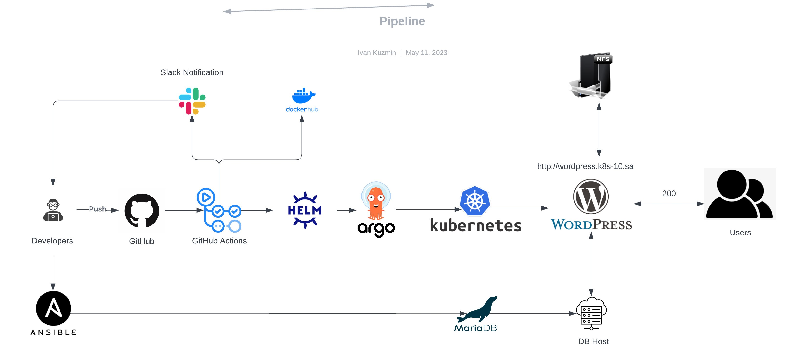

# Project report
---

### Project's reporter: Ivan Kuzmin
### Group number: md-sa2-23-23

---

## Description of application for deployment:

- Application: Wordpress

- Programming language: PHP

- DB: MariaDB

- Notification: Slack

- Link on git repository: https://github.com/ivankuzminn/project

---

## Pipeline. High Level Design

---

## Technologies which were used in project:

- Orchestration: 
Kubernetes

- Automation tools:
Github action, ArgoCD

- SCM:
Github

- Notification:
Slack

- Other tools:
 Docker, Helm

---

## CI/CD description:
After pushing to the main branch, Git Actions builds and pushes the image to DockerHUB, creates a HELM package. ArgoCD deploys application from HELM repository in k8s kluster.

## Rollback flow description and implementation:

Version selection in ArgoCD

---

## Links:

Project repository:   https://github.com/ivankuzminn/project

Dockerhub repository: https://hub.docker.com/repository/docker/ivankuzminn/project/general

CI fromGitHub Actions URL:   https://github.com/ivankuzminn/project/actions/workflows/CI.yml 

