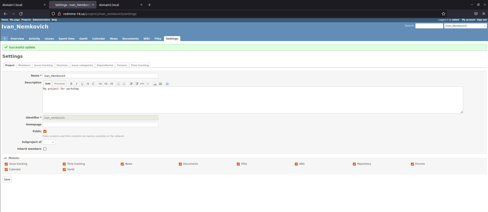

# 08.Ansible.Workshop

## Run after refactoring
```bash
PLAY [redmine] ********************************************************************************************************************************

TASK [Gathering Facts] ************************************************************************************************************************
Серада 18 мая 2022  23:58:58 +0300 (0:00:00.013)       0:00:00.013 ************ 
ok: [remine_18]

TASK [debug] **********************************************************************************************************************************
Серада 18 мая 2022  23:59:01 +0300 (0:00:02.294)       0:00:02.308 ************ 
ok: [remine_18] => {
    "msg": "192.168.201.18"
}

TASK [Redmine. Install packages] **************************************************************************************************************
Серада 18 мая 2022  23:59:01 +0300 (0:00:00.034)       0:00:02.343 ************ 
ok: [remine_18]

TASK [mysql : MySQL. Install packages] ********************************************************************************************************
Серада 18 мая 2022  23:59:04 +0300 (0:00:03.397)       0:00:05.741 ************ 
ok: [remine_18]

TASK [mysql : mysql_db] ***********************************************************************************************************************
Серада 18 мая 2022  23:59:06 +0300 (0:00:01.486)       0:00:07.227 ************ 
ok: [remine_18]

TASK [mysql : mysql_user] *********************************************************************************************************************
Серада 18 мая 2022  23:59:06 +0300 (0:00:00.808)       0:00:08.035 ************ 
ok: [remine_18]

TASK [redmine : Redmine. Clone repository] ****************************************************************************************************
Серада 18 мая 2022  23:59:07 +0300 (0:00:00.839)       0:00:08.874 ************ 
ok: [remine_18]

TASK [redmine : Redmine. Change permissions] **************************************************************************************************
Серада 18 мая 2022  23:59:08 +0300 (0:00:00.654)       0:00:09.528 ************ 
ok: [remine_18]

TASK [redmine : Redmine. Change permissions] **************************************************************************************************
Серада 18 мая 2022  23:59:09 +0300 (0:00:00.707)       0:00:10.236 ************ 
changed: [remine_18]

TASK [redmine : Config database] **************************************************************************************************************
Серада 18 мая 2022  23:59:09 +0300 (0:00:00.582)       0:00:10.818 ************ 
ok: [remine_18]

TASK [redmine : Redmine. Setup 01] ************************************************************************************************************
Серада 18 мая 2022  23:59:10 +0300 (0:00:01.142)       0:00:11.961 ************ 
changed: [remine_18]

TASK [redmine : Session store secret generation] **********************************************************************************************
Серада 18 мая 2022  23:59:15 +0300 (0:00:05.005)       0:00:16.966 ************ 
ok: [remine_18]

TASK [redmine : Redmine. Setup 02] ************************************************************************************************************
Серада 18 мая 2022  23:59:16 +0300 (0:00:00.555)       0:00:17.521 ************ 
changed: [remine_18]

TASK [redmine : Configuration files for virtualhost] ******************************************************************************************
Серада 18 мая 2022  23:59:25 +0300 (0:00:09.166)       0:00:26.688 ************ 
ok: [remine_18]

TASK [redmine : meta] *************************************************************************************************************************
Серада 18 мая 2022  23:59:26 +0300 (0:00:01.007)       0:00:27.695 ************ 

TASK [Add redmine-18.sa to host file] *********************************************************************************************************
Серада 18 мая 2022  23:59:26 +0300 (0:00:00.046)       0:00:27.742 ************ 
changed: [remine_18]

TASK [uri] ************************************************************************************************************************************
Серада 18 мая 2022  23:59:27 +0300 (0:00:00.581)       0:00:28.323 ************ 
ok: [remine_18]

TASK [lineinfile] *****************************************************************************************************************************
Серада 18 мая 2022  23:59:27 +0300 (0:00:00.767)       0:00:29.090 ************ 
changed: [remine_18]

PLAY RECAP ************************************************************************************************************************************
remine_18                  : ok=17   changed=5    unreachable=0    failed=0    skipped=0    rescued=0    ignored=0   

Серада 18 мая 2022  23:59:28 +0300 (0:00:00.558)       0:00:29.649 ************ 
=============================================================================== 
redmine : Redmine. Setup 02 ------------------------------------------------------------------------------------------------------------ 9.17s
redmine : Redmine. Setup 01 ------------------------------------------------------------------------------------------------------------ 5.01s
Redmine. Install packages -------------------------------------------------------------------------------------------------------------- 3.40s
Gathering Facts ------------------------------------------------------------------------------------------------------------------------ 2.29s
mysql : MySQL. Install packages -------------------------------------------------------------------------------------------------------- 1.49s
redmine : Config database -------------------------------------------------------------------------------------------------------------- 1.14s
redmine : Configuration files for virtualhost ------------------------------------------------------------------------------------------ 1.01s
mysql : mysql_user --------------------------------------------------------------------------------------------------------------------- 0.84s
mysql : mysql_db ----------------------------------------------------------------------------------------------------------------------- 0.81s
uri ------------------------------------------------------------------------------------------------------------------------------------ 0.77s
redmine : Redmine. Change permissions -------------------------------------------------------------------------------------------------- 0.71s
redmine : Redmine. Clone repository ---------------------------------------------------------------------------------------------------- 0.65s
redmine : Redmine. Change permissions -------------------------------------------------------------------------------------------------- 0.58s
Add redmine-18.sa to host file --------------------------------------------------------------------------------------------------------- 0.58s
lineinfile ----------------------------------------------------------------------------------------------------------------------------- 0.56s
redmine : Session store secret generation ---------------------------------------------------------------------------------------------- 0.56s
redmine : meta ------------------------------------------------------------------------------------------------------------------------- 0.05s
debug ---------------------------------------------------------------------------------------------------------------------------------- 0.03s
Playbook run took 0 days, 0 hours, 0 minutes, 29 seconds
```

## Screenshot

