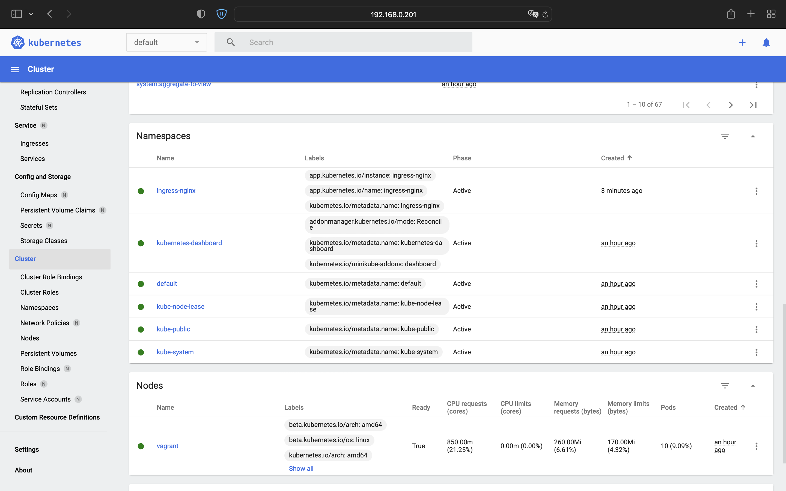

# 10.Kubernetes homework

## Minicube Commands
```bash
sudo minikube start --memory 8192 --cpus 2
sudo minikube status
sudo minikube addons enable ingress
```
```bash
vagrant@vagrant:~$ sudo minikube addons list
|-----------------------------|----------|--------------|--------------------------------|
|         ADDON NAME          | PROFILE  |    STATUS    |           MAINTAINER           |
|-----------------------------|----------|--------------|--------------------------------|
| ambassador                  | minikube | disabled     | third-party (ambassador)       |
| auto-pause                  | minikube | disabled     | google                         |
| csi-hostpath-driver         | minikube | disabled     | kubernetes                     |
| dashboard                   | minikube | enabled ✅   | kubernetes                     |
| default-storageclass        | minikube | enabled ✅   | kubernetes                     |
| efk                         | minikube | disabled     | third-party (elastic)          |
| freshpod                    | minikube | disabled     | google                         |
| gcp-auth                    | minikube | disabled     | google                         |
| gvisor                      | minikube | disabled     | google                         |
| helm-tiller                 | minikube | disabled     | third-party (helm)             |
| ingress                     | minikube | enabled ✅   | unknown (third-party)          |
| ingress-dns                 | minikube | disabled     | google                         |
| istio                       | minikube | disabled     | third-party (istio)            |
| istio-provisioner           | minikube | disabled     | third-party (istio)            |
| kong                        | minikube | disabled     | third-party (Kong HQ)          |
| kubevirt                    | minikube | disabled     | third-party (kubevirt)         |
| logviewer                   | minikube | disabled     | unknown (third-party)          |
| metallb                     | minikube | disabled     | third-party (metallb)          |
| metrics-server              | minikube | disabled     | kubernetes                     |
| nvidia-driver-installer     | minikube | disabled     | google                         |
| nvidia-gpu-device-plugin    | minikube | disabled     | third-party (nvidia)           |
| olm                         | minikube | disabled     | third-party (operator          |
|                             |          |              | framework)                     |
| pod-security-policy         | minikube | disabled     | unknown (third-party)          |
| portainer                   | minikube | disabled     | portainer.io                   |
| registry                    | minikube | disabled     | google                         |
| registry-aliases            | minikube | disabled     | unknown (third-party)          |
| registry-creds              | minikube | disabled     | third-party (upmc enterprises) |
| storage-provisioner         | minikube | enabled ✅   | google                         |
| storage-provisioner-gluster | minikube | disabled     | unknown (third-party)          |
| volumesnapshots             | minikube | disabled     | kubernetes                     |
|-----------------------------|----------|--------------|--------------------------------|
```

## Minicube Screenshot


##  K8s cluster Deployment (inside IT-ACADEMY environment)
```bash
PLAY RECAP ******************************************************************************************************************************************
localhost                  : ok=4    changed=0    unreachable=0    failed=0    skipped=0    rescued=0    ignored=0
node1                      : ok=768  changed=149  unreachable=0    failed=0    skipped=1315 rescued=0    ignored=6
node2                      : ok=507  changed=94   unreachable=0    failed=0    skipped=772  rescued=0    ignored=2

Нядзеля 22 мая 2022  17:09:52 +0300 (0:00:00.083)       0:20:47.584 ***********
===============================================================================
kubernetes/preinstall : Install packages requirements --------------------------------------------------------------------------------------- 69.34s
download : download_file | Validate mirrors ------------------------------------------------------------------------------------------------- 62.72s
download : download_container | Download image if required ---------------------------------------------------------------------------------- 32.13s
kubernetes/control-plane : kubeadm | Initialize first master -------------------------------------------------------------------------------- 29.08s
download : download_container | Download image if required ---------------------------------------------------------------------------------- 27.50s
download : download_container | Download image if required ---------------------------------------------------------------------------------- 26.76s
download : download_container | Download image if required ---------------------------------------------------------------------------------- 26.07s
kubernetes/kubeadm : Join to cluster -------------------------------------------------------------------------------------------------------- 25.09s
bootstrap-os : Assign inventory name to unconfigured hostnames (non-CoreOS, non-Flatcar, Suse and ClearLinux, non-Fedora) ------------------- 21.33s
container-engine/containerd : download_file | Download item --------------------------------------------------------------------------------- 20.44s
download : download_file | Download item ---------------------------------------------------------------------------------------------------- 18.92s
download : download_file | Download item ---------------------------------------------------------------------------------------------------- 18.36s
bootstrap-os : Update Apt cache ------------------------------------------------------------------------------------------------------------- 18.30s
download : download_container | Download image if required ---------------------------------------------------------------------------------- 17.68s
download : download_container | Download image if required ---------------------------------------------------------------------------------- 17.32s
container-engine/nerdctl : download_file | Download item ------------------------------------------------------------------------------------ 16.75s
container-engine/runc : download_file | Download item --------------------------------------------------------------------------------------- 16.28s
download : download_file | Download item ---------------------------------------------------------------------------------------------------- 15.93s
container-engine/crictl : download_file | Download item ------------------------------------------------------------------------------------- 15.63s
download : download_container | Download image if required ---------------------------------------------------------------------------------- 15.62s
ivan@UbMain:~/devops/it-academy.by/Ivan_Nemkovich/10.Kubernetes/kubespray$
```
