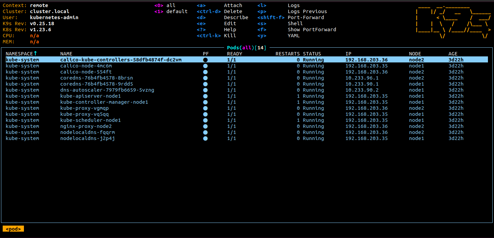

# 11. Kubernetes installation homework

## Aliases, config, contexts

### Config
```bash
ivan@ubmaster:~/git/it-academy.by/Ivan_Nemkovich/11.KubernetesInstall$ kcv
apiVersion: v1
clusters:
- cluster:
    certificate-authority-data: DATA+OMITTED
    server: https://127.0.0.1:6443
  name: cluster.local
- cluster:
    certificate-authority-data: DATA+OMITTED
    server: https://192.168.10.6:6443
  name: default
contexts:
- context:
    cluster: default
    user: default
  name: local
- context:
    cluster: cluster.local
    user: kubernetes-admin
  name: remote
current-context: local
kind: Config
preferences: {}
users:
- name: default
  user:
    client-certificate-data: REDACTED
    client-key-data: REDACTED
- name: kubernetes-admin
  user:
    client-certificate-data: REDACTED
    client-key-data: REDACTED
```
### Contexts
```bash
ivan@ubmaster:~/git/it-academy.by/Ivan_Nemkovich/11.KubernetesInstall$ kcgc
CURRENT   NAME     CLUSTER         AUTHINFO           NAMESPACE
*         local    default         default            
          remote   cluster.local   kubernetes-admin   
ivan@ubmaster:~/git/it-academy.by/Ivan_Nemkovich/11.KubernetesInstall$ kcuc remote
Switched to context "remote".
ivan@ubmaster:~/git/it-academy.by/Ivan_Nemkovich/11.KubernetesInstall$ kgno
NAME    STATUS   ROLES                  AGE     VERSION
node1   Ready    control-plane,master   3d20h   v1.23.6
node2   Ready    <none>                 3d20h   v1.23.6
ivan@ubmaster:~/git/it-academy.by/Ivan_Nemkovich/11.KubernetesInstall$ kcuc local
Switched to context "local".
ivan@ubmaster:~/git/it-academy.by/Ivan_Nemkovich/11.KubernetesInstall$ kgno
NAME    STATUS   ROLES                  AGE   VERSION
ubsrv   Ready    control-plane,master   19h   v1.23.6+k3s1

```

## Screenshot of k9s

