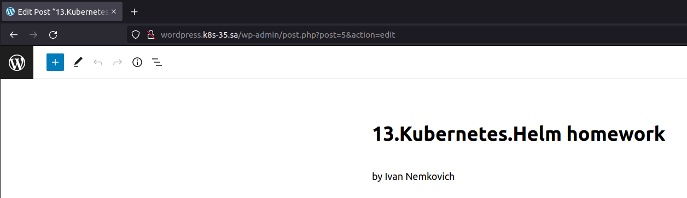
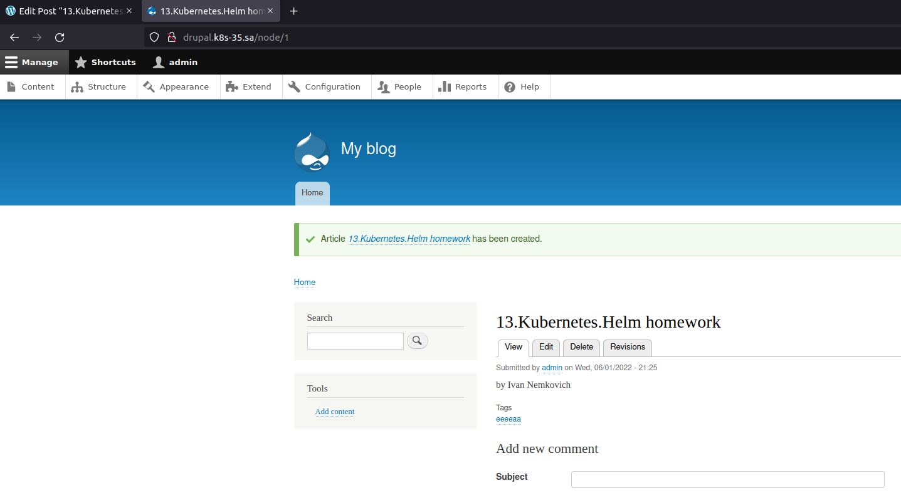

# 13.Kubernetes.Helm homework

## Wordpress installation
``` bash
helm repo add bitnami https://charts.bitnami.com/bitnami
helm repo add nfs-subdir-external-provisioner https://kubernetes-sigs.github.io/nfs-subdir-external-provisioner
helm install nfs-subdir-external-provisioner nfs-subdir-external-provisioner/nfs-subdir-external-provisioner --set nfs.server=192.168.37.105 --set nfs.path=/mnt/IT-Academy/nfs-data/sa2-20-22/Ivan_Nemkovich
kubectl create namespace wordpress
helm install -n wordpress sa-wordpress --set global.storageClass=nfs-client,service.type=ClusterIP,wordpressUsername=admin,wordpressPassword=********,mariadb.auth.rootPassword=********, bitnami/wordpress
vim wp_ingress.yml
kubectl apply -f wp_ingress.yml --namespace wordpress
```

## Wordpress screenshot


## Drupal installation
``` bash   
  165  kubectl create namespace drupal
  166  helm install -n drupal  sa-drupal --set global.storageClass=nfs-client,drupalUsername=admin,drupalPassword=********,mariadb.auth.rootPassword=******** bitnami/drupal
  167  vim dp_ingress.yml
  168  kubectl apply -f dp_ingress.yml --namespace drupal
```

## Drupal screenshot

