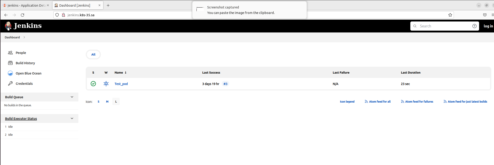
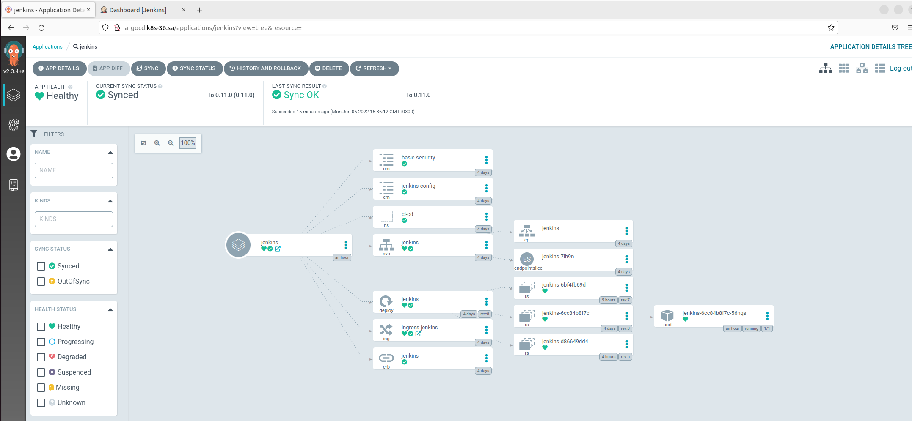

# 14.Kubernetes.ApplicationDeployment Homework

## Jenkins index.yml
``` yml
apiVersion: v1
entries:
  jenkins:
  - apiVersion: v2
    appVersion: 1.16.0
    created: "2022-06-06T15:34:08.25023829+03:00"
    description: A Helm chart for Kubernetes
    digest: bd949b12f30df9079a4caddf9612d1e4868eca29a7bc9a8b626e9e381f1f8af0
    name: jenkins
    type: application
    urls:
    - https://ivan-nemkovich.github.io/helm-repo/jenkins/jenkins-0.11.0.tgz
    version: 0.11.0
generated: "2022-06-06T15:34:08.238158032+03:00"
```

## Jenkins application manifest
``` yml
apiVersion: argoproj.io/v1alpha1
kind: Application
metadata:
  creationTimestamp: "2022-06-06T11:48:47Z"
  generation: 93
  name: jenkins
  namespace: argocd
  resourceVersion: "3029818"
  uid: ab616ced-06a8-4548-bb00-9f295e7d500b
spec:
  destination:
    namespace: ci-cd
    server: https://kubernetes.default.svc
  project: default
  source:
    chart: jenkins
    repoURL: https://ivan-nemkovich.github.io/helm-repo/
    targetRevision: 0.11.0
  syncPolicy:
    automated: {}
status:
  health:
    status: Healthy
  history:
  - deployStartedAt: "2022-06-06T12:02:02Z"
    deployedAt: "2022-06-06T12:02:02Z"
    id: 0
    revision: 0.9.0
    source:
      chart: jenkins
      repoURL: https://ivan-nemkovich.github.io/helm-repo/
      targetRevision: 0.9.0
  - deployStartedAt: "2022-06-06T12:05:32Z"
    deployedAt: "2022-06-06T12:05:32Z"
    id: 1
    revision: 0.9.0
    source:
      chart: jenkins
      repoURL: https://ivan-nemkovich.github.io/helm-repo/
      targetRevision: 0.9.0
  - deployStartedAt: "2022-06-06T12:19:48Z"
    deployedAt: "2022-06-06T12:19:48Z"
    id: 2
    revision: 0.10.0
    source:
      chart: jenkins
      repoURL: https://ivan-nemkovich.github.io/helm-repo/
      targetRevision: 0.10.0
  - deployStartedAt: "2022-06-06T12:20:12Z"
    deployedAt: "2022-06-06T12:20:13Z"
    id: 3
    revision: 0.10.0
    source:
      chart: jenkins
      repoURL: https://ivan-nemkovich.github.io/helm-repo/
      targetRevision: 0.10.0
  - deployStartedAt: "2022-06-06T12:36:12Z"
    deployedAt: "2022-06-06T12:36:12Z"
    id: 4
    revision: 0.11.0
    source:
      chart: jenkins
      repoURL: https://ivan-nemkovich.github.io/helm-repo/
      targetRevision: 0.11.0
  operationState:
    finishedAt: "2022-06-06T12:36:12Z"
    message: successfully synced (all tasks run)
    operation:
      initiatedBy:
        automated: true
      retry:
        limit: 5
      sync:
        revision: 0.11.0
    phase: Succeeded
    startedAt: "2022-06-06T12:36:12Z"
    syncResult:
      resources:
      - group: ""
        hookPhase: Running
        kind: Namespace
        message: namespace/ci-cd unchanged
        name: ci-cd
        namespace: ci-cd
        status: Synced
        syncPhase: Sync
        version: v1
      - group: ""
        hookPhase: Running
        kind: ConfigMap
        message: configmap/basic-security unchanged
        name: basic-security
        namespace: ci-cd
        status: Synced
        syncPhase: Sync
        version: v1
      - group: ""
        hookPhase: Running
        kind: ConfigMap
        message: configmap/jenkins-config unchanged
        name: jenkins-config
        namespace: ci-cd
        status: Synced
        syncPhase: Sync
        version: v1
      - group: rbac.authorization.k8s.io
        hookPhase: Running
        kind: ClusterRoleBinding
        message: clusterrolebinding.rbac.authorization.k8s.io/jenkins reconciled.
          clusterrolebinding.rbac.authorization.k8s.io/jenkins unchanged
        name: jenkins
        namespace: ci-cd
        status: Synced
        syncPhase: Sync
        version: v1
      - group: ""
        hookPhase: Running
        kind: Service
        message: service/jenkins unchanged
        name: jenkins
        namespace: ci-cd
        status: Synced
        syncPhase: Sync
        version: v1
      - group: apps
        hookPhase: Running
        kind: Deployment
        message: deployment.apps/jenkins configured
        name: jenkins
        namespace: ci-cd
        status: Synced
        syncPhase: Sync
        version: v1
      - group: networking.k8s.io
        hookPhase: Running
        kind: Ingress
        message: ingress.networking.k8s.io/ingress-jenkins configured
        name: ingress-jenkins
        namespace: ci-cd
        status: Synced
        syncPhase: Sync
        version: v1
      revision: 0.11.0
      source:
        chart: jenkins
        repoURL: https://ivan-nemkovich.github.io/helm-repo/
        targetRevision: 0.11.0
  reconciledAt: "2022-06-06T14:00:05Z"
  resources:
  - kind: ConfigMap
    name: basic-security
    namespace: ci-cd
    status: Synced
    version: v1
  - kind: ConfigMap
    name: jenkins-config
    namespace: ci-cd
    status: Synced
    version: v1
  - kind: Namespace
    name: ci-cd
    status: Synced
    version: v1
  - health:
      status: Healthy
    kind: Service
    name: jenkins
    namespace: ci-cd
    status: Synced
    version: v1
  - group: apps
    health:
      status: Healthy
    kind: Deployment
    name: jenkins
    namespace: ci-cd
    status: Synced
    version: v1
  - group: networking.k8s.io
    health:
      status: Healthy
    kind: Ingress
    name: ingress-jenkins
    namespace: ci-cd
    status: Synced
    version: v1
  - group: rbac.authorization.k8s.io
    kind: ClusterRoleBinding
    name: jenkins
    status: Synced
    version: v1
  sourceType: Helm
  summary:
    externalURLs:
    - http://jenkins.k8s-35.sa/
    images:
    - jfrog.it-academy.by/public/jenkins-ci:inemkovich
  sync:
    comparedTo:
      destination:
        namespace: ci-cd
        server: https://kubernetes.default.svc
      source:
        chart: jenkins
        repoURL: https://ivan-nemkovich.github.io/helm-repo/
        targetRevision: 0.11.0
    revision: 0.11.0
    status: Synced
```

## Screenshots


