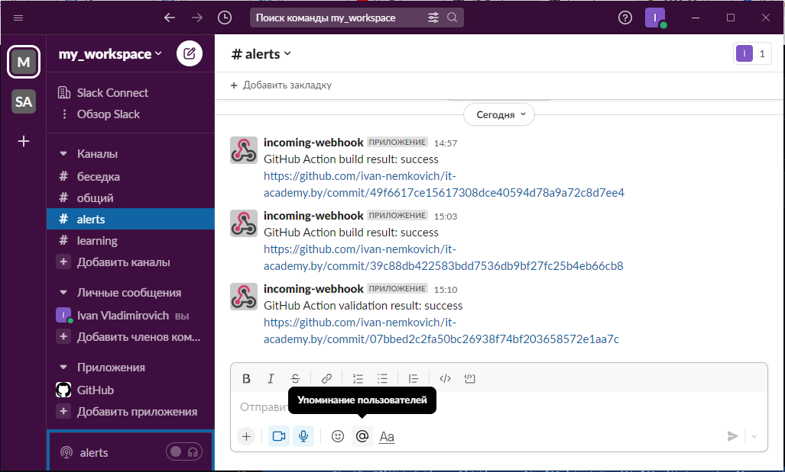

# 17.Testing homework

## Molecule test output:
``` bash
INFO     default scenario test matrix: dependency, lint, cleanup, destroy, syntax, create, prepare, converge, idempotence, side_effect, verify, cleanup, destroy
INFO     Performing prerun...
INFO     Set ANSIBLE_LIBRARY=/home/ivan/.cache/ansible-compat/20f65c/modules:/home/ivan/.ansible/plugins/modules:/usr/share/ansible/plugins/modules
INFO     Set ANSIBLE_COLLECTIONS_PATH=/home/ivan/.cache/ansible-compat/20f65c/collections:/home/ivan/.ansible/collections:/usr/share/ansible/collections
INFO     Set ANSIBLE_ROLES_PATH=/home/ivan/.cache/ansible-compat/20f65c/roles:/home/ivan/.ansible/roles:/usr/share/ansible/roles:/etc/ansible/roles
INFO     Running default > dependency
WARNING  Skipping, missing the requirements file.
WARNING  Skipping, missing the requirements file.
INFO     Running default > lint
INFO     Lint is disabled.
INFO     Running default > cleanup
WARNING  Skipping, cleanup playbook not configured.
INFO     Running default > destroy
INFO     Sanity checks: 'docker'

PLAY [Destroy] *****************************************************************

TASK [Destroy molecule instance(s)] ********************************************
changed: [localhost] => (item=instance1)
changed: [localhost] => (item=instance2)

TASK [Wait for instance(s) deletion to complete] *******************************
ok: [localhost] => (item=instance1)
ok: [localhost] => (item=instance2)

TASK [Delete docker networks(s)] ***********************************************

PLAY RECAP *********************************************************************
localhost                  : ok=2    changed=1    unreachable=0    failed=0    skipped=1    rescued=0    ignored=0

INFO     Running default > syntax

playbook: /home/ivan/devops/it-academy.by/Ivan_Nemkovich/17.Testing/roles/check/molecule/default/converge.yml
INFO     Running default > create

PLAY [Create] ******************************************************************

TASK [Log into a Docker registry] **********************************************
skipping: [localhost] => (item=None) 
skipping: [localhost] => (item=None) 
skipping: [localhost]

TASK [Check presence of custom Dockerfiles] ************************************
ok: [localhost] => (item={'image': 'ubuntu_py:v1.0', 'name': 'instance1', 'pre_build_image': True})
ok: [localhost] => (item={'image': 'centos:latest', 'name': 'instance2', 'pre_build_image': True})

TASK [Create Dockerfiles from image names] *************************************
skipping: [localhost] => (item={'image': 'ubuntu_py:v1.0', 'name': 'instance1', 'pre_build_image': True}) 
skipping: [localhost] => (item={'image': 'centos:latest', 'name': 'instance2', 'pre_build_image': True}) 

TASK [Discover local Docker images] ********************************************
ok: [localhost] => (item={'changed': False, 'skipped': True, 'skip_reason': 'Conditional result was False', 'item': {'image': 'ubuntu_py:v1.0', 'name': 'instance1', 'pre_build_image': True}, 'ansible_loop_var': 'item', 'i': 0, 'ansible_index_var': 'i'})
ok: [localhost] => (item={'changed': False, 'skipped': True, 'skip_reason': 'Conditional result was False', 'item': {'image': 'centos:latest', 'name': 'instance2', 'pre_build_image': True}, 'ansible_loop_var': 'item', 'i': 1, 'ansible_index_var': 'i'})

TASK [Build an Ansible compatible image (new)] *********************************
skipping: [localhost] => (item=molecule_local/ubuntu_py:v1.0) 
skipping: [localhost] => (item=molecule_local/centos:latest) 

TASK [Create docker network(s)] ************************************************

TASK [Determine the CMD directives] ********************************************
ok: [localhost] => (item={'image': 'ubuntu_py:v1.0', 'name': 'instance1', 'pre_build_image': True})
ok: [localhost] => (item={'image': 'centos:latest', 'name': 'instance2', 'pre_build_image': True})

TASK [Create molecule instance(s)] *********************************************
changed: [localhost] => (item=instance1)
changed: [localhost] => (item=instance2)

TASK [Wait for instance(s) creation to complete] *******************************
FAILED - RETRYING: [localhost]: Wait for instance(s) creation to complete (300 retries left).
changed: [localhost] => (item={'failed': 0, 'started': 1, 'finished': 0, 'ansible_job_id': '895143861943.13040', 'results_file': '/home/ivan/.ansible_async/895143861943.13040', 'changed': True, 'item': {'image': 'ubuntu_py:v1.0', 'name': 'instance1', 'pre_build_image': True}, 'ansible_loop_var': 'item'})
changed: [localhost] => (item={'failed': 0, 'started': 1, 'finished': 0, 'ansible_job_id': '327225300723.13068', 'results_file': '/home/ivan/.ansible_async/327225300723.13068', 'changed': True, 'item': {'image': 'centos:latest', 'name': 'instance2', 'pre_build_image': True}, 'ansible_loop_var': 'item'})

PLAY RECAP *********************************************************************
localhost                  : ok=5    changed=2    unreachable=0    failed=0    skipped=4    rescued=0    ignored=0

INFO     Running default > prepare
WARNING  Skipping, prepare playbook not configured.
INFO     Running default > converge

PLAY [Converge] ****************************************************************

TASK [Gathering Facts] *********************************************************
ok: [instance2]
ok: [instance1]

TASK [Include check] ***********************************************************

TASK [check : Print OS versions] ***********************************************
ok: [instance1] => {
    "msg": [
        "OS     : Ubuntu",
        "Version: 22.04"
    ]
}
ok: [instance2] => {
    "msg": [
        "OS     : CentOS",
        "Version: 8.4"
    ]
}

TASK [check : Print mount point/capacity/used] *********************************
ok: [instance1] => (item={'mount': '/etc/resolv.conf', 'device': '/dev/mapper/vgubuntu-root', 'fstype': 'ext4', 'options': 'rw,relatime,errors=remount-ro,bind', 'size_total': 52364288000, 'size_available': 33618042880, 'block_size': 4096, 'block_total': 12784250, 'block_available': 8207530, 'block_used': 4576720, 'inode_total': 3268608, 'inode_available': 2858173, 'inode_used': 410435, 'uuid': 'N/A'}) => {
    "msg": [
        "Mount   : /etc/resolv.conf",
        "Capacity: 49938 MB",
        "Used    : 17877 MB"
    ]
}
ok: [instance1] => (item={'mount': '/etc/hostname', 'device': '/dev/mapper/vgubuntu-root', 'fstype': 'ext4', 'options': 'rw,relatime,errors=remount-ro,bind', 'size_total': 52364288000, 'size_available': 33618042880, 'block_size': 4096, 'block_total': 12784250, 'block_available': 8207530, 'block_used': 4576720, 'inode_total': 3268608, 'inode_available': 2858173, 'inode_used': 410435, 'uuid': 'N/A'}) => {
    "msg": [
        "Mount   : /etc/hostname",
        "Capacity: 49938 MB",
        "Used    : 17877 MB"
    ]
}
ok: [instance1] => (item={'mount': '/etc/hosts', 'device': '/dev/mapper/vgubuntu-root', 'fstype': 'ext4', 'options': 'rw,relatime,errors=remount-ro,bind', 'size_total': 52364288000, 'size_available': 33618042880, 'block_size': 4096, 'block_total': 12784250, 'block_available': 8207530, 'block_used': 4576720, 'inode_total': 3268608, 'inode_available': 2858173, 'inode_used': 410435, 'uuid': 'N/A'}) => {
    "msg": [
        "Mount   : /etc/hosts",
        "Capacity: 49938 MB",
        "Used    : 17877 MB"
    ]
}
ok: [instance2] => (item={'mount': '/etc/resolv.conf', 'device': '/dev/mapper/vgubuntu-root', 'fstype': 'ext4', 'options': 'rw,relatime,errors=remount-ro,bind', 'size_total': 52364288000, 'size_available': 33618042880, 'block_size': 4096, 'block_total': 12784250, 'block_available': 8207530, 'block_used': 4576720, 'inode_total': 3268608, 'inode_available': 2858173, 'inode_used': 410435, 'uuid': 'N/A'}) => {
    "msg": [
        "Mount   : /etc/resolv.conf",
        "Capacity: 49938 MB",
        "Used    : 17877 MB"
    ]
}
ok: [instance2] => (item={'mount': '/etc/hostname', 'device': '/dev/mapper/vgubuntu-root', 'fstype': 'ext4', 'options': 'rw,relatime,errors=remount-ro,bind', 'size_total': 52364288000, 'size_available': 33618042880, 'block_size': 4096, 'block_total': 12784250, 'block_available': 8207530, 'block_used': 4576720, 'inode_total': 3268608, 'inode_available': 2858173, 'inode_used': 410435, 'uuid': 'N/A'}) => {
    "msg": [
        "Mount   : /etc/hostname",
        "Capacity: 49938 MB",
        "Used    : 17877 MB"
    ]
}
ok: [instance2] => (item={'mount': '/etc/hosts', 'device': '/dev/mapper/vgubuntu-root', 'fstype': 'ext4', 'options': 'rw,relatime,errors=remount-ro,bind', 'size_total': 52364288000, 'size_available': 33618042880, 'block_size': 4096, 'block_total': 12784250, 'block_available': 8207530, 'block_used': 4576720, 'inode_total': 3268608, 'inode_available': 2858173, 'inode_used': 410435, 'uuid': 'N/A'}) => {
    "msg": [
        "Mount   : /etc/hosts",
        "Capacity: 49938 MB",
        "Used    : 17877 MB"
    ]
}

TASK [check : Print RAM capacity/free] *****************************************
ok: [instance1] => {
    "msg": [
        "RAM total: 2967 MB",
        "RAM free : 108 MB"
    ]
}
ok: [instance2] => {
    "msg": [
        "RAM total: 2967 MB",
        "RAM free : 109 MB"
    ]
}

PLAY RECAP *********************************************************************
instance1                  : ok=4    changed=0    unreachable=0    failed=0    skipped=0    rescued=0    ignored=0
instance2                  : ok=4    changed=0    unreachable=0    failed=0    skipped=0    rescued=0    ignored=0

INFO     Running default > idempotence

PLAY [Converge] ****************************************************************

TASK [Gathering Facts] *********************************************************
ok: [instance1]
ok: [instance2]

TASK [Include check] ***********************************************************

TASK [check : Print OS versions] ***********************************************
ok: [instance1] => {
    "msg": [
        "OS     : Ubuntu",
        "Version: 22.04"
    ]
}
ok: [instance2] => {
    "msg": [
        "OS     : CentOS",
        "Version: 8.4"
    ]
}

TASK [check : Print mount point/capacity/used] *********************************
ok: [instance1] => (item={'mount': '/etc/resolv.conf', 'device': '/dev/mapper/vgubuntu-root', 'fstype': 'ext4', 'options': 'rw,relatime,errors=remount-ro,bind', 'size_total': 52364288000, 'size_available': 33618038784, 'block_size': 4096, 'block_total': 12784250, 'block_available': 8207529, 'block_used': 4576721, 'inode_total': 3268608, 'inode_available': 2858173, 'inode_used': 410435, 'uuid': 'N/A'}) => {
    "msg": [
        "Mount   : /etc/resolv.conf",
        "Capacity: 49938 MB",
        "Used    : 17877 MB"
    ]
}
ok: [instance1] => (item={'mount': '/etc/hostname', 'device': '/dev/mapper/vgubuntu-root', 'fstype': 'ext4', 'options': 'rw,relatime,errors=remount-ro,bind', 'size_total': 52364288000, 'size_available': 33618038784, 'block_size': 4096, 'block_total': 12784250, 'block_available': 8207529, 'block_used': 4576721, 'inode_total': 3268608, 'inode_available': 2858173, 'inode_used': 410435, 'uuid': 'N/A'}) => {
    "msg": [
        "Mount   : /etc/hostname",
        "Capacity: 49938 MB",
        "Used    : 17877 MB"
    ]
}
ok: [instance2] => (item={'mount': '/etc/resolv.conf', 'device': '/dev/mapper/vgubuntu-root', 'fstype': 'ext4', 'options': 'rw,relatime,errors=remount-ro,bind', 'size_total': 52364288000, 'size_available': 33618558976, 'block_size': 4096, 'block_total': 12784250, 'block_available': 8207656, 'block_used': 4576594, 'inode_total': 3268608, 'inode_available': 2858177, 'inode_used': 410431, 'uuid': 'N/A'}) => {
    "msg": [
        "Mount   : /etc/resolv.conf",
        "Capacity: 49938 MB",
        "Used    : 17877 MB"
    ]
}
ok: [instance2] => (item={'mount': '/etc/hostname', 'device': '/dev/mapper/vgubuntu-root', 'fstype': 'ext4', 'options': 'rw,relatime,errors=remount-ro,bind', 'size_total': 52364288000, 'size_available': 33618558976, 'block_size': 4096, 'block_total': 12784250, 'block_available': 8207656, 'block_used': 4576594, 'inode_total': 3268608, 'inode_available': 2858177, 'inode_used': 410431, 'uuid': 'N/A'}) => {
    "msg": [
        "Mount   : /etc/hostname",
        "Capacity: 49938 MB",
        "Used    : 17877 MB"
    ]
}
ok: [instance2] => (item={'mount': '/etc/hosts', 'device': '/dev/mapper/vgubuntu-root', 'fstype': 'ext4', 'options': 'rw,relatime,errors=remount-ro,bind', 'size_total': 52364288000, 'size_available': 33618558976, 'block_size': 4096, 'block_total': 12784250, 'block_available': 8207656, 'block_used': 4576594, 'inode_total': 3268608, 'inode_available': 2858177, 'inode_used': 410431, 'uuid': 'N/A'}) => {
    "msg": [
        "Mount   : /etc/hosts",
        "Capacity: 49938 MB",
        "Used    : 17877 MB"
    ]
}
ok: [instance1] => (item={'mount': '/etc/hosts', 'device': '/dev/mapper/vgubuntu-root', 'fstype': 'ext4', 'options': 'rw,relatime,errors=remount-ro,bind', 'size_total': 52364288000, 'size_available': 33618038784, 'block_size': 4096, 'block_total': 12784250, 'block_available': 8207529, 'block_used': 4576721, 'inode_total': 3268608, 'inode_available': 2858173, 'inode_used': 410435, 'uuid': 'N/A'}) => {
    "msg": [
        "Mount   : /etc/hosts",
        "Capacity: 49938 MB",
        "Used    : 17877 MB"
    ]
}

TASK [check : Print RAM capacity/free] *****************************************
ok: [instance1] => {
    "msg": [
        "RAM total: 2967 MB",
        "RAM free : 106 MB"
    ]
}
ok: [instance2] => {
    "msg": [
        "RAM total: 2967 MB",
        "RAM free : 105 MB"
    ]
}

PLAY RECAP *********************************************************************
instance1                  : ok=4    changed=0    unreachable=0    failed=0    skipped=0    rescued=0    ignored=0
instance2                  : ok=4    changed=0    unreachable=0    failed=0    skipped=0    rescued=0    ignored=0

INFO     Idempotence completed successfully.
INFO     Running default > side_effect
WARNING  Skipping, side effect playbook not configured.
INFO     Running default > verify
INFO     Running Ansible Verifier

PLAY [Verify] ******************************************************************

TASK [Example assertion] *******************************************************
ok: [instance1] => {
    "changed": false,
    "msg": "All assertions passed"
}
ok: [instance2] => {
    "changed": false,
    "msg": "All assertions passed"
}

PLAY RECAP *********************************************************************
instance1                  : ok=1    changed=0    unreachable=0    failed=0    skipped=0    rescued=0    ignored=0
instance2                  : ok=1    changed=0    unreachable=0    failed=0    skipped=0    rescued=0    ignored=0

INFO     Verifier completed successfully.
INFO     Running default > cleanup
WARNING  Skipping, cleanup playbook not configured.
INFO     Running default > destroy

PLAY [Destroy] *****************************************************************

TASK [Destroy molecule instance(s)] ********************************************
changed: [localhost] => (item=instance1)
changed: [localhost] => (item=instance2)

TASK [Wait for instance(s) deletion to complete] *******************************
FAILED - RETRYING: [localhost]: Wait for instance(s) deletion to complete (300 retries left).
changed: [localhost] => (item=instance1)
changed: [localhost] => (item=instance2)

TASK [Delete docker networks(s)] ***********************************************

PLAY RECAP *********************************************************************
localhost                  : ok=2    changed=2    unreachable=0    failed=0    skipped=1    rescued=0    ignored=0

INFO     Pruning extra files from scenario ephemeral directory

```

## GitHub workflow
``` yml
name: Validation by kubeval
on: [push]
jobs:
  validation:
    runs-on: ubuntu-latest
    steps:
      - uses: actions/checkout@v2
      - name: validate_manifest
        uses: makocchi-git/actions-k8s-manifests-validate-kubeval@v1.0.1
        with:
          files: Ivan_Nemkovich/12.Kubernetes.FirstDeployment/nginx.yml
      - name: Send GitHub Action trigger data to Slack workflow
        id: slack
        uses: slackapi/slack-github-action@v1.19.0
        with:
          payload: |
            {
              "text": "GitHub Action validation result: ${{ job.status }}\n${{ github.event.pull_request.html_url || github.event.head_commit.url }}",
              "blocks": [
                {
                  "type": "section",
                  "text": {
                    "type": "mrkdwn",
                    "text": "GitHub Action validation result: ${{ job.status }}\n${{ github.event.pull_request.html_url || github.event.head_commit.url }}"
                  }
                }
              ]
            }
        env:
          SLACK_WEBHOOK_URL: ${{ secrets.SLACK_WEBHOOK_URL }}
```

## Notification screenshot

