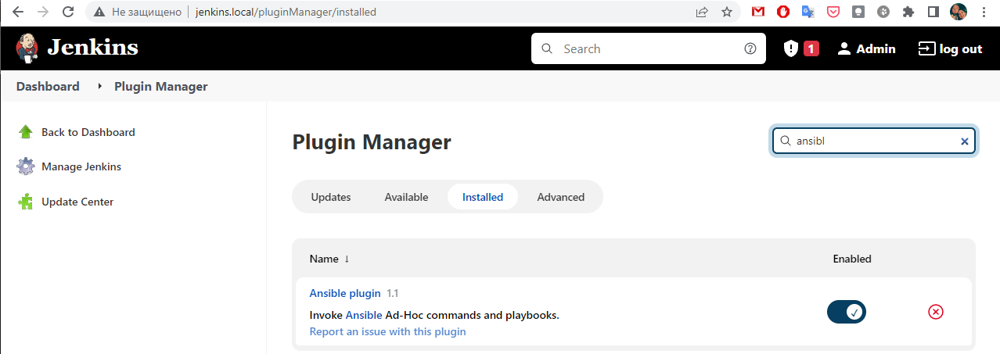
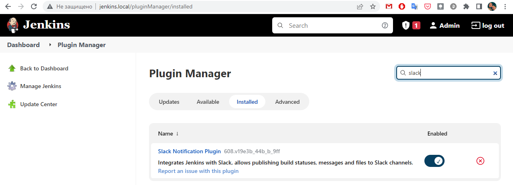

# 18.Jenkins.Start homework

## Vagrantfile
``` ruby
Vagrant.configure("2") do |config|
    config.vm.box = "ubuntu/focal64"
    config.vm.network "public_network", ip: "192.168.0.25"
    config.vm.provider "virtualbox" do |vb|
        vb.gui = false
        vb.memory = "2048"
        vb.cpus = "2"
    end
    config.vm.provision "shell", inline: <<-SHELL
        apt update
        echo "Docker installation"
        apt install -y apt-transport-https ca-certificates curl software-properties-common
        curl -fsSL https://download.docker.com/linux/ubuntu/gpg | apt-key add -
        add-apt-repository "deb [arch=amd64] https://download.docker.com/linux/ubuntu focal stable"
        apt update
        apt install -y docker-ce
        echo "Java installation"
        apt install -y openjdk-11-jre
        echo "Jenkins installation"
        curl -fsSL https://pkg.jenkins.io/debian-stable/jenkins.io.key | tee \
          /usr/share/keyrings/jenkins-keyring.asc > /dev/null
        echo deb [signed-by=/usr/share/keyrings/jenkins-keyring.asc] \
          https://pkg.jenkins.io/debian-stable binary/ | tee \
          /etc/apt/sources.list.d/jenkins.list > /dev/null
        apt update
        apt -y install jenkins
        usermod -s /bin/bash jenkins
        usermod -aG docker jenkins
        echo "##### Waiting for secret"
        while [ ! -f /var/lib/jenkins/secrets/initialAdminPassword ]
        do
            sleep 2
        done
        echo "Nginx installation"
        apt install -y nginx
        mkdir -p /var/log/nginx/jenkins
        usermod -aG jenkins www-data
        SHELL
    config.vm.provision "file", source: "jenkins", destination: "/tmp/"
    config.vm.provision "shell", inline: <<-SHELL
        mv /tmp/jenkins /etc/nginx/sites-enabled/jenkins
        service nginx restart
        runuser -l jenkins -c 'echo -e "\n\n\n" | ssh-keygen -t rsa'
        runuser -l jenkins -c 'cat ~/.ssh/id_rsa'
        runuser -l jenkins -c 'cat ~/.ssh/id_rsa.pub'
        echo "##### Secret here"
        cat /var/lib/jenkins/secrets/initialAdminPassword
        SHELL
end
```

## Nginx config
- [NGINX config](jenkins)

## Plugins installed



## Restricted user

