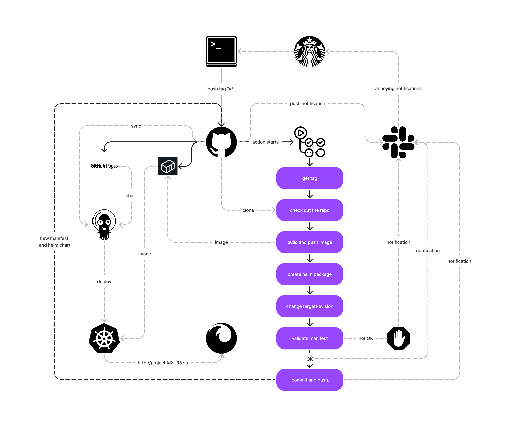

# Project Report
- Project's reporter: Ivan Niamkovich
- Group number: md-sa2-20-22

## Description of application for deployment
- Name of application: Wordpress
- Which programming language is this application written in: PHP
- What kind of DB: MySQL
- Link on git repository: https://github.com/docker-library/wordpress

## Pipeline. High Level Design

## Technologies which were used in project
- Orchestration: Kubernetes
- Automation tools: GitHub Action, ArgoCD, bash
- Notification: Slack
- CI description: by pushing tag (see scheme)

## Deployment flows short description:
ArgoCD synchronizes the presence and state of the application manifest. 
If the manifest appears/changes, the application is deployed to Kubernetes from helm chart . 
Kubernetes downloads the image from the registry.

## Rollback flow description and implementation:
Disable auto-sync in ArgoCD. Select the required version of the application to roll back.

## Links
[Project repository](https://github.com/ivan-nemkovich/project-sa)
