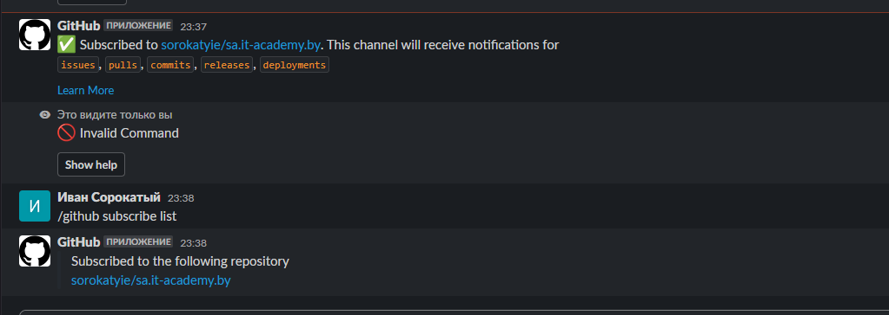

## Create key
```bash
pos@pos:~$ ssh-keygen
Generating public/private rsa key pair.
Enter file in which to save the key (/home/pos/.ssh/id_rsa):
/home/pos/.ssh/id_rsa already exists.
Overwrite (y/n)? y
Enter passphrase (empty for no passphrase):
Enter same passphrase again:
Your identification has been saved in /home/pos/.ssh/id_rsa
Your public key has been saved in /home/pos/.ssh/id_rsa.pub
The key fingerprint is:
The key's randomart image is:
```
GIT and GITLAB

[Gitlab](https://gitlab.com/ivan_sorokaty/repo)


[Github](https://github.com/sorokatyie/repo)

## Script
```bash
#! /bin/bash

for push in $(git remote)
do
git push $push --all
done
```
## Alias
```bash
alias gitgo='/home/new_trie/sa.it-academy.by/Ivan_Sorokatyi/03.GIT.Hosting/git.sh'
```

## Slack notification

