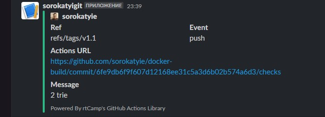

# 08.DockerCompose

## URL
[DockerHub](https://hub.docker.com/repository/docker/sorokatyi/docker_build/general)
[GIT Action](https://github.com/sorokatyie/docker-build/actions/runs/4483522478/jobs/7882912766)

```bash
name: Docker Build

on:
  push:
    tags:
      - "v*"
jobs:
  push_to_registries:
    name: Push Docker image
    runs-on: ubuntu-latest
    permissions:
      packages: write
      contents: read
    steps:
      - name: Check out the repo
        uses: actions/checkout@v2

      - name: Log in to the Docker hub
        uses: docker/login-action@v2
        with:
          username: sorokatyi
          password: ${{ secrets.DOCKER_HUB_ACESS_TOKEN }}

      - name: Log in to the Container registry
        uses: docker/login-action@v1
        with:
          registry: ghcr.io
          username: ${{ github.actor }}
          password: ${{ secrets.GHCR_TOKEN }}

      - name: Build and push Docker images
        uses: docker/build-push-action@v2
        with:
          context: .
          push: true
          tags: |.
            sorokatyi/docker_build:${{ github.ref_name }}


      - name: Slack notification fail
        uses: rtCamp/action-slack-notify@v2.0.2
        if: failure()
        with:
          status: ${{ job.status }}
          fields: repo,message,commit,author,action,eventName
          mention: '@channel'
          channel: sorokatyigit
        env:
          GITHUB_TOKEN: ${{ secrets.GITHUB_TOKEN }}
          SLACK_WEBHOOK: ${{ secrets.SLACK_WEBHOOK_URL }}

      - name: Slack notification ok
        uses: rtCamp/action-slack-notify@v2.0.2
        if: success()
        with:
          status: ${{ job.status }}
          fields: repo,message,commit,author,action,eventName
          mention: '@channel'
          channel: sorokatyigit
        env:
          GITHUB_TOKEN: ${{ secrets.GITHUB_TOKEN }}
          SLACK_WEBHOOK: ${{ secrets.SLACK_WEBHOOK_URL }}

```

##Slack notification
