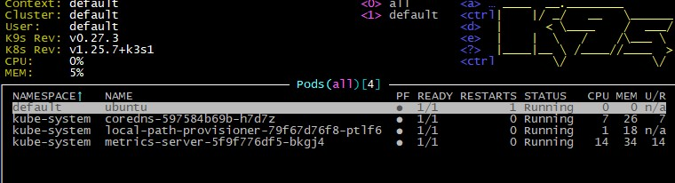
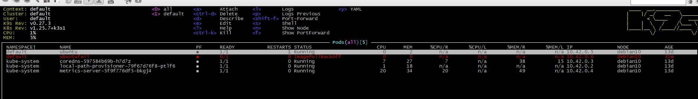
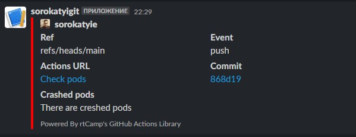

#10.Kubernetes
kubectl version
```bash
kubectl version --short
Flag --short has been deprecated, and will be removed in the future. The --short output will become the default.
Client Version: v1.26.3
Kustomize Version: v4.5.7
```
k9s version
```bash
pid 7904;
pos@pos:~$ k9s version
 ____  __.________
|    |/ _/   __   \______
|      < \____    /  ___/
|    |  \   /    /\___ \
|____|__ \ /____//____  >
        \/            \/

Version:    v0.27.3
Commit:     7c76691c389e4e7de29516932a304f7029307c6d
Date:       2023-02-12T15:19:22Z
```

github action

```bash
name: Check pods

on:
  push:
jobs:
  build:
    name: Check pods kubectl
    runs-on: ubuntu-latest

    steps:
      - name: Connection to host
        run: |
      mkdir ~/.ssh
      eval `ssh-agent -s`
      ssh-add - <<< "${{ secrets.SSH_KEY }}"
      ssh-keyscan ${{ secrets.PROXY_HOST }} >> ~/.ssh/known_hosts
      ssh ${{ secrets.PROXY_USERNAME }}@${{ secrets.PROXY_HOST}} ssh-keyscan ${{ secrets.HOST }} >> ~/.ssh/known_hosts
      ssh -o ProxyCommand="ssh -W %h:%p ${{ secrets.PROXY_USERNAME }}@${{ secrets.PROXY_HOST }}" ${{ secrets.USERNAME }}@${{ secrets.HOST }} "kubectl get pods -A" >> ${{ env.report }}
    - name: check pods
      id: check-pods
      run: |
        echo "pods-failed=$(cat report.log | grep -v Running | wc -l)" >> $GITHUB_OUTPUT

    - name: Check pods
      uses: actions/upload-artifact@v3
      with:
        path: report.log

    - name: Slack notification
      uses: rtCamp/action-slack-notify@v2
      env:
        SLACK_CHANEL: sorokatyigit
        SLACK_COLOR: '#FF0000'
        SLACK_ICON: https://github.com/rtCamp.png?size=48
        SLACK_MESSAGE: 'There are creshed pods'
        SLACK_TITLE: 'Crashed pods'
        SLACK_USERNAME: rtCamp
        SLACK_WEBHOOK: ${{ secrets.SLACK_WEBHOOK }}
```
result








