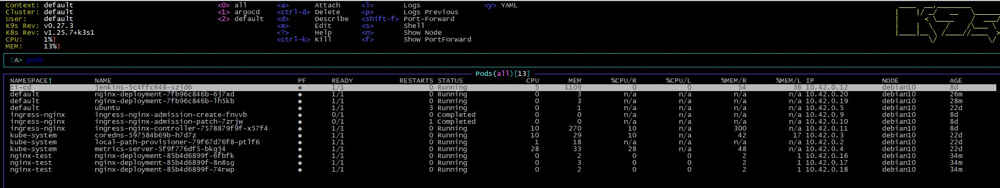

## 11. 9ks
--
```bash
apiVersion: apps/v1
kind: Deployment
metadata:
  name: nginx-deployment
spec:
  replicas: 3
  strategy:
    type: RollingUpdate
    rollingUpdate:
      maxSurge: 1
      maxUnavailable: 0
  selector:
    matchLabels:
      app: nginx
  template:
    metadata:
      labels:
        app: nginx
    spec:
      containers:
      - name: nginx
        image: nginx:1.16.1
        ports:
        - containerPort: 80
        resources:
          requests:
            cpu: 100m
            memory: 128Mi
          limits:
            cpu: 200m
            memory: 256Mi
```
--
```bash
apiVersion: networking.k8s.io/v1
kind: Ingress
metadata:
  name: nginx-ingress
spec:
  rules:
  - host: "nginx-test.k8s-19.sa"
    http:
      paths:
      - pathType: ImplementationSpecific
        path: "/"
        backend:
          service:
            name: nginx-service
            port:
              number: 80
```
--
```bash
apiVersion: networking.k8s.io/v1
kind: Ingress
metadata:
  name: nginx-ingress
spec:
  rules:
  - host: "nginx-test.k8s-19.sa"
    http:
      paths:
      - pathType: ImplementationSpecific
        path: "/"
        backend:
          service:
            name: nginx-service
            port:
              number: 80
```
--
etc/hosts
178.124.206.53 nginx-test.k8s-19.sa
--

