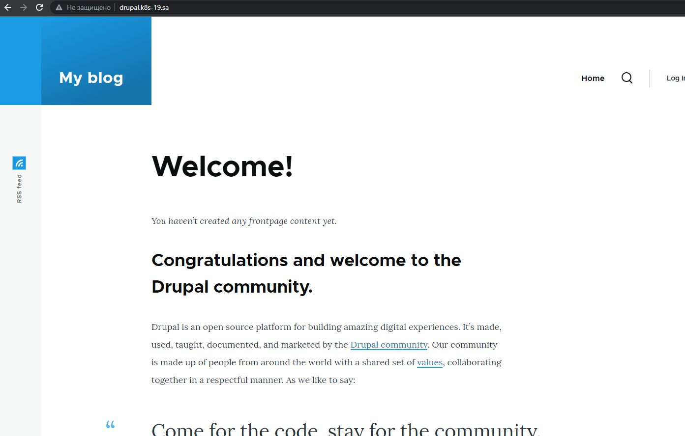
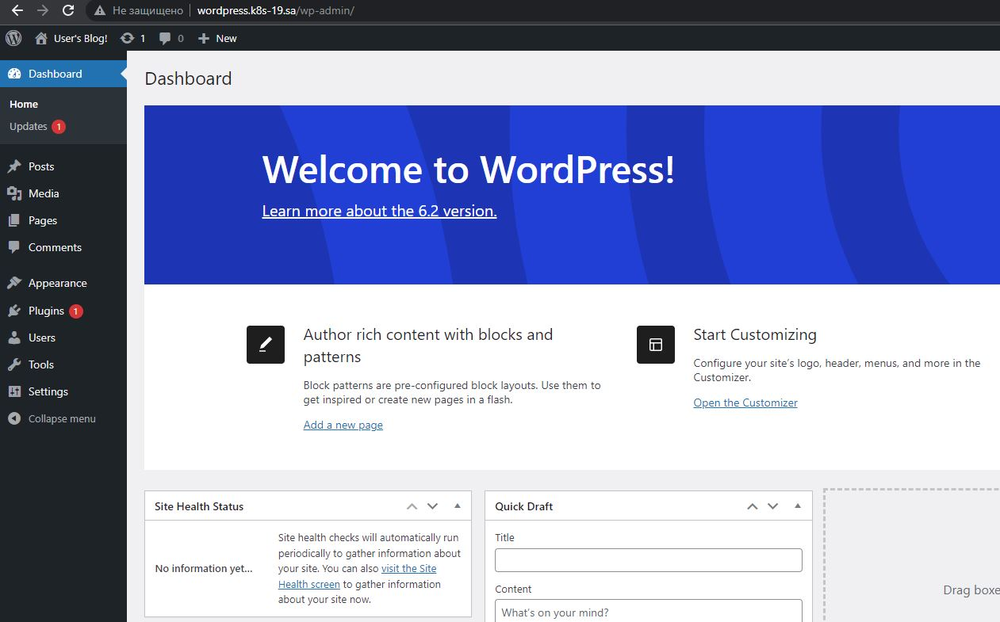

## 13.Helm
nfs
```bash
---
apiVersion: v1
kind: Namespace
metadata:
  name: nfs-provisioner
  labels:
    name: nfs-provisioner
---
apiVersion: helm.cattle.io/v1
kind: HelmChart
metadata:
  name: nfs
  namespace: nfs-provisioner
spec:
  chart: nfs-subdir-external-provisioner
  repo: https://kubernetes-sigs.github.io/nfs-subdir-external-provisioner
  targetNamespace: nfs-provisioner
  set:
    nfs.server: 192.168.37.105
    nfs.path: /mnt/IT-Academy/nfs-data/sa2-23-23/IvanSorokatyi/
    storageClass.name: nfs
---
apiVersion: storage.k8s.io/v1
kind: StorageClass
metadata:
  name: nfs-wordpress
provisioner: cluster.local/nfs-nfs-subdir-external-provisioner
parameters:
  onDelete: "retain"
  pathPattern: "/wordpress/"

```
ingress

```bash
apiVersion: networking.k8s.io/v1
kind: Ingress
metadata:
  name: ingress-wordpress
  annotations:
    kubernetes.io/ingress.class: nginx
spec:
  rules:
    - host: wordpress.k8s-19.sa
      http:
        paths:
          - path: /
            pathType: Prefix
            backend:
              service:
                name: wordpress
                port:
                  number: 80
---
apiVersion: networking.k8s.io/v1
kind: Ingress
metadata:
  name: ingress-drupal
  annotations:
    kubernetes.io/ingress.class: nginx
spec:
  rules:
    - host: drupal.k8s-19.sa
      http:
        paths:
          - path: /
            pathType: Prefix
            backend:
              service:
                name: drupal
                port:
                  number: 80
```




helm repo add bitnami https://charts.bitnami.com/bitnami
helm install wordpress --set mariadb.enabled=false,externalDatabase.host=192.168.201.19,externalDatabase.user=wpress,externalDatabase.password=wpress,externalDatabase.database=wpress,global.storageClass=nfs-wordpress,wordpressUsername=wpress,wordpressPassword=wpress,livenessProbe.initialDelaySeconds=1200,readinessProbe.initialDelaySeconds=120 bitnami/wordpress
helm install drupal --set mariadb.enabled=false,externalDatabase.host=192.168.201.19,externalDatabase.user=wpress,externalDatabase.password=wpress,externalDatabase.database=wpress,global.storageClass=nfs-drupal,drupalUsername=drupal,drupalPassword=drupal bitnami/drupal