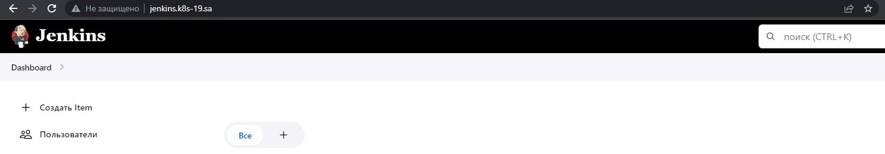

## Jenkins page


## Create helm package for jenkins application
[Manifest.yaml](https://github.com/sorokatyie/helm/blob/master/helm-source/jenkins/templates/deployment.yaml)


[Values.yaml](https://github.com/sorokatyie/helm/blob/master/helm-source/values.yaml)

## Command
```
helm create jenkins
helm repo index --url https://sorokatyie.github.io/helm/ .
helm install helm helm/jenkins
# helm search repo helm -l
NAME                            CHART VERSION   APP VERSION     DESCRIPTION
helm/jenkins                    0.1.0           1.16.0          A Helm chart for Kubernetes
helm install helm helm-course/jenkins
kubectl get pods -A
NAMESPACE         NAME                                                   READY   STATUS      RESTARTS        AGE
default           helms-jenkins-dd689475d-8mw9z                          1/1     Running     0               6m
```