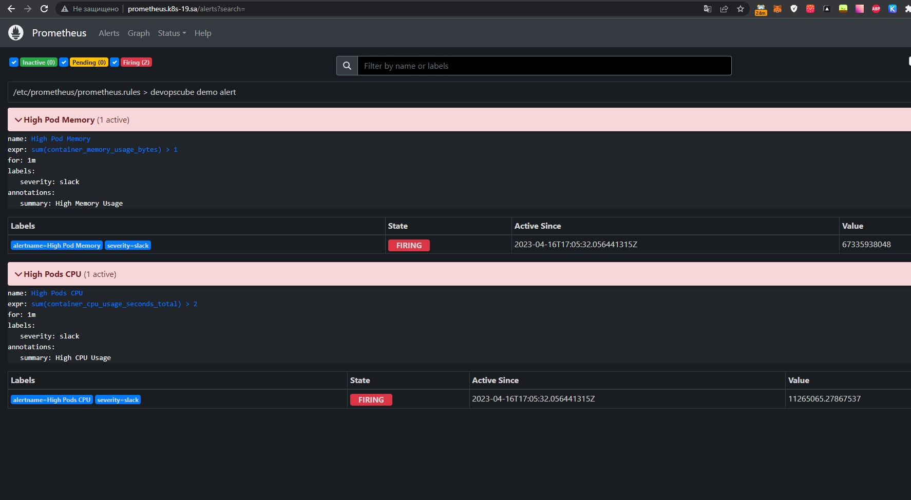
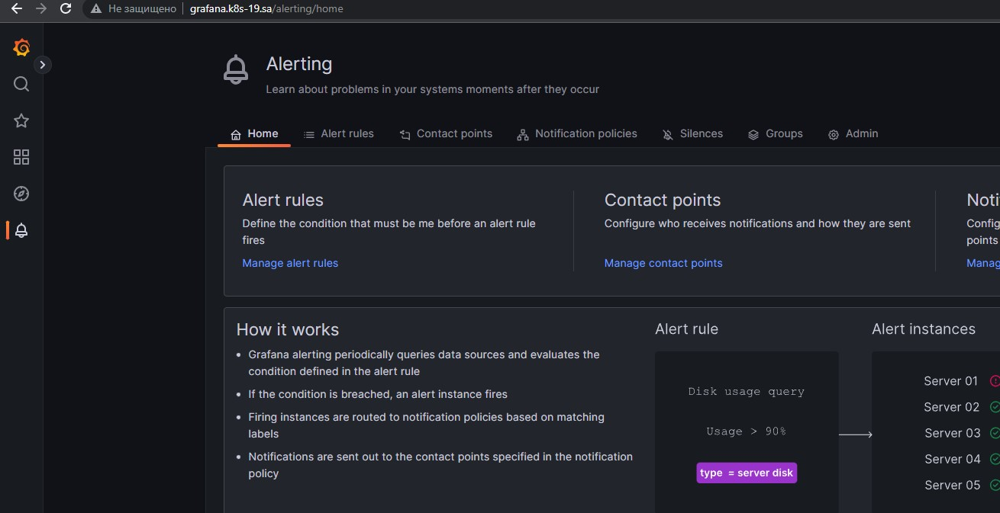
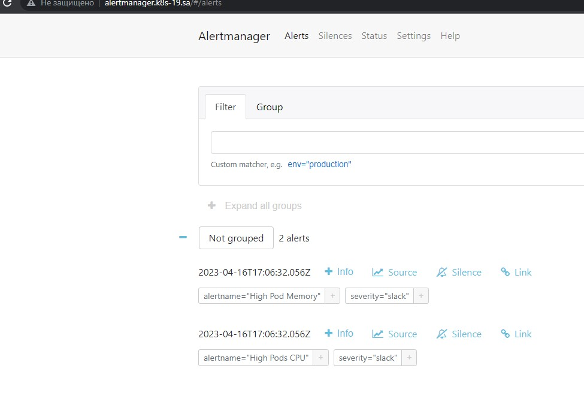
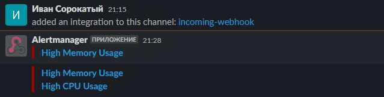

## 16. Technical and service monitoring

```bash
kubectl create namespace monitoring
kubectl apply -f prometheus.yaml -n monitoring
kubectl apply -f alertmanager.yaml -n monitoring
kubectl apply -f grafana.yaml -n monitoring
```
---


---



---



---

