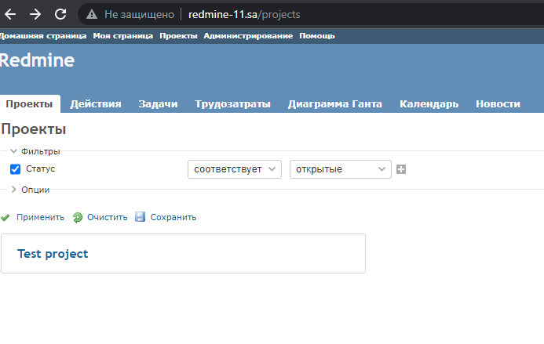

# 08.Ansible.Workshop - Ivan Ustinovich
ansible-playbook -i inventory.yaml redmine.yaml
```bash
PLAY [redmine] ***********************************************************************************************************************************************************************************************

TASK [Gathering Facts] ***************************************************************************************************************************************************************************************
ok: [redmine]

TASK [debug] *************************************************************************************************************************************************************************************************
ok: [redmine] => {
    "msg": "192.168.201.11"
}

TASK [Redmine. Install packages] *****************************************************************************************************************************************************************************
ok: [redmine]

TASK [mysql : mysql_db] **************************************************************************************************************************************************************************************
ok: [redmine]

TASK [mysql : mysql_user] ************************************************************************************************************************************************************************************
ok: [redmine]

TASK [app : Redmine. Clone repository] ***********************************************************************************************************************************************************************
ok: [redmine]

TASK [app : Redmine. Change permissions] *********************************************************************************************************************************************************************
ok: [redmine]

TASK [app : Redmine. Change permissions] *********************************************************************************************************************************************************************
ok: [redmine]

TASK [app : Config database] *********************************************************************************************************************************************************************************
ok: [redmine]

TASK [app : Redmine. Setup 01] *******************************************************************************************************************************************************************************
changed: [redmine]

TASK [app : Session store secret generation] *****************************************************************************************************************************************************************
changed: [redmine]

TASK [app : Redmine. Setup 02] *******************************************************************************************************************************************************************************
changed: [redmine]

TASK [app : Configuration files for virtualhost] *************************************************************************************************************************************************************
changed: [redmine]

RUNNING HANDLER [app : apache restart] ***********************************************************************************************************************************************************************
changed: [redmine]

TASK [Add redmine-11.sa to host file] ************************************************************************************************************************************************************************
changed: [redmine]

TASK [uri] ***************************************************************************************************************************************************************************************************
ok: [redmine]

TASK [lineinfile] ********************************************************************************************************************************************************************************************
changed: [redmine]

PLAY RECAP ***************************************************************************************************************************************************************************************************
redmine                    : ok=17   changed=7    unreachable=0    failed=0    skipped=0    rescued=0    ignored=0
```

## Redmine



