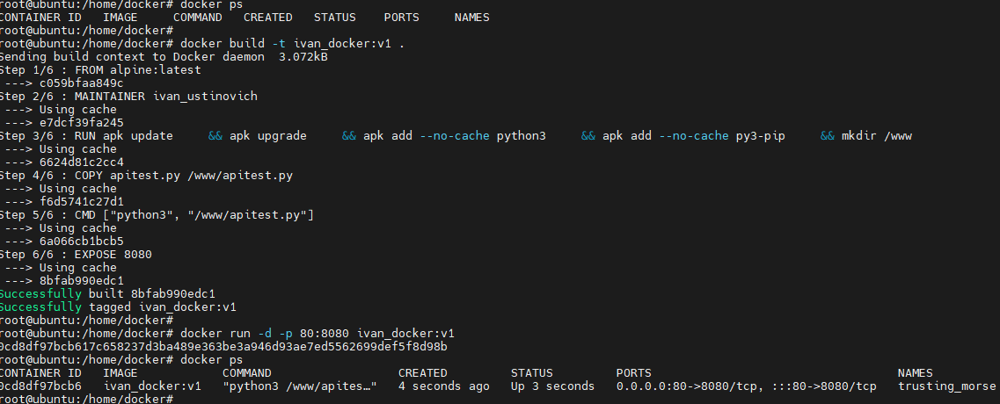

## 09.Docker - Ivan Ustinovich

### Github repo
```bash
https://github.com/Gusiner/docker
```
### Docker Hub
```bash
https://hub.docker.com/repository/docker/gusiner/docker
```
### python script
```bash
import socket

server = socket.socket(socket.AF_INET, socket.SOCK_STREAM)
server.setsockopt(socket.SOL_SOCKET, socket.SO_REUSEADDR, 1)


server.bind(('', 8080))
server.listen()
while True:
      client_socket, addr = server.accept()
      request = client_socket.recv(1024)
      print ('Connected ' + addr[0] + ':' + str(addr[1]))
      client_socket.sendall(b'Its Works!')
      client_socket.close()

```
### Dockerfile
```bash
FROM alpine:latest

MAINTAINER ivan_ustinovich


RUN apk update \
    && apk upgrade \
    && apk add --no-cache python3 \
    && apk add --no-cache py3-pip \
    && mkdir /www

COPY apitest.py /www/apitest.py

CMD ["python3", "/www/apitest.py"]

EXPOSE 8080
```


