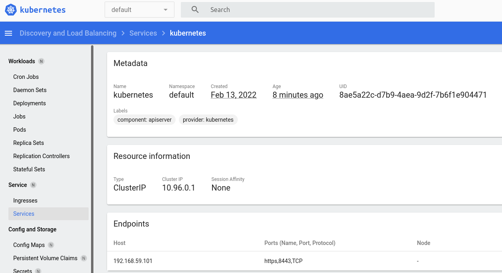

# 10. ks8 - Ivan Ustinovich
### minikube commands
```bash
minikube start --memory 4096 --cpus 4
kubectl proxy --address='0.0.0.0' --disable-filter=true &
minikube addons enable ingress
minikube dashboard
minikube stop
minikube delete
```
### dashboard
```bash
minikube dashboard
http://127.0.0.1:36175/api/v1/namespaces/kubernetes-dashboard/services/http:kubernetes-dashboard:/proxy/#/node/minikube?namespace=default
```


### final summary of ansible play kubespray
```bash
PLAY RECAP ***********************************************************************************************************
localhost                  : ok=4    changed=0    unreachable=0    failed=0    skipped=0    rescued=0    ignored=0   
node1                      : ok=703  changed=148  unreachable=0    failed=0    skipped=1177 rescued=0    ignored=3   
node2                      : ok=570  changed=117  unreachable=0    failed=0    skipped=975  rescued=0    ignored=2   

Sunday 13 February 2022  23:36:30 +0300 (0:00:00.023)       0:33:31.696 ******* 
=============================================================================== 
kubernetes/preinstall : Install packages requirements -------------------------------------------------------- 70.04s
kubernetes-apps/ansible : Kubernetes Apps | Lay Down CoreDNS templates --------------------------------------- 47.76s
download : download_container | Download image if required --------------------------------------------------- 43.82s
download : download_container | Download image if required --------------------------------------------------- 43.47s
download : download_container | Download image if required --------------------------------------------------- 40.74s
download : download_container | Download image if required --------------------------------------------------- 40.13s
kubernetes-apps/ansible : Kubernetes Apps | Start Resources -------------------------------------------------- 35.34s
download : download_container | Download image if required --------------------------------------------------- 34.17s
kubernetes/control-plane : kubeadm | Initialize first master ------------------------------------------------- 33.25s
network_plugin/calico : Calico | Create calico manifests ----------------------------------------------------- 28.91s
kubernetes/control-plane : Joining control plane node to the cluster. ---------------------------------------- 24.36s
download : download_container | Download image if required --------------------------------------------------- 24.14s
bootstrap-os : Assign inventory name to unconfigured hostnames (non-CoreOS, non-Flatcar, Suse and ClearLinux, non-Fedora) -- 23.17s
download : download_container | Download image if required --------------------------------------------------- 23.11s
container-engine/containerd : download_file | Download item -------------------------------------------------- 22.38s
download : download_file | Download item --------------------------------------------------------------------- 21.88s
download : download_container | Download image if required --------------------------------------------------- 21.36s
download : download_container | Download image if required --------------------------------------------------- 20.46s
download : download_file | Download item --------------------------------------------------------------------- 19.00s
policy_controller/calico : Create calico-kube-controllers manifests ------------------------------------------ 18.96s
```
