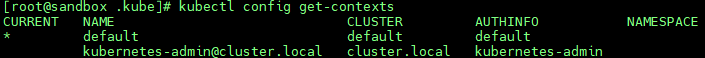
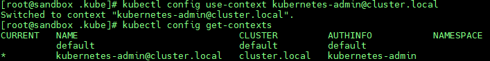
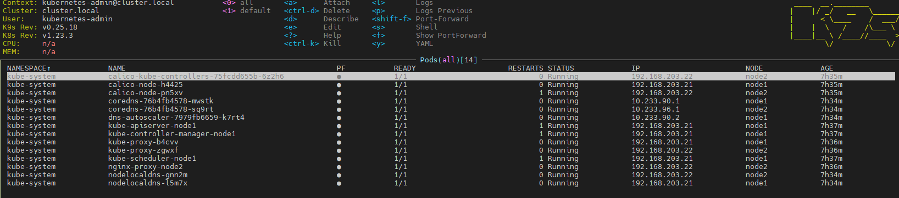
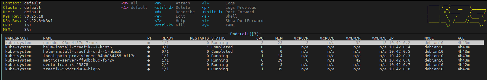

# 11. Kubernetes installation - Ivan Ustinovich
### kubectl config view
```bash
apiVersion: v1
clusters:
- cluster:
    certificate-authority-data: DATA+OMITTED
    server: https://192.168.203.21:6443
  name: cluster.local
- cluster:
    certificate-authority-data: DATA+OMITTED
    server: https://192.168.203.35:6443
  name: default
contexts:
- context:
    cluster: default
    user: default
  name: default
- context:
    cluster: cluster.local
    user: kubernetes-admin
  name: kubernetes-admin@cluster.local
current-context: default
kind: Config
preferences: {}
users:
- name: default
  user:
    client-certificate-data: REDACTED
    client-key-data: REDACTED
- name: kubernetes-admin
  user:
    client-certificate-data: REDACTED
    client-key-data: REDACTED
```



## k9s on k8s cluster


## k9s on k3s cluster

