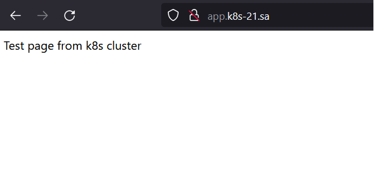
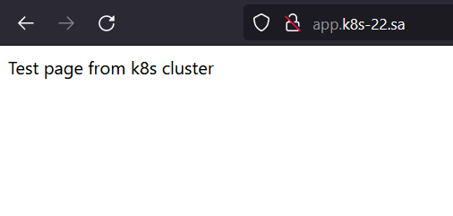

# 12. Kubernetes installation - Ivan Ustinovich
### Deployment of nginx service




## Ingress controller
```bash
---
apiVersion: apps/v1
kind: Deployment
metadata:
  name: webserver
  labels:
    app: simple-web
spec:
  replicas: 1
  selector:
    matchLabels:
      app: simple-web
  template:
    metadata:
      labels:
        app: simple-web
    spec:
      containers:
      - name: nginx-server
        image: nginx
        ports:
        - containerPort: 80
        resources:
          requests:
            cpu: 50m
            memory: 50Mi
          limits:
            cpu: 100m
            memory: 100Mi
        volumeMounts:
        - name: persistent-storage
          mountPath: "/usr/share/nginx/html/"
        #- name: config-mount
        #  mountPath: /tmp/index.html
        #  subPath: index.html
      volumes:
      - name: persistent-storage
        persistentVolumeClaim:
          claimName: web-pv-claim
      #- name: config-mount
      #  configMap:
      #    name: config
---
apiVersion: v1
kind: Service
metadata:
  name: simple-web-service
  labels:
    run: simple-web-service
spec:
#  type: LoadBalancer
  ports:
  - port: 80
    protocol: TCP
  selector:
    app: simple-web
---
apiVersion: v1
kind: PersistentVolume
metadata:
  name: nfs-pv
  labels:
    type: nfs
    name: web-nfs
spec:
  capacity:
    storage: 2Gi
  accessModes:
    - ReadWriteMany
  persistentVolumeReclaimPolicy: Recycle
  nfs:
    path: /mnt/IT-Academy/nfs-data/sa2-19-22/Ivan_Ustinovich/app
    server: 192.168.37.105
---
apiVersion: v1
kind: PersistentVolumeClaim
metadata:
  name: web-pv-claim
  labels:
    app: wordpress
    name: web-pv-claim
spec:
  accessModes:
    - ReadWriteMany
  resources:
    requests:
      storage: 2Gi
  selector:
    matchLabels:
      name: web-nfs
      type: nfs

---

apiVersion: networking.k8s.io/v1
kind: Ingress
metadata:
  name: ingress-sa
  annotations:
    kubernetes.io/ingress.class: nginx
    nginx.ingress.kubernetes.io/server-alias: "app.k8s-22.sa"
spec:
  rules:
    - host: app.k8s-21.sa
      http:
        paths:
          - path: /
            pathType: Prefix
            backend:
              service:
                name: simple-web-service
                port:
                  number: 80
---
apiVersion: v1
kind: ConfigMap
metadata:
  name: config
data:
  index.html: |
    Test page nginx k8s
```
