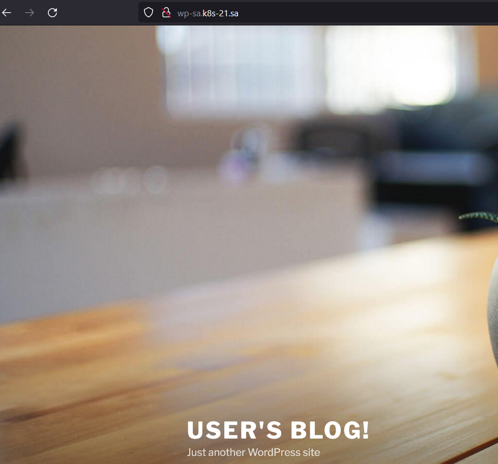
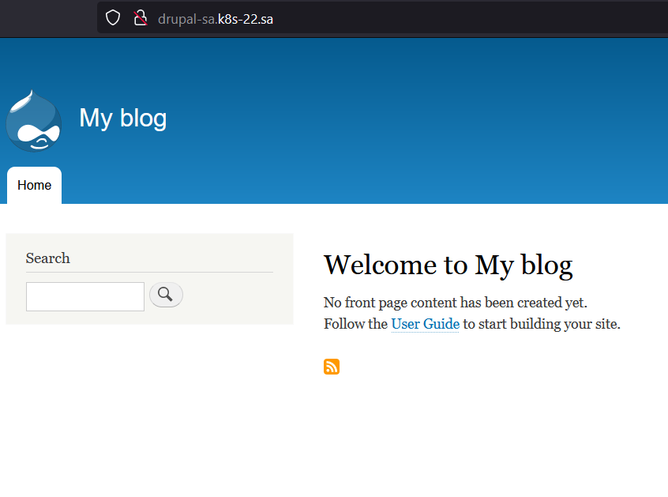

# 13.Kubernetes.Helm - Ivan Ustinovich
### Deployment of nginx service




## history
```bash
187 k9s
  188  helm install nfs-subdir-external-provisioner nfs-subdir-external-provisioner/nfs-subdir-external-provisioner     --set nfs.server=192.168.37.105     --set nfs.path=/mnt/IT-Academy/nfs-data/sa2-19-22/Ivan_Ustinovich/wp
  189  k9s
  190  helm install wordpress --set global.storageClass=nfs-client,wordpressUsername=admin,wordpressPassword=password,serviceType=ClusterIP stable/wordpress
  191  k9s
  192  nano ingress-wp.yaml
  193  k9s
  194  nano ingress-wp.yaml
  195  kubectl apply -f ingress-wp.yaml
  196  k9s
  197  cat ingress-wp.yaml
  198  cd /mnt/ivan/sa2-19-22/Ivan_Ustinovich/wp/
  199  ll
  200  cd --
  201  helm install drupal  --set global.storageClass=nfs-client,drupalUsername=admin,drupalPassword=password,ingress.enabled=True,ingress.hostname=drupal-sa.k8s-21.sa,ingress.path="/",serviceType=ClusterIP bitnami/drupal
  202  k9s
  203  cat ingress-wp.yaml
  204  k9s
  205  cp ingress-wp.yaml ingress-drupal.yaml
  206  nano ingress-drupal.yaml
  207  kubectl apply -f ingress-drupal.yaml
  208  k9s
  209  ll
  210  cat app.yaml
  211  history
```
