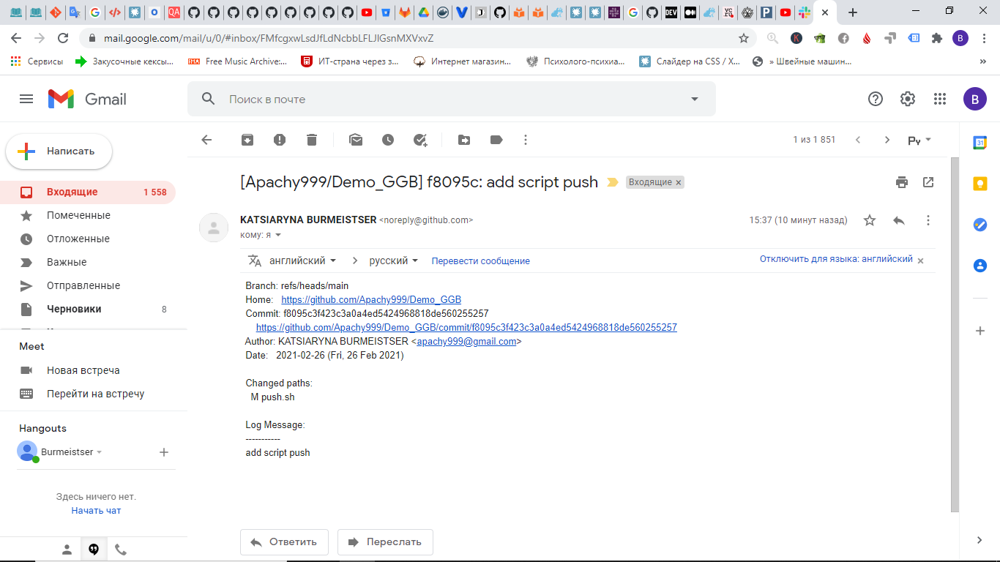
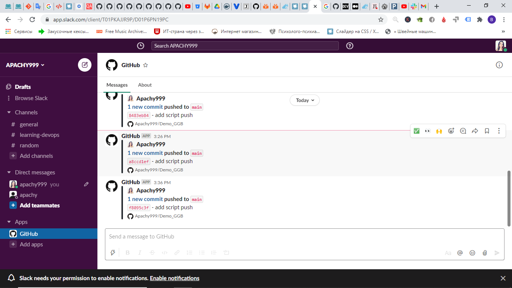

  # 03.Git.Hosting
  ---
  ### Links 

  + [GitHub](https://github.com/Apachy999/Demo_GGB)
  + [GitLab](https://gitlab.com/apachy999/demo_ggb)
  + [BitBucket](https://bitbucket.org/Apachy/demo_ggb)
  

  ### Slack + Mail
  
    
	
	
	

  
  ### Script
  
  ```
  #!/bin/bash

  for item in $(git remote); do
      git push -u $item --all
  done

  ```


