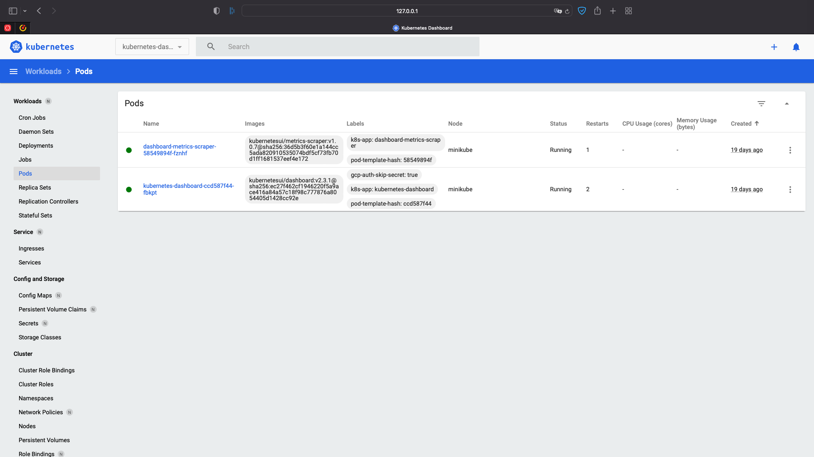

# minikube

1. Provide access to the dashboard from your workstation



2. Enable plugin: ingress
```bash
kirill@kirills-MacBook-Pro 10.Kubernetes % minikube addons enable ingress
    ▪ Используется образ k8s.gcr.io/ingress-nginx/controller:v1.1.1
    ▪ Используется образ k8s.gcr.io/ingress-nginx/kube-webhook-certgen:v1.1.1
    ▪ Используется образ k8s.gcr.io/ingress-nginx/kube-webhook-certgen:v1.1.1
🔎  Verifying ingress addon...
🌟  The 'ingress' addon is enabled
kirill@kirills-MacBook-Pro 10.Kubernetes % minikube addons list
|-----------------------------|----------|--------------|--------------------------------|
|         ADDON NAME          | PROFILE  |    STATUS    |           MAINTAINER           |
|-----------------------------|----------|--------------|--------------------------------|
| ambassador                  | minikube | disabled     | third-party (ambassador)       |
| auto-pause                  | minikube | disabled     | google                         |
| csi-hostpath-driver         | minikube | disabled     | kubernetes                     |
| dashboard                   | minikube | enabled ✅   | kubernetes                     |
| default-storageclass        | minikube | enabled ✅   | kubernetes                     |
| efk                         | minikube | disabled     | third-party (elastic)          |
| freshpod                    | minikube | disabled     | google                         |
| gcp-auth                    | minikube | disabled     | google                         |
| gvisor                      | minikube | disabled     | google                         |
| helm-tiller                 | minikube | disabled     | third-party (helm)             |
| ingress                     | minikube | enabled ✅   | unknown (third-party)          |
| ingress-dns                 | minikube | disabled     | google                         |
| istio                       | minikube | disabled     | third-party (istio)            |
| istio-provisioner           | minikube | disabled     | third-party (istio)            |
| kong                        | minikube | disabled     | third-party (Kong HQ)          |
| kubevirt                    | minikube | disabled     | third-party (kubevirt)         |
| logviewer                   | minikube | disabled     | unknown (third-party)          |
| metallb                     | minikube | disabled     | third-party (metallb)          |
| metrics-server              | minikube | disabled     | kubernetes                     |
| nvidia-driver-installer     | minikube | disabled     | google                         |
| nvidia-gpu-device-plugin    | minikube | disabled     | third-party (nvidia)           |
| olm                         | minikube | disabled     | third-party (operator          |
|                             |          |              | framework)                     |
| pod-security-policy         | minikube | disabled     | unknown (third-party)          |
| portainer                   | minikube | disabled     | portainer.io                   |
| registry                    | minikube | disabled     | google                         |
| registry-aliases            | minikube | disabled     | unknown (third-party)          |
| registry-creds              | minikube | disabled     | third-party (upmc enterprises) |
| storage-provisioner         | minikube | enabled ✅   | google                         |
| storage-provisioner-gluster | minikube | disabled     | unknown (third-party)          |
| volumesnapshots             | minikube | disabled     | kubernetes                     |
|-----------------------------|----------|--------------|--------------------------------|
```

3. Prepare command for run minikube with different HW options (RAM/CPU)

```
kirill@kirills-MacBook-Pro 10.Kubernetes % minikube start --memory 4096 --cpus 2
```

# k8s cluster
```
PLAY RECAP ***************************************************************************************************
localhost                  : ok=4    changed=0    unreachable=0    failed=0    skipped=0    rescued=0    ignored=0   
node1                      : ok=768  changed=144  unreachable=0    failed=0    skipped=1315 rescued=0    ignored=6   
node2                      : ok=506  changed=87   unreachable=0    failed=0    skipped=773  rescued=0    ignored=2   

воскресенье 22 мая 2022  22:59:49 +0300 (0:00:00.085)       0:45:10.714 ******* 
=============================================================================== 
kubernetes/preinstall : Install packages requirements ----------------------------------------------- 192.40s
download : download_file | Validate mirrors ---------------------------------------------------------- 73.37s
download : download_file | Download item ------------------------------------------------------------- 57.94s
kubernetes/preinstall : Remove search/domain/nameserver options before block ------------------------- 52.55s
kubernetes-apps/ansible : Kubernetes Apps | Lay Down CoreDNS templates ------------------------------- 51.31s
download : download_file | Download item ------------------------------------------------------------- 49.84s
container-engine/containerd : download_file | Download item ------------------------------------------ 46.62s
kubernetes-apps/ansible : Kubernetes Apps | Start Resources ------------------------------------------ 37.81s
download : download_file | Download item ------------------------------------------------------------- 34.22s
download : download_container | Download image if required ------------------------------------------- 30.86s
network_plugin/calico : Calico | Create calico manifests --------------------------------------------- 30.06s
download : download_container | Download image if required ------------------------------------------- 28.87s
download : download_container | Download image if required ------------------------------------------- 28.76s
container-engine/nerdctl : download_file | Download item --------------------------------------------- 28.65s
download : download_container | Download image if required ------------------------------------------- 28.48s
kubernetes/control-plane : kubeadm | Initialize first master ----------------------------------------- 27.66s
bootstrap-os : Assign inventory name to unconfigured hostnames (non-CoreOS, non-Flatcar, Suse and ClearLinux, non-Fedora) -- 23.77s
kubernetes/kubeadm : Join to cluster ----------------------------------------------------------------- 21.33s
download : download_container | Download image if required ------------------------------------------- 21.32s
policy_controller/calico : Create calico-kube-controllers manifests ---------------------------------- 20.55s
```