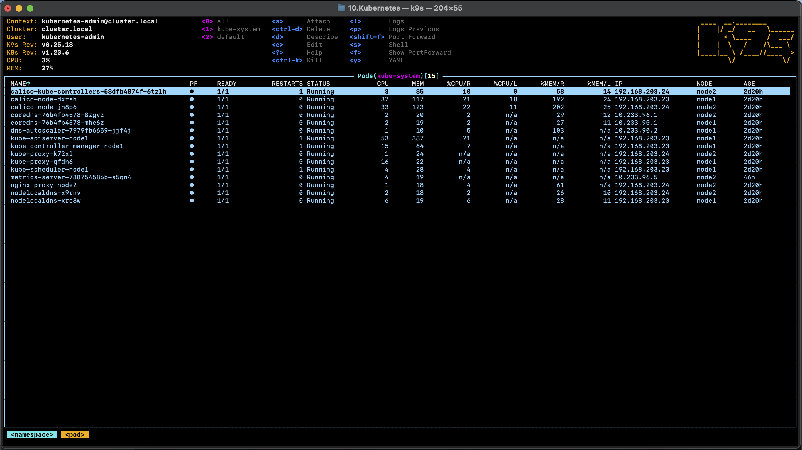

### K9S



### K3S, aliases and context
```bash
kirill@kirills-MacBook-Pro / % kcgc
CURRENT   NAME   CLUSTER         AUTHINFO           NAMESPACE
          k3s    default         default            
*         k8s    cluster.local   kubernetes-admin   
kirill@kirills-MacBook-Pro / % kgno
NAME    STATUS   ROLES                  AGE     VERSION
node1   Ready    control-plane,master   2d22h   v1.23.6
node2   Ready    <none>                 2d22h   v1.23.6
kirill@kirills-MacBook-Pro / % kcuc k3s
Switched to context "k3s".
kirill@kirills-MacBook-Pro / % kgno
NAME      STATUS   ROLES                  AGE   VERSION
vagrant   Ready    control-plane,master   21m   v1.23.6+k3s1
kirill@kirills-MacBook-Pro / % 
```