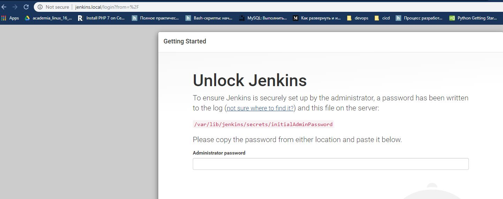

```
sudo apt update
sudo apt install openjdk-8-jdk
wget -q -O - https://pkg.jenkins.io/debian/jenkins.io.key | sudo apt-key add -
sudo sh -c 'echo deb http://pkg.jenkins.io/debian-stable binary/ > /etc/apt/sources.list.d/jenkins.list'
sudo apt update
sudo apt install jenkins
```

```
sudo apt install nginx
sudo  vim etc/nginx/sites-available/jenkins.conf
```
jenkins.conf:
```
upstream app_server {
server 127.0.0.1:8080 fail_timeout=0;
}

server {
listen 80;
listen [::]:80 default ipv6only=on;
server_name jenkins.local;

location / {
proxy_set_header X-Forwarded-For $proxy_add_x_forwarded_for;
proxy_set_header Host $http_host;
proxy_redirect off;

if (!-f $request_filename) {
proxy_pass http://app_server;
break;
}
}
}
```

```
sudo cp /etc/nginx/sites-available/jenkins.conf /etc/nginx/sites-enabled/jenkins.conf
sudo rm -rf etc/nginx/sites-enabled/default
sudo rm -rf etc/nginx/sites-available/default

sudo systemctl restart nginx
sudo systemctl restart jenkins
```

After all ports forwarding:

