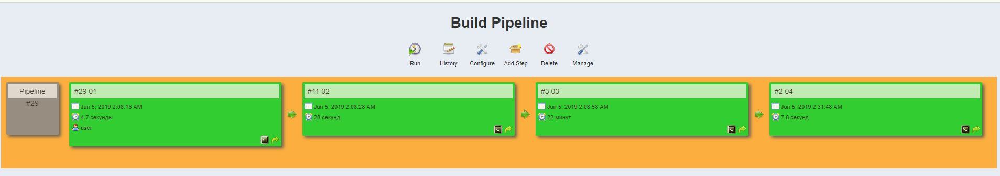

# Task 09.Jenkins.Routine
## Job01 
### Check connection to the host
```
Started by user user
Building in workspace /var/lib/jenkins/workspace/01
[01] $ ansible my_host -m ping -f 5
ub | SUCCESS => {
    "changed": false, 
    "ping": "pong"
}
Triggering a new build of 02
Finished: SUCCESS
```
## Job02
### Install/upgrade nmap
```
Started by upstream project "01" build number 29
originally caused by:
 Started by user user
Building in workspace /var/lib/jenkins/workspace/02
[02] $ ansible my_host -m shell -a "sudo apt install -y nmap" -f 5
 [WARNING]: Consider using 'become', 'become_method', and 'become_user' rather
than running sudo
ub | SUCCESS | rc=0 >>
Reading package lists...
Building dependency tree...
Reading state information...
The following NEW packages will be installed:
  nmap
0 upgraded, 1 newly installed, 0 to remove and 109 not upgraded.
Need to get 4,638 kB of archives.
After this operation, 21.3 MB of additional disk space will be used.
Get:1 http://us.archive.ubuntu.com/ubuntu xenial/main amd64 nmap amd64 7.01-2ubuntu2 [4,638 kB]
Fetched 4,638 kB in 11s (413 kB/s)
Selecting previously unselected package nmap.
(Reading database ... 
(Reading database ... 5%
(Reading database ... 10%
(Reading database ... 15%
(Reading database ... 20%
(Reading database ... 25%
(Reading database ... 30%
(Reading database ... 35%
(Reading database ... 40%
(Reading database ... 45%
(Reading database ... 50%
(Reading database ... 55%
(Reading database ... 60%
(Reading database ... 65%
(Reading database ... 70%
(Reading database ... 75%
(Reading database ... 80%
(Reading database ... 85%
(Reading database ... 90%
(Reading database ... 95%
(Reading database ... 100%
(Reading database ... 126255 files and directories currently installed.)
Preparing to unpack .../nmap_7.01-2ubuntu2_amd64.deb ...
Unpacking nmap (7.01-2ubuntu2) ...
Processing triggers for man-db (2.7.5-1) ...
Setting up nmap (7.01-2ubuntu2) ...
WARNING: apt does not have a stable CLI interface. Use with caution in scripts.

debconf: unable to initialize frontend: Dialog
debconf: (Dialog frontend will not work on a dumb terminal, an emacs shell buffer, or without a controlling terminal.)
debconf: falling back to frontend: Readline
Triggering a new build of 03
Finished: SUCCESS
```
## Job03
### Checks all online hosts
```
Started by upstream project "02" build number 11
originally caused by:
 Started by upstream project "01" build number 29
 originally caused by:
  Started by user user
Building in workspace /var/lib/jenkins/workspace/03
[03] $ ansible my_host -m shell -a "nmap  192.168.253.0/24" -s -f 5
[DEPRECATION WARNING]: The sudo command line option has been deprecated in 
favor of the "become" command line arguments. This feature will be removed in 
version 2.6. Deprecation warnings can be disabled by setting 
deprecation_warnings=False in ansible.cfg.
ub | SUCCESS | rc=0 >>

Starting Nmap 7.01 ( https://nmap.org ) at 2019-06-05 09:09 +03
Nmap scan report for 192.168.253.10
Host is up (0.00023s latency).
Not shown: 998 closed ports
PORT   STATE SERVICE
22/tcp open  ssh
80/tcp open  http
MAC Address: D2:84:7E:EE:4B:B4 (Unknown)

Nmap scan report for 192.168.253.44
Host is up (0.042s latency).
All 1000 scanned ports on 192.168.253.44 are filtered
MAC Address: 24:2E:02:4E:35:A1 (Unknown)

Nmap scan report for 192.168.253.81
Host is up (0.00026s latency).
Not shown: 998 filtered ports
PORT   STATE SERVICE
22/tcp open  ssh
80/tcp open  http
MAC Address: D2:70:08:FA:4E:09 (Unknown)

Nmap scan report for 192.168.253.112
Host is up (0.014s latency).
Not shown: 998 closed ports
PORT     STATE SERVICE
80/tcp   open  http
8080/tcp open  http-proxy
MAC Address: 00:0A:F5:00:11:64 (Airgo Networks)

Nmap scan report for 192.168.253.117
Host is up (0.00023s latency).
Not shown: 997 closed ports
PORT    STATE SERVICE
22/tcp  open  ssh
80/tcp  open  http
443/tcp open  https
MAC Address: BE:EA:82:63:B9:06 (Unknown)

Nmap scan report for 192.168.253.128
Host is up (0.00037s latency).
Not shown: 996 filtered ports
PORT     STATE SERVICE
135/tcp  open  msrpc
139/tcp  open  netbios-ssn
445/tcp  open  microsoft-ds
5357/tcp open  wsdapi
MAC Address: 20:89:84:E5:A4:3F (Compal Information (kunshan))

Nmap scan report for 192.168.253.130
Host is up (0.00022s latency).
Not shown: 998 closed ports
PORT   STATE SERVICE
22/tcp open  ssh
80/tcp open  http
MAC Address: C6:B6:22:B5:8B:7F (Unknown)

Nmap scan report for 192.168.253.131
Host is up (0.00023s latency).
Not shown: 998 closed ports
PORT   STATE SERVICE
22/tcp open  ssh
80/tcp open  http
MAC Address: 82:B4:E3:E1:D1:C3 (Unknown)

Nmap scan report for 192.168.253.132
Host is up (0.00019s latency).
Not shown: 998 closed ports
PORT   STATE SERVICE
22/tcp open  ssh
80/tcp open  http
MAC Address: 66:01:54:A7:86:27 (Unknown)

Nmap scan report for 192.168.253.133
Host is up (0.00021s latency).
Not shown: 998 closed ports
PORT   STATE SERVICE
22/tcp open  ssh
80/tcp open  http
MAC Address: 22:0D:D0:E0:4B:2A (Unknown)

Nmap scan report for 192.168.253.134
Host is up (0.00019s latency).
Not shown: 998 closed ports
PORT   STATE SERVICE
22/tcp open  ssh
80/tcp open  http
MAC Address: 3E:6C:FF:F2:60:8B (Unknown)

Nmap scan report for 192.168.253.135
Host is up (0.00020s latency).
Not shown: 998 closed ports
PORT   STATE SERVICE
22/tcp open  ssh
80/tcp open  http
MAC Address: 1A:FB:B8:61:61:E5 (Unknown)

Nmap scan report for 192.168.253.137
Host is up (0.00019s latency).
Not shown: 998 closed ports
PORT   STATE SERVICE
22/tcp open  ssh
80/tcp open  http
MAC Address: 1E:4F:8C:30:0E:4B (Unknown)

Nmap scan report for 192.168.253.138
Host is up (0.00019s latency).
Not shown: 998 closed ports
PORT   STATE SERVICE
22/tcp open  ssh
80/tcp open  http
MAC Address: D2:AA:22:BD:43:FC (Unknown)

Nmap scan report for 192.168.253.139
Host is up (0.00020s latency).
Not shown: 998 closed ports
PORT   STATE SERVICE
22/tcp open  ssh
80/tcp open  http
MAC Address: 7A:82:A0:7F:DD:6A (Unknown)

Nmap scan report for 192.168.253.140
Host is up (0.00023s latency).
Not shown: 999 closed ports
PORT   STATE SERVICE
22/tcp open  ssh
MAC Address: 12:72:4B:8C:FF:EE (Unknown)

Nmap scan report for 192.168.253.141
Host is up (0.00023s latency).
Not shown: 998 closed ports
PORT   STATE SERVICE
22/tcp open  ssh
80/tcp open  http
MAC Address: DE:A7:6B:87:7C:18 (Unknown)

Nmap scan report for 192.168.253.142
Host is up (0.00020s latency).
Not shown: 998 closed ports
PORT   STATE SERVICE
22/tcp open  ssh
80/tcp open  http
MAC Address: 56:CC:FC:BF:A0:79 (Unknown)

Nmap scan report for 192.168.253.143
Host is up (0.00027s latency).
Not shown: 998 closed ports
PORT   STATE SERVICE
22/tcp open  ssh
80/tcp open  http
MAC Address: 22:36:FF:7D:92:3C (Unknown)

Nmap scan report for 192.168.253.144
Host is up (0.00020s latency).
Not shown: 998 closed ports
PORT   STATE SERVICE
22/tcp open  ssh
80/tcp open  http
MAC Address: 42:06:F0:7D:13:05 (Unknown)

Nmap scan report for 192.168.253.145
Host is up (0.00019s latency).
Not shown: 998 closed ports
PORT   STATE SERVICE
22/tcp open  ssh
80/tcp open  http
MAC Address: 02:2E:D6:49:EB:E6 (Unknown)

Nmap scan report for 192.168.253.162
Host is up (0.00027s latency).
Not shown: 996 closed ports
PORT     STATE SERVICE
22/tcp   open  ssh
80/tcp   open  http
443/tcp  open  https
5900/tcp open  vnc
MAC Address: AC:1F:6B:8E:45:4E (Unknown)

Nmap scan report for 192.168.253.179
Host is up (0.00040s latency).
Not shown: 999 closed ports
PORT     STATE SERVICE
8443/tcp open  https-alt
MAC Address: AC:1F:6B:C5:1D:60 (Unknown)

Nmap scan report for 192.168.253.180
Host is up (0.00041s latency).
Not shown: 998 closed ports
PORT     STATE SERVICE
80/tcp   open  http
3306/tcp open  mysql
MAC Address: AC:1F:6B:BA:B5:82 (Unknown)

Nmap scan report for 192.168.253.230
Host is up (0.0082s latency).
All 1000 scanned ports on 192.168.253.230 are filtered
MAC Address: AC:B5:7D:FA:4B:27 (Liteon Technology)

Nmap scan report for 192.168.253.231
Host is up (0.00023s latency).
Not shown: 999 closed ports
PORT   STATE SERVICE
22/tcp open  ssh
MAC Address: B4:FB:E4:73:2D:B5 (Unknown)

Nmap scan report for 192.168.253.251
Host is up (0.0024s latency).
Not shown: 998 filtered ports
PORT    STATE SERVICE
135/tcp open  msrpc
445/tcp open  microsoft-ds
MAC Address: F8:94:C2:80:3A:D1 (Unknown)

Nmap scan report for 192.168.253.253
Host is up (0.068s latency).
All 1000 scanned ports on 192.168.253.253 are closed
MAC Address: C4:0B:CB:3B:2F:25 (Unknown)

Nmap scan report for 192.168.253.160
Host is up (0.0000050s latency).
Not shown: 998 closed ports
PORT   STATE SERVICE
22/tcp open  ssh
80/tcp open  http

Nmap done: 256 IP addresses (29 hosts up) scanned in 1358.27 seconds
Triggering a new build of 04
Finished: SUCCESS
```
## Job04
### Remove nmap
```
Started by upstream project "03" build number 3
originally caused by:
 Started by upstream project "02" build number 11
 originally caused by:
  Started by upstream project "01" build number 29
  originally caused by:
   Started by user user
Building in workspace /var/lib/jenkins/workspace/04
[04] $ ansible my_host -m shell -a "sudo apt remove nmap -y" -f 5
 [WARNING]: Consider using 'become', 'become_method', and 'become_user' rather
than running sudo
ub | SUCCESS | rc=0 >>
Reading package lists...
Building dependency tree...
Reading state information...
The following packages were automatically installed and are no longer required:
  libblas-common libblas3 liblinear3 liblua5.2-0 lua-lpeg ndiff python-bs4
  python-chardet python-html5lib python-lxml python-pkg-resources python-six
Use 'sudo apt autoremove' to remove them.
The following packages will be REMOVED:
  nmap
0 upgraded, 0 newly installed, 1 to remove and 109 not upgraded.
After this operation, 21.3 MB disk space will be freed.
(Reading database ... 
(Reading database ... 5%
(Reading database ... 10%
(Reading database ... 15%
(Reading database ... 20%
(Reading database ... 25%
(Reading database ... 30%
(Reading database ... 35%
(Reading database ... 40%
(Reading database ... 45%
(Reading database ... 50%
(Reading database ... 55%
(Reading database ... 60%
(Reading database ... 65%
(Reading database ... 70%
(Reading database ... 75%
(Reading database ... 80%
(Reading database ... 85%
(Reading database ... 90%
(Reading database ... 95%
(Reading database ... 100%
(Reading database ... 126987 files and directories currently installed.)
Removing nmap (7.01-2ubuntu2) ...
Processing triggers for man-db (2.7.5-1) ...
WARNING: apt does not have a stable CLI interface. Use with caution in scripts.
Finished: SUCCESS
```
## Pipeline picture
